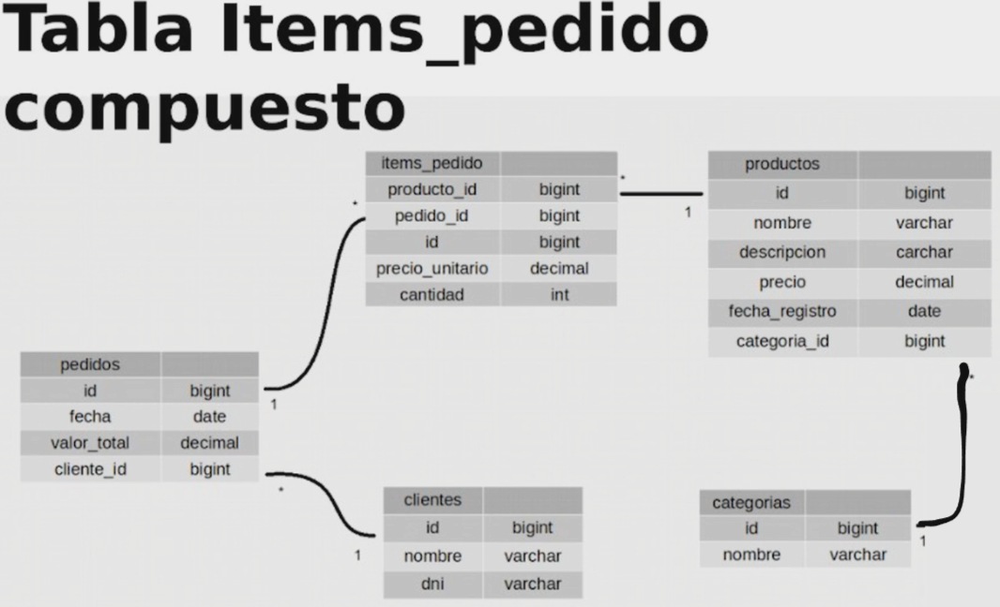

# Java y JPA: consultas avanzadas, rendimiento y modelos complejos

## Relacionamiento ManyToMany

Usando la etiqueta `@ManyToMany` de JPA indicamos que muchas entidades de un tipo pueden tener muchas entidades de otro tipo

```java
public class Pedido {

    @ManyToMany //Muchos pedidos pueden tener muchos productos
    private List<Producto> productos;

}
```

### @joinTable

- Con la anotación **``@JoinTable``** en JPA, se utiliza para personalizar la tabla de asociación que contiene las relaciones entre dos entidades en una relación de Many-To-Many. Esta anotación se usa a menudo junto con la anotación ``@ManyToMany`` para definir la estructura de la tabla de unión.

JPA crea la tabla de relacionamiento que utilizan la anotación ``@ManyToMany`` con la anotación ``@JoinTable()``

- Tabla de Items_pedido **forma simple**

```java
    @ManyToMany
    @JoinTable(name="items_pedidox")
    private List<Producto> productos;
```

Esta nueva tabla creada con la anotación con `JoinTable()` permite la relación entre 2 entidades `ManyToMany` que permite tener el identidicador de cada tabla, si queremos tener más elementos podemos anexarle un conjunto de atributos.

</br>

- Relacion *ManyToMany* sin JoinTable

**Relacionamiento Bidireccional:** Siempre que tengamos una lista es `@OneToMany`, la entidad debe estar creada manualmente al cual tambien utilizamos para agregar mas atributos

```java

    class ItemPedido {
        @ManyToOne
        private Pedido pedido;
    }

    public class Pedido {
        //Si aqui ponemos el OneToMany, del otro lado tenemos que poner ManyToMany
        @OneToMany  //ManyToOne   OneToMany  --> ManyToToMany -->  ManyToMany
        private List<ItemPedido> items;
    }
```

</br>

Para corregir la creación de una 6ta tabla creada por JPA debemos usar el parámetro **``MappedBy``** en la etiqueta `OneToMany`, para indicar que se trata de una **relación bidireccional**, sin este parámetro, JPA considera que es otra relación, asumiendo que hay otra tabla de unión.

```java
    @OneToMany(mappedBy = "pedido")  //Mapeada por el elemento existente en la entidad ItemPedido
    private List<ItemsPedido> items = new ArrayList<>(); //nos permite acceder a los productos de ese pedido

```



</br>

Hay una propiedad en la anotación `OneToMany` que permite a la hora de realizar una acción en la entidad que esta declarada, realice esa acción en cascada para la entidad que esta relacionada

- **`cascade = CascadeType.xxxx`**
    Cascade crea un efecto dominó en las operaciones realizadas en una entidad, su uso es propagar las operaciones realizadas en una entidad en su relación.
  - **REMOVE**: Ocurre cuendo eliminas un archivo
  - **PERSIST**: Cuando guardes por primera vez un archivo
  - **MERGE**: Cuando actualice (traer se la base de datos)
  - **ALL**: En todos los casos

```java
    public class Pedido {
        //cascadeAll - que cada operacion que realice una operacion con pedido, que haga una alteracion en ItemPedido
        @OneToMany(mappedBy = "pedido", cascade = CascadeType.ALL)
        private List<ItemsPedido> items = new ArrayList<>();
    }
```

> Los valores se agregan de forma automática a través del parametro que pasamos a la etiqueta `OneToMany` llamada **cascade**, este valor nos permite que al realizar operaciones se apliquen en forma de cascada, sea para eliminar, actualizar, modificar o eliminar un nuevo elemento, se agrega de forma automatica a la Base de datos y no es necesario realizar otra clase Dao para agregar esos valores

</br>

## Consultas avanzadas

### Consultas con funciones de agregación SQL

Las funciones de agregación son aquellas que recorren la tabla y realiza una operación en conjunto.

|           Funciones de Agregado                                                      |
|--------------------------------------------------------------------------------------|

| Función   | Descripción                                                                |
|:---------:|----------------------------------------------------------------------------|
| **AVG**   | Utiliza para calcular el promedio de los valores de un campo determinado   |
| **COUNT** | Utiliza para devolver el número de los registros de la selección           |
| **SUM**   | Utiliza para devolver la suma de todos los valores de un campo determinado |
| **MAX**   | Utiliza para devolver el valor más alto de un campo específico             |
| **MIN**   | Utiliza para devolver el valor más bajo de un campo específico             |

El valor de sumatoria va a recorre todos los elementos

```java
    //Ejemplo de como utlizar     
    public BigDecimal valorTotalVendido() {
        String jpql = "SELECT MAX(p.valorTotal) FROM Pedido AS p";  //valorTotal y Pedido deben ser escritas iguales a la entidad
        return em.createQuery(jpql, BigDecimal.class).getSingleResult();
    }

```

### Consultas por relatorio

#### 1 USANDO OBJECT

Multiples atributos de multiples entidades, **JOIN** concatenar entidades (Entrar a los valores de la entidad ingresada como atributos)

```java
    public List<Object[]> relatorioDeVentas(){
        String jpql = "SELECT producto.nombre, " +
                "SUM(item.cantidad)," +
                "MAX(pedido.fecha) " +
                "FROM Pedido pedido " + //mismos nombre de la entidad y atributos
                "JOIN pedido.items item " +
                "JOIN item.producto producto " +
                "GROUP BY producto.nombre " + //Agrupar por nombre
                "ORDER BY item.cantidad DESC"; //Ordenar por la cantidad de forma decendiente ASC = ascendiente

        return em.createQuery(jpql, Object[].class).getResultList();
    }
```

</br>

#### 2 VO (Paquete ``Value Object``) o DTO

```java
Paquete VO
    
public class RelatorioDeVenta {

    private String nombreDelProducto;
    private Long cantidad;
    private LocalDate FechaDeUltimaVenta;

        //Getters and Setters y Constructor que recibe parametros segun las 
        //consultas JPQL...

    }
```

Nuestra consulta quedaría así

```java
    CLASE DAO
    public List<RelatorioDeVenta> relatorioDeVentasVO(){
        String jpql = "SELECT new com.alberttlee.tienda.vo.RelatorioDeVenta(producto.nombre, " +
                "SUM(item.cantidad), " +
                "MAX(pedido.fecha)) " +
                "FROM Pedido pedido " + //mismos nombre de la entidad y atributos
                "JOIN pedido.items item " +
                "JOIN item.producto producto " +
                "GROUP BY producto.nombre " + //Agrupar por nombre
                "ORDER BY item.cantidad DESC"; //Ordenar por la cantidad de forma decendiente

        return em.createQuery(jpql, RelatorioDeVenta.class).getResultList();
```

</br>

### Named Queries

Es un recurso de JPA, son consultas que se encuentran dentro de la entidad (Nomramlmente se usa el DAO)

Las **NamedQueries** se declaran en la clase de entidad, En la entidad a utilizar vamos a agregar una etiqueta llamada `@NamedQuery` a la cual le asignaremos 2 parametros, el **name** con el que identificaremos y la **query** que sera utilizada

```java
    @Entity
    @Table(name = "productos")
    @NamedQuery(name= "ConsultaDePrecio", query = "SELECT P.precio FROM Producto AS P WHERE P.nombre=:nombre")
    public class Producto {
            
    ///atributos, getter y setters y constructores

    }

    // en el metodo que que ara uso de sa query normalmente en el Dao de la entidad

    public BigDecimal consultarPrecioPorNombreDeProducto(String nombre){
        return em.createNamedQuery("ConsultaDePrecio",BigDecimal.class).setParameter("nombre",nombre).getSingleResult();
    }    

```

</br>

### Performance de consultas

Es común olvidarse de la consulta que se esta realizando en la base de datos, traer valores que son inncesarios o consultas ineficientes porque traen muchos valores o que no es la consulta necesaria

#### Lazy / Eager

- **Eager**: Todos los elementos que tengan la anotación **ToOne**, ya sea `ManyToOne` o `OneToOne` tienen una estrategia de cargamento de tipo **Eager**, Una estrategia de tipo anticipada, es decir; siempre que instanciemos una entidad (llamemos una tabla de la base de datos) y que uno de sus atributos tenga la anotación del tipo `ToOne` el va a hacer un *`Join`* con todos los atributos que tengan esas anotaciones, por lo que si tienes 5 atributos del tipo ManyToOne el va a hacer un Join con esas 5 entidades apesar de que nosotros no las estemos utilizando.

- **Lazy**: Todas las anotaciones que sean del tipo **ToMany**, ya se `ManyToMany` o `OneToMany` tienen la estrategia de cargamento de tipo **Lazy** o cargamento perezoso, Nosotros vamos a traer ese recurso solamente cuando sean solicitadas

</br>

Para corregir el error de desempeño en las anotaciones *ToOne* y parte de las buenas practicas es utilizar un atributo en la anotación ManyToOne que es el aatributo **fetch**.

</br>

> Por buenas prácticas toda nuestra aplicación debe ser *Lazy* Para evitar el consumo excesivo de memoria y aumentar la velocidad de nuestra aplicación
>
> - Para las anotaciones del tipo **ManyToOne** vamos a utilizar la estrategia de cargamento de tipo **Lazy** o perezoso, que nos va a permitir llamar los elementos cundo sean solicitados
>- Las anotaciones **ToMany** tienen por defecto la estrategia de cargamento de tipo **Lazy**

```Java
///Ejemplos///
    
    @ManyToOne(fetch = FetchType.LAZY) 
    private Cliente cliente;

    @ManyToOne(fetch = FetchType.LAZY) 
    private Categoria categoria;
```

</br>

Uno de los problemas que puede ocurrir cuando agregamos el parametro `fetch = FetchType.LAZY` a una anotación de tipo *Eager* es encontrarnos con una excepción *LazyInitializationException* ya que puede ocurrir que para ese punto el EntityManger se encuentre cerrado

Consultas planeadas: son consultas donde nosotros ya planificamos cuales son los elementos que vamos a obtener posteriormente aunque nos encontremos con la conexión cerrada que nos da acceso a la base de datos, nostros ya tendremos esos registros almacenados.

- Recurso de JPA llamado Join Fetch

```java
    public Pedido consultarPedidoConCliente(Long id){
        String jpql = "SELECT p FROM Pedido p JOIN FETCH p.cliente WHERE p.id =:id";
        return em.createQuery(jpql,Pedido.class).setParameter("id",id).getSingleResult();

    }
```

> Recordar cuando va a ser el momento para realizar las consultas planeadas ya que podemos encontrarnos que para un cierto punto el EntityManger se encuentre cerrado.
>
>- ¿Por qué es interesante utilizar el recurso JOIN FETCH en una consulta JPQL?
> JOIN FETCH permite elegir qué relaciones se cargarán en una consulta determinada, en lugar de cargarlas siempre.

</br>

### Consultas con parámetros dinamicos

Usando ``StringBuilder`` que nos permite el uso de string mutables vamos a crear nuestra query, junto a validaciones o condiciones para construir la consulta a medida que los parametros existan o no,y si uno es nulo o esta vacio no agrega el valor en la consulta y salta al siguiente valor, solo aquellos que existen o no son null

```java
    public List<Producto> consultarPorParametros(String nombre, BigDecimal precio, LocalDate fecha){
        StringBuilder jpql = new StringBuilder("SELECT p FROM Producto p WHERE 1=1 ");
            if (nombre != null && !nombre.trim().isEmpty()){ //nombre diferente de nulo && nombre que no sea vacio
                jpql.append("AND p.nombre=:nombre ");
            }
            if (precio != null && !precio.equals(new BigDecimal(0))){
                jpql.append("AND p.precio=:precio ");
            }
            if (fecha != null){ //fecha sea nulo, se puede poner si la fecha es mayor o menor a tal fecha
                jpql.append("AND p.fechaDeRegistro=:fecha");
            }

        TypedQuery<Producto> query = em.createQuery(jpql.toString(), Producto.class);

            if (nombre != null && !nombre.trim().isEmpty()){ //nombre diferente de nulo && nombre que no sea vacio
                query.setParameter("nombre",nombre);
            }
            if (precio != null && !precio.equals(new BigDecimal(0))){
                query.setParameter("precio",precio);
            }
            if (fecha != null){ //fecha sea nulo, se puede poner si la fecha es mayor o menor a tal fecha
                query.setParameter("fechaDeRegistro",fecha);
            }

            return query.getResultList();

    }
```

</br>

### Api de Criteria

Similar al ejemplo anterior

```java
    public List<Producto> consultarPorParametrosConAPICriteria(String nombre, BigDecimal precio, LocalDate fecha){
        CriteriaBuilder builder = em.getCriteriaBuilder();
        CriteriaQuery<Producto> query = builder.createQuery(Producto.class);
        Root<Producto> from = query.from(Producto.class);//Corresponde a nuestro from de nuestra consulta JPQL


        Predicate filtro = builder.and();
            if (nombre != null && !nombre.trim().isEmpty()){ //nombre diferente de nulo && nombre que no sea vacio
                filtro = builder.and(filtro,builder.equal(from.get("nombre"),nombre));
            }
            if (precio != null && !precio.equals(new BigDecimal(0))){
                filtro = builder.and(filtro,builder.equal(from.get("precio"),precio));
            }
            if (fecha != null){ //fecha sea nulo, se puede poner si la fecha es mayor o menor a tal fecha
                filtro = builder.and(filtro,builder.equal(from.get("fechaDeRegistro"),fecha));
            }
    
            query = query.where(filtro);
    
            return em.createQuery(query).getResultList();
    }
```

> **Criteria API** hace que el código sea más difícil de entender.

</br>

### Simplificando entidades con `Embeddable`

Los atributos de las entidades pueden ser demasiados extensos, podemos llegar a tener 10, 20 o hasta 50 atributos dependiendo de nuestra entidad. Una forma de organizar nuestro código es *crear* otra entidad/clase donde almacenemos esos atributos sin necesidad de generar una nueva tabla en la base de datos.

Una nueva clase que va a ser inyectada dentro de otra clase conteniendo esos atributos adicionaeles, creada ya la clase agregaremos el resto de los atributos y colocar un identificador de la que pertenece.

- Para indicar a JPA que una clase puede ser inyectada dentro de otra clase usamos usamos la etiqueta **`@Embeddable`**

```java
    @Embeddable  ////  <----------------
    public class DatosPersonales {
    
        //Atributos, getters and setters que se utilizaran
    }
```

Y para conectarla a la otra clase/entidad debemos agregarla como nuevo atributo en la clase que inyectaremos junto con la etiqueta `Embedded`

```java
    @Entity
    @Table(name = "Clientes")
    public class Cliente {
    
        @Id
        @GeneratedValue(strategy = GenerationType.IDENTITY)
        private Long id;

        @Embedded  //////    <----------
        private DatosPersonales datosPersonales;
    }
```

Con métodos delegate, delegamos la responsabilidad de generar los getters and setters a otra clase que se encuentra inyectada dentro de la clase

</br>

### Mapeamiento de herencias

Las herencias entre entidades es a través de la palabra reservada `extends`, Los mapeamientos iniciales son los mismos, @Entity para indicar la Entidad.

Para conectar las herencias tenemos que utilizar una anotación en la clase Padre llamada `@Inheritence` idicando como queremos heredar, si va a ser una única tabla o si va a ser tabla separada

- Indicando **`InheritanceType.SINGLE_TABLE`** ayuda al desempeño de la aplicación, y la única desvenja que encontraremos es el tener una gran cantidad de elementos una unica tabla y puede llegar a ser confuso

```java
    @Inheritance(strategy = InheritanceType.SINGLE_TABLE) // <-------- indicando una unica tabla con todos los atributos
    public class Producto { //clase padre
    }
```

- En La estrategia **`InheritanceType.JOINED`** vamos a contruir tablas separadas, disminuye en desempeño, más lento a la hora de realizar la carga pero tenemos los elementos de forma más organizada junto con llaves estranjeras entre clases que las identifican con la llave primaria de la entidad padre

```java
    @Inheritance(strategy = InheritanceType.JOINED)
    public class Producto {
    }
```

</br>

### Mapeamiento de Llaves compuestas

Recurso de JPA nos va a permitir hacer referencia a una entidad a través de llaves compuestas, idetificar una fila por multiples elementos (llaves compuestas)

- Debemos crear una nueva clase que va a contener esos atributos que van a ser de referencia en la entidad, Usando la eiqueta `Embeddable` Para indicar a Jpa que esta no es una nueva tabla, que va tener atributos de otra clase y que va a ser inyectada, todos los elementos que sean del tipo `Embeddable` tienen que implementar la interfaz `Serilizable` ya que van a ser elementos que van a ser serializados en bits para transitar en la aplicación, y para identificar que son elementos unicos tenemos que implementar el método *hashCode* e *equals*

```java
    @Embeddable //Indicar a Jpa que esta no es una nueva tabla  que va tener atributos, va a ser inyectada
    public class CategoriaId  implements Serializable {
    
        private String nombre;
        private String password;
    
        //CONSTRUCTORES, GETTER AND SETTERS
    
        //agregamos equals y hashCode para identificar que son elementos unicos 
        @Override
        public boolean equals(Object o) {
            if (this == o) return true;
            if (o == null || getClass() != o.getClass()) return false;
            CategoriaId that = (CategoriaId) o;
            return Objects.equals(nombre, that.nombre) && Objects.equals(password, that.password);
        }
    
        @Override
        public int hashCode() {
            return Objects.hash(nombre, password);
        }
    }
```

- Deifinimos un atributo de llave primaria en la clase que se inyectara

```java
    @Entity
    @Table(name = "categorias")
    public class Categoria {
    
        @EmbeddedId //   <---------------
        private CategoriaId categoriaId;
        //constructores
        public Categoria() {
        }
    
        public Categoria(String nombre, String contrasenia) {
            this.categoriaId = new CategoriaId(nombre, contrasenia);
        }
        ///
        public String getNombre() {
            return categoriaId.getNombre();
        }
    
        public void setNombre(String nombre) {
            this.categoriaId.setNombre(nombre);
        }
    }
```

</br>

> **Todos los elementos del tipo `Embeddable` tienen que implementar `Serilizable`**

</br>

---

Los 3 recursos que nos permiten organizar aún mejor nuestro código:

1. El primero es la anotación **@Embeddable** y **@Embedded** que nos permiten agrupar un conjunto de atributos o propiedades dentro de otra clase que no va a ser indicada como una nueva entidad, sino como una clase que va a ser inyectada dentro de nuestra clase entidad. Con esto podemos agrupar atributos como dirección, datos personales, datos familiares, entre otros, sin tener que colocar millones de atributos en una única clase.

    Solo hay que notar que al reemplazar los atributos por una clase embutida tenemos que cuidar que los getter y setter así como, otros métodos continúen funcionando correctamente. De lo contrario podemos delegar la función de retornar esa propiedad para la nueva clase construyendo así un método delegate.

    ```java
            @Entity
            @Table(name="clientes")
            public class Cliente {
            
                @Id
                @GeneratedValue(strategy=GenerationType.IDENTITY)
                private Long id;
            
                @Embedded
                private DatosPersonales datosPersonales;
            
                public Cliente() {}
            
                public Cliente(String nombre, String dni) {
                    this.datosPersonales=new DatosPersonales(nombre,dni);
                }
            
                public Long getId() {
                    return id;
                }
                public String getNombre() {
                    return datosPersonales.getNombre();
                }
                public void setNombre(String nombre) {
                    this.datosPersonales.setNombre(nombre);
                }
                public String getDni() {
                    return datosPersonales.getDni();
                }
                public void setDni(String dni) {
                    this.datosPersonales.setDni(dni);
                }
            }
        /////////
            
            @Embeddable
            public class DatosPersonales implements Serializable{
                private static final long serialVersionUID = 8063180201812979106L;
            
                private String nombre;
                private String dni;
            
                public DatosPersonales() {    }
            
                public DatosPersonales(String nombre, String dni) {
                    this.nombre = nombre;
                    this.dni = dni;
                }
            //getter and setters
    ```

    </br>

2. El segundo recurso es el mapeamiento de herencia, puede que querramos crear nuevas entidades que compartan propiedades o más especificamente que deriven de una clase madre. Para lograr esto no tenemos que colocar todas la propiedades en la nueva entidad, sino que solo debemos marcar la clase madre con la anotación **@Inheritance** y construir nuestras nuevas entidades, normalmente, colocando solo las nuevas propiedades y usando la palabra reservada extends para indicar herencia de clase.

    </br>

   - Clase madre:

    ```java
        @Entity
        @Table(name="productos")
        @NamedQuery(name="Producto.consultarPrecioPorNombre", query="SELECT P.precio FROM Producto AS P WHERE P.nombre=:nombre")
        @Inheritance(strategy=InheritanceType.JOINED)
        public class Producto{
            /////
        }
    ```

    </br>

3. Y ya por último, existe un recurso que nos permite identificar elementos en nuestras entidades utilizando más de un único parámetro, generalmente utilizamos un parámetro que puede ser numérico o alfanumérico para identificar las filas. A esto se llama llave primaria única, pero podemos utilizar llaves primarias con parámetros compuestos, para eso JPA nos provee como recurso la anotación **@EmbeddedId** que nos permite indicarle a nuestra entidad que está siendo inyectada una clase que no es una entidad, sino una clase que compone el ID de esa entidad formado por multiples parametros.

    ```java
        @Entity
        @Table(name="categorias")
        public class Categoria {
        
            @EmbeddedId
            private CategoriaId categoriaId;
        
            public Categoria() {}
        }
    ```

    - En la clase que va a componer la llave primaria la anotamos con @Embeddable como lo habíamos hecho anteriormente, pero la anotación @EmbeddedId va a indicarle a la entidad que debe tomar esa clase como ID, adicional todas las clases embutidas sean llaves primarias o no deben implantar la interfaz Serializable ya que sirve para indicarle a la API que van a haber datos transitando dentro de ella.

    ```java
    @Embeddable
    public class CategoriaId implements Serializable{
    
        private static final long serialVersionUID = 4198020985304539350L;
    
        private String nombre;
        private String password;
        public CategoriaId() {
        }
        public CategoriaId(String nombre, String password) {
            this.nombre = nombre;
            this.password = password;
        }
    
    //getters setters
    ```
