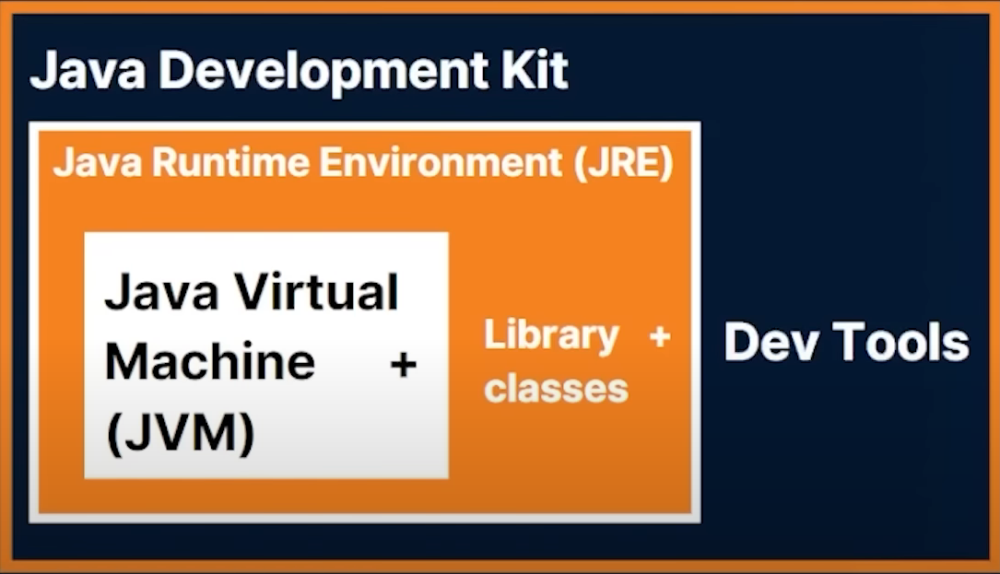
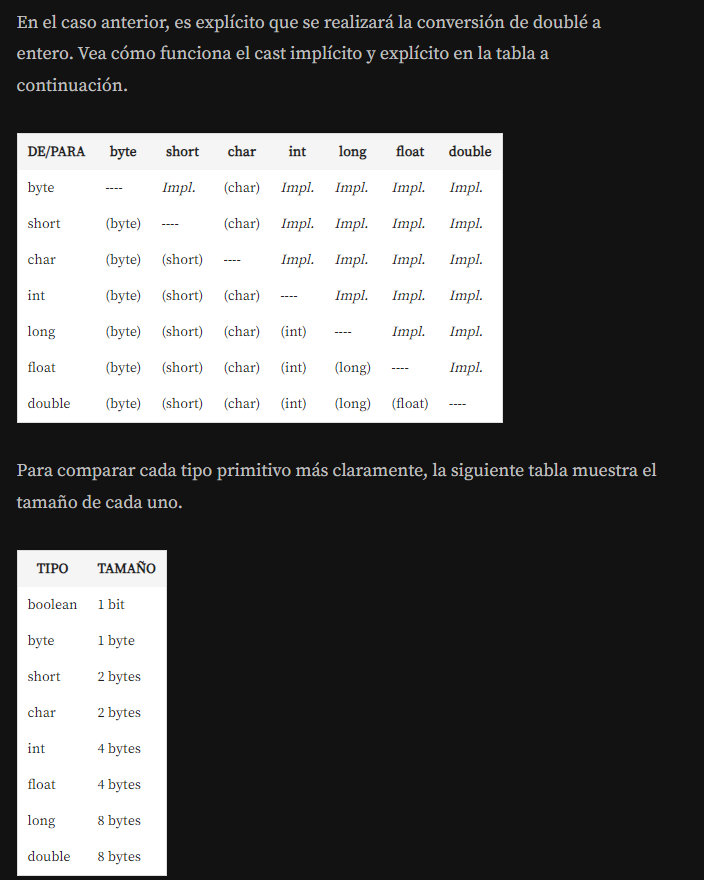

# JAVA

**VRE**: Java Runtime Environment
**JDK**: Java Devevlopment Kit
**JVM**: Java Virtual Machine

Plataforma de Java : Maquina virtual de Java, frameworks, librerias.

- Portable
- Fácil
- Segura
- Omniprente

## Maquina Virtul de Java (JVM)

**James Gosling** (Padre de Java)

En el mundo Java siempre tendremos el mismo archivo "ejecutable" (Bytecode) que será ejecutado por la máquina virtual de Java (JVM) independientemente del sistema operativo que estemos usando. De esta forma, no es necesario reescribir el código o adaptarlo a cada sistema operativo. ¡Tenemos un único ejecutable para todas las plataformas!

1. Lenguaje Java  (Codigo Java - archivos ``.java``)
2. JAVAC (Java Compiler - ***Java Development***)
3. Byte Code (Archivos ``.class``) resultado de la compilacion
4. JVM (Java Virtual Machine - ***Java Runtime Environment***)
5. Sistema Operativo (SO)

</br>

La JVM se encarga de:

- Adimistracion de Memoria
- Multiplataforma
- Seguridad
- Optimización
- Librerias

**Compilacion:**
Es el proceso de tranformacion de codigo fuente a codigo ejecutable, el codigo fuente se compila en binario y debe ser compatible con el sisteka operativo

**`W.O.R.A (Write Once, Run Everywhere)`**



| `Si queremos ejecutar codigo java Utilizar JRE que contienes el JVM y las librerias, para desarrllo el JDK aue tiene un conjunto de herramientas para poder escribir codigo.` |

---

*La entrada de una aplicación Java es siempre la **función/método** public static void main(String[] args)*

**Workspace (Espacio de trabajo):** Es como una carpeta para varios proyectos.

</br>

---

### ``JAVA es fuertemente tipado, es decir, dado el valor de una variable de un tipo concreto, no se puede usar como si fuera de otro tipo distinto a menos que se haga una conversión``

</br>

## TIPOS DE VARIABLES

**```Las variables almacenan valores y no referencias.```**

- byte
- short
- char: El tipo char contiene solo un carácter de la tabla Unicode
- int
- float
- double

### ``byte``, ``short``, ``int`` , ``long``

| Tipo  | Bits    | Valor minimo         | Valor Maximo        | Conversion                              |
|-------|---------|----------------------|---------------------|-----------------------------------------|
| byte  | 8bits   | -128                 | = 127               | (byte) 129                              |
| short | 16 bits | -32768               | 32767               | (short)32768                            |
| char  | 16 bits | 0                    | 65536 (2 ^ 16)      | (char) 33                               |
| int   | 32 bits | -2147483648          | 2147483647          | (int)2147483648L ( L = Long )           |
| long  | 64 bits | -9223372036854775808 | 9223372036854775807 | (long)9223372036854775808F( F = Float ) |

> El valor de Int es el mas utilizado para ahorrar espacio, es por **default** el usado por java cuando se muestra un numero.

</br>

### ``float`` y ``double``

| Tipo   | Bits   | Valor minimo | Valor Maximo           | Conversion  |
|--------|--------|--------------|------------------------|-------------|
| float  | 32bits | 1.4E-45      | 3.4028235E38           | (float)10.0 |
| Double | 64bits | 9E-324       | 1.7976931348623157E308 | -           |

Las literales de punto flotante simplemente con tener un punto `.` por default java lo cataloga como que ya de tipo ``Double``.

</br>

### Tipo ``char``

Para usar un char debe se utiliza comilla simple  ''    (Almacena un un caracter)
Para usar un codigo unicode usar ``\u + el codigo``

</br>

### Tipo ``boolean``

Almacenan true o false

```Java
    boolean a = 2 > 4  // true
    boolean b = 2 < 2  //false
```

</br>

## Conversión de Tipos Primitivos en Java (Casting)

**Casting:** El casting es un procedimiento para transformar una variable primitiva de un tipo a otro, o transformar un objeto de una clase a otra clase siempre y cuando haya una relación de herencia entre ambas.

Ejemplo:

```Java
public class TestConversion {

    public static void main(String[] args){
        double salario = 1270.50;
        int valor = (int) salario;    //cast
    }
}
```

- ``Integer.parseInt(string)`` - Convertir a Int - Recibe una cadena y lo convierte a int
- ``Double.parseDouble(string)`` - Convertir a Double - Recibe un string y lo convierte a double
- ``String.valueOf(10)`` - Convertir a string  - Recibe un Entero o numero y lo convierte a string
  
Ejemplo `int` a `string`

```java
String edadTexto = String.valueOf(10)
```

- ``.charAt(intIndex)`` - Para recuperar un caracter de una cadena

Ejemplo:

```java
Char caracter = "hola".charAt(1)     // devuelve la letra "o" de hola.
```

</br>



---

El operador lógico **AND** está representado por los caracteres `&&` y el **OR** por `||`.

Los operadores lógicos deben tener una expresión booleana en los lados izquierdo y derecho.

```java
if (edad > 18 && edad < 65) {

}
```

| Los Boolean por defecto son `false` |
|                -                        |

---

## Java Scope (Alcance  de Java)

En Java, solo se puede acceder a las variables dentro de la región en la que se crearon. Esto se llama scope.

- **Alcance de metodo**: Las variables declaradas directamente dentro de un método están disponibles en cualquier parte del método siguiendo la línea de código en la que fueron declaradas
- **Ambito de bloque**: Un bloque de código se refiere a todo el código entre llaves ``{}``. Solo se puede acceder a las variables declaradas dentro de bloques de código mediante el código entre llaves, que sigue la línea en la que se declaró la variable.

</br>

---

## Operadores

### Operadores aritmeticos

- `+` suma  ``a + b``
- `-` resta   `a - b`
- `*` multiplicacion  `a * b * a`
- `/` division    `a / b`
- `%` modulo (residuo entero de la division)=
  - Ejemplo del uso del operador residuo: saber si un dato es par:

```Java
        if(n % 2 == 0){ 
        //si el resultado es verdadero "n" es par, sino es impar
        }
```

### Operador de Asignacion

- ``=`` - asignacion      ``a = 3``
- ``+=`` - composicion suma   ``a += 1  //a = a + 1``   (la variable "a" se va a incrementar en 1)
- ``-=`` - composicion resta   ``a -= 2 //a = a - 2``
- ``*=`` - composicion multiplicación ``a*= 2; //a = a*2``
- ``/=`` - composicion division    ``a /= 2; //a = a / 2``
- ``%=`` - composicion modulo      ``a %= 2; //a = a %``

### Operadores Unarios

- ``+`` Operador unario suma. Indica un número positivo.
- ``-`` Operador unario resta. Niega una expresión.     var b = -a
- ``++`` Operador de incremento. Incrementa el valor en 1.

```Java
            //obtiene el valor de 4 y "f" utiliza el valor "e" ya incrementada = 4 
            var e= 3; var f = ++e;      //e=4 y f=4
            //primero se asigna el valor de "g" a "h" y despues se incrementa en este caso "g" = 6 
            var g = 5; var h = g++;  //g=6 y h=5 
```

- ``–-`` Operador de decremento. Decrementa el valor en 1.

```Java
            var i = 2; var j = --g;     //i=1 y j=1 
            var k = 2; var l = k--;     //k=1 y l=2
```

- ``!`` - Operador de complemento lógico. Invierte el valor de un booleano `var d = !c` si ``c`` era true en la variable ``d`` se invierte y c se convierte en ``false``

```java
                var c = true;    var d = !c;  //c es false
```

### Operadores Igualdad

``==`` - Compara si 2 elementos son iguales. Ejemplo: ``3 == 2`` (el resultado arrojaria false)
``!=`` - Diferente. Ejemplo: ``3 != 2`` (el resultado devuelve true)

``nomCadena.equals(nomCadena)``  Compara contenido de cadenas. Ejem: ``var f = cadena1.equals(cadena2)``

### Operadores Relacionales

Indica si es igual o menor, igual o mayor a otro valor.

``>`` - mayor que
``>=`` - mayor o igual
``<=`` - menor o igual
``<`` - menor que

### Operadores condicionales

``&&`` - (AND) Solo regresa verdadero si ambas expresiones son "verdadero"
``||`` - (OR) Regresa verdadero si alguna expresion es verdadera, ambas falsas regresa falso.

### Operador Ternario

Evaluamos una condición, si la condicon es verdadera asignamos el primer valor `?` , o bien un segundoValor si la condición resulta falsa `:`.

```java
    //SINTAXIS//    
 resultado = (condicion) ? valor1 : valor2;           

// Ejemplo:// 

var resultado = (3 > 2) ? "Verdadero" : "Falso" ;

```

>Recomendable usar cuando son operaciones sencillas, si es mas compleja lo recomendable es usar otro tipo de estructura.

---

## Sentencias de control

### if - else

Expresiones booleanas

```java
if (condicion) {
    "codigo si es verdadero"
}
else {
    "   codigo si es falso"
}
```

### if - else if

```java
if (condicion) {
            
        }
        else if (condicion){
            
            
        }
```  

- **Ejemplo**

```java
int mes = 3; // Marzo
String estacion;

if (mes == 12 || mes == 1 || mes == 2) {
    estacion = "Invierno";
} else if (mes >= 3 && mes <= 5) {
    estacion = "Primavera";
} else if (mes >= 6 && mes <= 8) {
    estacion = "Verano";
} else {
    estacion = "Otoño";
}

System.out.println("La estación del año es: " + estacion);
```

- *``else`` sirve para romper la comprobación de los siguientes casos*

</br>

### Switch

Las comprobaciones no tienen que ser de tipo booleano, en este caso pueden ser de tipo numerico o tipo string.

Dependiendo de los casos que estamos comprobando, entonces se ejecuta las sentencias de ese caso, y asi sucesivamente hasta pasar por los casos, tambien es necesario usar la palabra reservada `break` para cuando un coso se evalue y es la correcta el switch se detiene.

- Recomendada cuando estamos creando menús.

```Java
switch (expresion) {//valor que queremos comprobar en cada uno de los casos
    case valor1:
        // Bloque de código a ejecutar si la expresión es igual a valor1
        break;
    case valor2:
        // Bloque de código a ejecutar si la expresión es igual a valor2
        break;
    // ... más casos si es necesario
    default:
        // Bloque de código a ejecutar si la expresión no coincide con ninguno de los valores anteriores
}

////////EJEMPLO ///////
int mes = 3; // Marzo
String estacion;

switch (mes) {
    case 12:
    case 1:
    case 2:
        estacion = "Invierno";
        break;
    case 3:
    case 4:
    case 5:
        estacion = "Primavera";
        break;
    case 6:
    case 7:
    case 8:
        estacion = "Verano";
        break;
    default:
        estacion = "Otoño";
}
System.out.println("La estación del año es: " + estacion);

//break sirve para romper la comprobacion de los siguientes casos


/////////////////////////////
/////////JAVA 12////////////
tipoDeDato variable = switch (expresion) {
    case valor1 -> valorDevuelto1;
    case valor2 -> valorDevuelto2;
    // ... más casos si es necesario
    default -> valorDevueltoPorDefecto;
};


//////EJEMPLO//////
int dia = 5;
String diaDeLaSemana = switch (dia) {
    case 1 -> "Lunes";
    case 2 -> "Martes";
    case 3 -> "Miércoles";
    case 4 -> "Jueves";
    case 5 -> "Viernes";
    case 6 -> "Sábado";
    case 7 -> "Domingo";
    default -> "Número inválido";
};
System.out.println("El día de la semana es: " + diaDeLaSemana);
```

</br>

---

## CICLOS

El tema de ciclos tiene que ver con la repetición de lineas de código, cuando se trabaja con ciclos lo que se revisa es una **condición**, si la condición es *verdadera* entonces se ejecuta una o más sentencias que al terminar vuelve evaluar de nuevo la condición y mientras la condición sea verdadera se seguira ejecutando la sentencia (un ciclo donde se se ejecuta una cantidad de veces según la condición que se evalua), cuando la condición sea *falsa* entonces se terminar el ciclo.

- ### While

El ciclo while acepta dos valores: ´true´ o ´false´. El valor ´true´ mantiene el ciclo en ejecución, cuando cambia a ´false´ este ciclo es finalizado. Esos valores pueden ser resultado de una expresión como `contador <=10`

```java
contador = 0;

            while (condicion){
                "codigo si es verdadero"
                contador++
            }
```

- **Ejemplo**

```java
int contador = 0;
//se crea un contador que se utilizara para evaluar la condicion y evitar ciclos infinitos
        var contador = 0;
        //mientras contador sea menor o igual que 10 ejecutara las sentencias 
        while (contador <= 10){  //Mientras que (conficion)
            //ejecuta esto
            System.out.println(contador);
            //contador = contador + 1;
            //contador += 1;
            contador++;  //incrementamos en cada vuelta para evaluar
        }
```

- ### Do While

Similar al ciclo `While` pero con la diferencia es el orden en que se ejecutan las líneas de código.

Primero tenemos la palabra reservada de `do` con las lineas de código a ejecutar y despues tenemos la condición. En esta estructura por lo menos **se ejecuta una vez la línea de código** y despues se revisa la condición, si es falsa se termina nuestro ciclo pero al menos se ejecuto una vez el ciclo `do while`

```Java
        //Sintaxis// 
        var contador = 0;  //un contador para evaluar
                
                do{
                    //sentencias a realizar
                }while (contador < 3); //condicion
        
        /////Ejemplo/////
        var contador = 0; 
        
        do{
            System.out.println("contador = " + contador);
            contador++;
        }while (contador < 3);

```

> Si queremos que la condicion se compruebe desde el inico y no ejecute el codigo delciclo usar `While` , en caso de que necesitemos de que se ejecute al menos una vez el bloque de código independiente mente de si la condición es falsa usar `do while`.

- ### For

Tenemos secciones mas especificas para el manejo de la expresion booleana, el contador y el incremento.

El for tiene 3 partes en su definicion, declaramos la variable contador, despues tenemos la condicon y por ultimo tenemos el incrementador o decrementador, posteriormente colocamos el codigo que realizara dicho ciclo entre llaves `{}`.

```java
            //////Sintaxis//////
            for (variable; condicion; incrementador-o-decrementador) {
                //Sentencias de codigo
        }

```

- **Ejemplo**

```JAVA
            for (int contador = 0; contador <= 10; contador++){
                System.out.println(contador);
            }
```

```java
            for(int numero = 3; numero <= 100; numero += 3){
                System.out.print(numero + " ");
        }
```

```java
            for (int i = 1; i < 100; i++ ){
                if (i % 3 == 0)    {
                    System.out.println(i + " ");
                }
            }
```

- ### Bucles anidados

```java
            for(int i = 0; i <= 5; i++) {
                for (int j = 0; j <= i; j++){
                    System.out.print(j +  1 + " ");
                }
            System.out.println();
            }
```

#### Palabra `break` y `continue`

- La palabra `break` nos va a permitir romper una cliclo
- La palabra `continue` lo que va a hacer es que ya no va a ejecutar nada mas de nuestro ciclo, va a omitir las siguientes lineas y se va a la siguiente iteracion.

```Java
for (int contador = 0; contador < 3; contador++){
            if(contador % 2 != 0){
                continue; // ir  a la siguiente iteracion
            }
            System.out.println("contador = " + contador);
        }
```

#### Etiquetas

Una etiqueta nos va a permitir a las palabras continue o break ir hacia un lugar en especifico de nuestro programa, **No es muy recomendable de usar ni aplicar a proyectos de la vida real** ya que esta programacion se conoce como de tipo `go to` y puede romper con la lógica de nuestros programas así quee no es convenciente de usar.

```Java
        inicio: //agregamos la etiqueta
        for (int contador = 0; contador < 3; contador++){
            if(contador % 2 != 0){
                continue inicio; //indicamos a continue ir a la siguiente linea de codigo de la etiqueta, igual con break funciona (ciclos anidados)
            }
            System.out.println("contador = " + contador);
        }
```

Si tuvieramos ciclos anidados, un ciclo for dentro de otro ciclo for, entonces esto podría ser útil siendo el único caso que podria ser de utilidad, en otros casos no es conveniente indicar este tipo de etiquetas.

---
