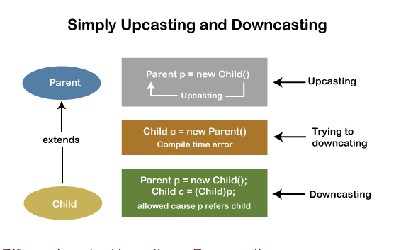

# Orientacion a  objetos

Es un paradigma de programación en el cual intentamos ___encapsular y abstraer diferentes funcionalidades de nuestro código___ de forma que podamos ___reutilizarlo___ y sea mas entedible para cualquier programador.

</br>

__Corner case__:

- Los corner case son la ruina de la programación informática. Suelen ser donde encuentras errores. Muy a menudo, en el procesamiento de un archivo, el primer y el último registro deben procesarse especialmente en algún mismo. Estos no se llamarían casos de esquina, ya que el código se ejercita cada vez que ejecuta los programas. Los casos de esquina incluirían:

  - ¿Funciona este código para la cadena vacía , nula , 0 o un conjunto de 0 elementos?
  - ¿Funciona este código para Integer . MIN_VALUE y Entero . MAX_VALOR ?
  - ¿Funciona este código si hay valores duplicados?
  - ¿Funciona este código para byte s con el bit alto activado?
  - Si el código exige puntos, ¿qué sucede si tres de los puntos son colineales?

__`Incluso los programadores famosos pueden volverse locos por los corner case.`__

## Programación orientada a objetos

Se basa en el concepto de agrupar código y datos juntos dentro de una misma unidad llamada __clase.__

Sus principales caracteristicas son:

- Abstracción
- Encapsulamiento
- Polimorfismo
- Herencia
- UML

__¿Que es un objeto?__

Representacion de un conjunto de atributos que definen alguna entidad o un tipo.

- Ejemplo: Un auto.
  - Tiene disntos tipos de atributos como marca, color, año, etc.

### Clase

- Palabra reservada de java que sirve para representar un tipo, una entidad, un objeto, representa una cosa, una abstraccion, un conjunto que va a representar una cosa.
- Una clase es el modelo a partir del cual se crean los objetos individuales
- una clase Java no es más que un molde o receta con el vas a crear un esquema del objeto que quieres instanciar.
- Un objeto es una instancia de una clase donde podemos definir valores para sus `atributos.`
- Es una plantilla,  o molde que permite construir objetos.
  - Por ejemplo, si tuvieramos un Auto, ésta sería el plano para construir el Objeto (en este caso uno o varios autos).
- Poseen atributos y métodos los cuales van a extraer lo información del mundo real.
- No pueden se utilizadas directamente (sino mediante instancias a objetos).

Dentro de una clase se definen los datos y el código que actúa sobre esos datos. El código está contenido en métodos. Debido a que las clases, los objetos y los métodos son fundamentales para Java.

</br>

__Atributo:__ En orientacion a objeto llamamos atributo a las caracteristicas de una clase.  

</br>

## 1. Abstracción

La abstracción describe el proceso mediante el cual se da forma a una entidad de la realidad tangible para ponerla en un código que maneje pautas basadas en estas características junto con funciones que representen este tipo de clases, la abstracción en concreto es representada dentro del lenguaje de programación Java por medio de atributos, métodos y clases, a través de los cuales se va a dar forma a un código determinado.

</br>

### Instancias

Las instancias son la materialización de una clase, es decir, son objetos concretos que tienen su propio estado (los valores de sus atributos) y su propio comportamiento (los métodos que pueden ejecutar)

</br>

#### Referencias

Las referencias en Java son identificadores de instancias de las clases Java. Una referencia dirige la atención a un objeto de un tipo específico.

Cuando creamos un nuevo objeto en la memoria se crea un carácter alfanumerico por así decir, y para dirigirnos hacia el usamos un identificador que en este caso es una referencia.

```java
        /*Para llamar un campo con eso decimos que separe en la memoria espacio para el 
        nuevo objeto con cosas y memoria difente. le decimos a java que es otra instancia*/
        new NombreClase();  

        //EJEMPLO

        new Cuenta();
```

Si queremos llamar un elemento

```java
        public static void main(String[] args) {
            Cuenta primeraCuenta = new Cuenta();  
            primeraCuenta.saldo = 1000;   //llamos a saldo e ingresamos un valor 

            System.out.println(primeraCuenta.saldo);  //1000.0
        }
```

Al crear un objeto o instancia con `new` automaticamente los campos se inicializan
Ejemplo:

```java
        double saldo;  // 0.0
        int agencia;  // 0
        int numero; // 0
        String titular; // null
```

</BR>

#### Métodos

Son acciones contenidas en una clase, y definen su __comportamiento.__
Son toda secuencia de pasos para realizar una cosa o alguna acción, parte del código que vamos a poder utilizar.

En java hay 2 tipos de métodos

1. Que retornan valor (`return`)
   - La palabra return se usa para devolver un valor desde un método al programa.
2. Los que no retornan valor (`void`).
   - La palabra reservada `void` de Java, se utiliza para indicar que un método no tiene return (valor de retorno).

> La sentencia ``return`` tiene dos usos importantes. Primero, fuerza una salida inmediata de la función en que se encuentra. O sea, hace que la ejecución del programa vuelva al código que llamó a la función. En segundo lugar, se puede utilizar para devolver un valor.

</br>

La sintaxis y el orden correcto para llamar a um método con Java es:

```java
        nombreDeReferencia.nombreDelMetodo();

        //ejemplo
        miCuenta.depositar();
```

- El `this` esta es una referencia, es decir, "apunta" a un objeto actual en un método o constructor. Es una palabra clave igual al `void`, `class`, `new`, `int` y varias otras

```java
        this.saldo = this.saldo + valor;
```

</br>

##### Parametros

Acción necesaria que ese método necesaria usar

- Los parámetros son variables que se utilizan para pasar información a funciones o métodos cuando son llamados.

---

## 2. Encapsulamiento

El término encapsulamiento en Java, consiste en ocultar atributos de un objeto de manera que solo se pueda cambiar mediante operaciones definidas en ese objeto.

Modifiacdores de acceso `public`, `private` ...

</br>

### Ocultación de datos en Java

Con frecuencia, la encapsulación de Java se conoce como ocultación de datos . Pero más que el ocultamiento de datos, el concepto de encapsulación está destinado a una mejor gestión o agrupación de datos relacionados.

Para lograr un menor grado de encapsulación en Java, puede usar modificadores como “protegido” o “público”. Con la encapsulación, los desarrolladores pueden cambiar una parte del código fácilmente sin afectar a los demás.

</br>

### Métodos Getter y Setter en Java

Si un miembro de datos se declara “privado”, solo se puede acceder a él dentro de la misma clase. Ninguna clase externa puede acceder al miembro de datos de esa clase. Si necesita acceder a estas variables, debe usar los métodos públicos `getter` y `setter`.

- Los métodos que permiten acceder al valor de un atributo se denominan `getters` (del verbo inglés "get", obtener) y los que fijan el valor de un atributo se denominan `setters` (del verbo inglés "set", fijar).

Los métodos de `Getter` y `Setter` se utilizan para crear, modificar, eliminar y ver los valores de las variables.

El siguiente código es un ejemplo de métodos getter y setter:

```java
      Cuenta de clase { 
          private int account_number;
          private int account_balance;     
          // método getter         
          public int getBalance () {        
            devuelve this.account_balance;    
          }    
          // método setter         
          public void setNumber (int num) {        
            this.account_number = num;    
          }
      }
```

En el ejemplo anterior, el método `getBalance ()` es el método `getter` que lee el valor de variable `account_balance` y el método `setNumber ()` es el método `setter` que establece o actualiza el valor para la variable `account_number`.

</br>

#### Abstracción vs. Encapsulación

A menudo, la encapsulación se entiende mal con Abstracción. Estudiemos-

- La encapsulación se trata más de “cómo” lograr una funcionalidad
- La abstracción se trata más de “Qué” puede hacer una clase.
Un simple ejemplo para entender esta diferencia es un teléfono móvil. Donde la lógica compleja en la placa de circuito está encapsulada en una pantalla táctil, y se proporciona la interfaz para abstraerla.

</br>

#### Ventajas de la encapsulación en Java

- La encapsulación vincula los datos con sus funcionalidades relacionadas. Aquí las funcionalidades significan “métodos” y los datos significan “variables”
- Entonces mantenemos variables y métodos en un solo lugar. Ese lugar es “clase”. La clase es la base para la encapsulación.
- Con Java Encapsulation, puede ocultar (restringir el acceso) a los miembros de datos críticos en su código, lo que mejora la seguridad
- Como mencionamos anteriormente, si un miembro de datos se declara “privado”, solo se puede acceder a él dentro de la misma clase. Ninguna clase externa puede acceder al miembro de datos (variable) de otra clase.
- Sin embargo, si necesita acceder a estas variables, debe utilizar los métodos públicos “getter” y “setter”.
  
|Con los métodos `get` y `set` nuestros atributos privados no pueden ser accesibles directamente, esto quiere decir que cuando nuestro objeto es creado no es manipulable a no ser que sea a traves de nuestros métodos ya definidos, a esto se le llama el estado consistente de un objeto|
|---|

</br>

### Contructores

- Un constructor es un método que se ejecuta de manera automática al instanciar un objeto de una clase. El constructor tiene como finalidad la incialización de las variables de la clase y posiblemente ejecutar algunos de los métodos de la clase.

Un constructor sirve para inicializar el objeto y establecer sus propiedades y valores predeterminados.
Tiene el mismo nombre que la clase y no cuenta con ningún valor de retorno, ya que su función principal es inicializar el objeto y no devolver ningún valor.

Ventaja

- El constructor te obliga a informar parámetros al momento del nacimiento del objeto
- Te fuerza a dar información para que este objeto sea creado.

#### Static

- En Java el uso de `static` indica que en lugar de pertenecer a una instancia del tipo que se acaba de declarar pertenece a un tipo en si mismo. Es decir, solo se creará una instancia de ese miembro estático el cual será compartida por todas las instancias de la clase.
- Indica que es accesible a nivel de Clase y no necesita una instancia de ella para ser usada.
- El modificador static permite acceder a las variables y métodos aunque no tengamos una instancia del objeto que los contiene.
- **Al contrario que con las variables no static, no habrá una por cada instancia de una clase, sino una para todas las instancias de la clase.**
- La palabra `static` nos dice que la variable que la usa, no es alterada por la instancia, solo con la clase.

</br>

##### Método statico

El método estático en Java es un método que pertenece a la clase y no al objeto. Un método estático solo puede acceder a datos estáticos.

- Es un método que pertenece a la clase y no al objeto (instancia)
- Un método estático solo puede acceder a datos estáticos. No puede acceder a datos no estáticos (variables de instancia)
- Un método estático puede llamar solo a otros métodos estáticos y no puede invocar un método no estático a partir de él.
- Sirven para que puedan ser accedidos desde cualquier parte del código (inclusive desde otras clases) sin tener que crear un objeto.
- Un método estático no puede hacer referencia a `this` o `super` palabras clave de todos modos

</br>

## 3. Herencia

### Herencia

La herencia es un mecanismo que permite la definición de una clase a partir de la definición de otra ya existente. La herencia permite compartir automáticamente métodos y datos entre clases, subclases y objetos.

La herencia está fuertemente ligada a la reutilización del código en la OOP. Esto es, el código de cualquiera de las clases puede ser utilizado sin más que crear una clase derivada de ella, o bien una subclase.

### Superclase y Subclases

El concepto de herencia conduce a una estructura jerárquica de clases o estructura de árbol, lo cual significa que en la OOP todas las relaciones entre clases deben ajustarse a dicha estructura.

En esta estructura jerárquica, cada clase tiene sólo una clase padre. La clase padre de cualquier clase es conocida como su superclase. La clase hija de una superclase es llamada una subclase. La palabra reservada que nos permite realizar herencia entre clases es `extends`.

- Una superclase puede tener cualquier número de subclases.
- Una subclase puede tener sólo una superclase.

#### Extends
  
- La palabra clave `extends` es usada en la declaración o expresión de clases, para crear una clase hija de otra.
- La palabra clave `extends` se puede usar para crear una subclase a partir de clases personalizadas, así como sus objetos incorporados.

```java
public class Gerente extends Funcionario{  //Gerente hereda los metodos y atributos public o protected
                                           //de la superclase o clase padre Funcionario       
}
```

</br>

### Modificadores de Acceso

Access Levels

| Modifier    | Class | Package | Subclass | World |
|-------------|-------|---------|----------|-------|
| public      | Y     | Y       | Y        | Y     |
| protected   | Y     | Y       | Y        | N     |
| no modifier | Y     | Y       | N        | N     |
| private     | Y     | N       | N        | N     |

- #### Protected

Al usar el modificador de acceso `protected`, los miembros de la clase y las clases son accesibles para otros elementos siempre que estén dentro del mismo package o, si pertenecen a otros packages, siempre que tengan una relación extendida (herencia), es decir, las clases secundarias pueden acceder a los miembros de su clase principal (o clase de abuelos, etc.).

- #### Private
  
El modificador `private` en Java es el más restrictivo de todos, básicamente cualquier elemento de una clase que sea privado puede ser accedido únicamente por la misma clase por nada más. Es decir, si por ejemplo, un atributo es privado solo puede ser accedido por lo métodos o constructores de la misma clase. Ninguna otra clase sin importar la relación que tengan podrá tener acceso a ellos.

- #### default (package private)

El modificador de acceso `default` tambien llamado package private el miembro es visible en la clase y en el package, pero es invisible fuera del package (ni siquiera para los hijos).

- #### Public

El modificador de acceso `public` es el más permisivo de todos, básicamente public es lo contrario a private en todos los aspectos (lógicamente), esto quiere decir que si un componente de una clase es public, tendremos acceso a él desde cualquier clase o instancia sin importar el paquete o procedencia de ésta.

</br>

##### Palabra reservada `super`

Se puede utilizar para acceder a variables y métodos de la clase principal(padre) desde la subclase(hija).

```java
      public double getBonificacion(){
        return super.getSalario() + super.getBonificacion();
    }


    super();  //Llama al constructor por defecto sin parametros de la clase padre(Solo si lo tiene)

```

</br>

## 4. Polimorfismo

Es la capacidad que tienen los objetos de una clase en ofrecer respuesta distinta e independiente en función de los parámetros (diferentes implementaciones) utilizados durante su invocación. Dicho de otro modo el objeto como entidad puede contener valores de diferentes tipos durante la ejecución del programa.

Hace referencia a la cualidad por la que un objeto adquiere o puede tener diferentes formas. En Java, el polimorfismo alude al modo en que se pueden crear y utilizar dos o más métodos con el mismo nombre para ejecutar funciones diferentes.

El polimorfismo permite que las referencias de tipos de clases más genericos referencian objetos más específicos.

- **Upcasting**

Upcasting es un tipo de Typecasting de objetos en el que un child object se encasilla en un objeto de parent class object. Al usar Upcasting, podemos acceder fácilmente a las variables y métodos de la parent class a una child class.

```java
      class  Parent{  
        void PrintData() {  
          System.out.println("method of parent class");  
        }  
      }  
  
      class Child extends Parent {  
        void PrintData() {  
            System.out.println("method of child class");  
        }  
      }  

      class UpcastingExample{  
        public static void main(String args[]) {  
              
            Parent obj1 = (Parent) new Child();  
            Parent obj2 = (Parent) new Child();   
            obj1.PrintData();  //method of child class
            obj2.PrintData();  //method of child class
        }  
      } 
```

- **Downcasting**
  
Downcasting es otro tipo de Typecasting de objetos.

```java
      //Parent class  
      class Parent {   
          String name;   
          
          // A method which prints the data of the parent class   
          void showMessage(){   
              System.out.println("Parent method is called");   
          }   
      }   
          
      // Child class   
      class Child extends Parent {   
          int age;   
          
          // Performing overriding  
          @Override  
          void showMessage(){   
              System.out.println("Child method is called");   
          }   
      }   
          
      public class Downcasting{  
          
          public static void main(String[] args) {   
              Parent p = new Child();  
              p.name = "Shubham";  
                
              // Performing Downcasting Implicitly   
              //Child c = new Parent(); // it gives compile-time error   
                
              // Performing Downcasting Explicitly   
              Child c = (Child)p;   
          
              c.age = 18;   
              System.out.println(c.name);   //18
              System.out.println(c.age);    //child method is called
              c.showMessage();   
          }   
      }  
```

</br>

**¿Por qué necesitamos Upcasting y Downcasting?**

En Java, rara vez usamos Upcasting . Lo usamos cuando necesitamos desarrollar un código que se ocupe solo de la clase principal. Downcasting se usa cuando necesitamos desarrollar un código que acceda a los comportamientos de la clase secundaria.



</br>

**Sobrecarga de métodos**

La sobrecarga de métodos es la creación de varios métodos con el mismo nombre pero con diferente lista de tipos de parámetros.

Java diferencia los métodos sobrecargados con base en el número y tipo de parámetros o argumentos que tiene el método y no por el tipo que devuelve.

Tambien existe la sobrecarga de constructores: Cuando en una clase existen constructores múltiples, se dice que hay sobrecarga de constructores.

```java
      Ejemplo

      /* Métodos sobrecargados */
      int calculaSuma(int x, int y, int z){
          ...
      }
      int calculaSuma(double x, double y, double z){
          ...
      }

      /* Error: estos métodos no están sobrecargados */
      int calculaSuma(int x, int y, int z){
          ...
      }
      double calculaSuma(int x, int y, int z){
          ...
      }


            Ejemplo

      /* Usuario4.java */

      class Usuario4{
          String nombre;
          int edad;
          String direccion;

          /* El constructor de la clase Usuario4 esta sobrecargado */
          Usuario4( )
          {
              nombre = null;
              edad = 0;
              direccion = null;
          }

          Usuario4(String nombre, int edad, String direccion)
          {
              this.nombre = nombre;
              this.edad = edad;
              this.direccion = direccion;
          }
      }
```

**Sobreescritura de métodos**

Una subclase hereda todos los métodos de su superclase que son accesibles a dicha subclase a menos que la subclase sobreescriba los métodos.

Una subclase sobreescribe un método de su superclase cuando define un método con las mismas características ( nombre, número y tipo de argumentos) que el método de la superclase.

Las subclases emplean la sobreescritura de métodos la mayoría de las veces para agregar o modificar la funcionalidad del método heredado de la clase padre.

El `Override` Java es una función de programación importante que permite a los programadores cambiar el comportamiento de una clase sin tener que cambiar su código original.

```java
      Ejemplo

      class ClaseA
      {
        void miMetodo(int var1, int var2)
        { ... }

        String miOtroMetodo( )
        { ... }
      }

      class ClaseB extends ClaseA
      {
        /* Estos métodos sobreescriben a los métodos 
        de la clase padre */
        @Override
        void miMetodo (int var1 ,int var2)
        { ... }

        @Override
        String miOtroMetodo( )
        { ... }
      }
```

```Java
      class Cuenta {

        public boolean retirar(double valor) {
          if (this.saldo >= valor) {
              this.saldo -= valor;
              return true;
          }
              return false;
        }

      }


      public class CuentaCorriente extends Cuenta{

        @Override
        public boolean retirar(double valor) { //sobreescribimos el metodo de la clase padre mismo nombre y parametros
             double comision = 0.2;    
            return super.retirar(valor + comision); 
        } 
      }
 ```

| Si un método esta implementado en la clase mas especifica (referencia) entonces se va a llamar a ese, y si no lo tiene sube un nivel más arriba (padre) y obtiene la respuesta de él. |
|---|

## Clase abstracta

Una clase abstracta es como un plano en el que se puede generalizar objetos del mismo, puede que en ocasiones necesitemos crear una clase padre donde únicamente coloquemos la estructura de una abstracción, una estructura muy general, dejando que las clases hijas definan los detalles.

Cuando se crea una clase abstracta con la palabra reservada `abstract` esta no se puede instanciar, simplemente va a servir como superclase a otras clases(herencia).

```Java
        //Ejemplo
        public abstract class Funcionario {

        }
```

- La clase abstracta puede o no incluir métodos abstractos.
- Se pueden crear subclases, al nosotros heredar de una clase abstracta es obligatorio implementar sus métodos abstractos, es decir debemos definir comportamiento, definir cómo se va a realizar la tarea.

## Método abstracto

Un método abstracto no es más que un método vacío, un método el cual no posee cuerpo (sin llaves y seguido de punto y coma), por ende no puede realizar ninguna acción. La utilidad de un método abstracto es definir qué se debe hacer pero no el cómo se debe hacer.

Es usado por las clases  hijas que definiran su comportamiento.

Si una clase incluye métodos abstractos, entonces la clase misma debe declararse `abstract`

</br>

_**Nota:** Es obligatorio usar y definir el método abstracto de una clase padre abstracta._

```Java
        //Ejemplo
        public abstract double getBonificacion();
```

</br>

## Interfaces

Una interface es una variante de una clase abstracta con la condición de que todos sus métodos deben ser asbtractos, puede o no usarse las palabras reservadas en los metodos aunque no es necesario, por default son abastractas (Todos los metodos son abstractas)

- No puede tener metodos implementados, no puede  tener métodos con cuerpo
- No puede tener atributos privados (No se pueden acceder a ellos porque no hay cuerpo en los métodos y es inaccesible desde otra forma del código).
- Puede emplearse también para declarar constantes que luego puedan ser utilizadas por otras clases.
- Una interfaz no puede extender de una clase, pero puede extender de otra interfaz.

Una interfaz no declara variables de intancia, no se pueden instanciar objetos del tipo interfaz, porque un interfaz no tiene constructor.

```java
            public interface Modificacion {
                // Cuerpo de la interfaz ...
                public void incremento (int a); //metodo sin cuerpo, solo dice que hacer más no como hacerlo
            } 
```

### Implementación de una interfaz en una clase

Una clase implementa una o más interfaces (separadas con comas ",") con la palabra reservada implements. Con el uso de interfaces se puede "simular" la herencia múltiple que Java no soporta.

Las cabeceras de los métodos (identificador y número y tipo de parámetros) deben aparecer en la clase tal y como aparecen en la interfaz implementada. Por ejemplo, la clase Acumulador implementa la interfaz Modificacion y por lo tanto debe declarar un método incremento:

```Java
            /**
             * Declaracion de la clase Acumulador
             */
            public class Acumulador implements Modificacion {
                private int valor;
             
                public Acumulador (int i) {
                    this.valor = i;
                }
             
                public int daValor () {
                    return this.valor;
                }
             
                public void incremento (int a) { //Metodo de la interfaz modificacion
                    this.valor += a;
                }
            }
```

Si la interface va a tener atributos, éstos deben llevar las palabras reservadas static final y con un valor inicial ya que funcionan como constantes por lo que, por convención, su nombre va en mayúsculas.

```java
              interface Nomina{

                  public static final String EMPRESA = "Patito, S. A.";
                  public void detalleDeEmpleado(Nomina obj);
              }
```

> Nota:
> La clase que implementa una interface tiene dos opciones:
>
> 1. Implementar todos los métodos de la interface.
> 2. Implementar sólo algunos de los métodos de la interface pero esa clase debe ser una clase abstracta (debe declararse con la palabra abstract).

</br>

| Interfaz                                                                             | Clase Abstracta                                               |
|:------------------------------------------------------------------------------------:|:------------------------------------------------------------:|
| Palabra clave: __implements__                                                        | Palabra clave: __extends__                                   |
| La intefaz admite herencia múltiple                                                  | La clase abstracta no admite herencia multiple               |
| Proporciona una abstracción absoluta y no se puede tener implementaciones de métodos | Puede tener métodos con implementaciones                     |
| La interfaz no contiene constructor                                                  | La clase abstracta contiene constructor                      |
| Los miembros de la interfaz no pueden ser static                                     | Solo los miembros completamente abstractos pueden ser static |

Puedes usar de parametro una interfaz (Una interfaz es como un sello, rotulo, etiqueta o un contrato, quien lo tenga tendra todos sus metodos si o si) para decir que quien tenga ese "sello" va a ejecutar en metodo.

Ejemplo:

```Java
        public class SistemaInterno { //es una  clase normal 
            
              public boolean autentica(Autenticable gerente){ // autenticable es una interfaz, el metodo llama a todo aquel que tenga autenticable aplicado,
              //todo que tenga la etiqueta autenticable podra usar el método autentica
                
              }
          }
```
