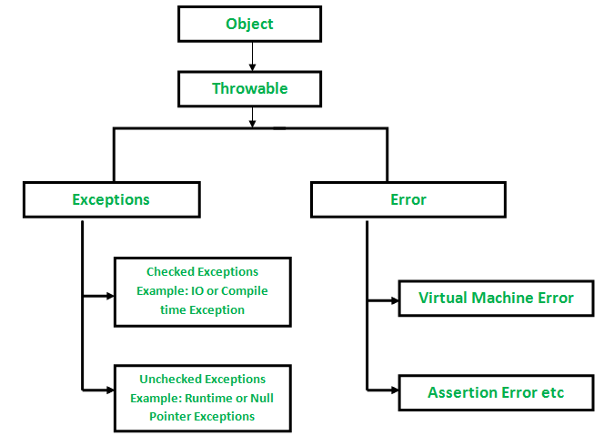

# Excepciones en Java

## Pila de ejecución (Stack)

Lugar en la memoria por decir así, donde tiene lugar todos los eventos que java va ejecutando.

Una pila de Java es parte de la JVM y almacena los métodos que se están ejecutando. Además del bloque de código, la pila almacena las variables y referencias de ese bloque. Entonces, la JVM organiza la ejecución y sabe exactamente qué método se está ejecutando, que es siempre el método en la parte superior de la pila. La JVM también sabe qué otros aún deben ejecutarse, que son precisamente los métodos que continúan.

La pila es una secuencia de elementos del mismo tipo en la que el acceso a la misma se realiza por un único lugar denominado cima:

Vemos como el acceso a los elementos de la pila se realiza siempre sobre un único extremo. Las operaciones que caracterizan la pila son las de introducir un nuevo elemento sobre la cima (push) y la de extraer el elemento situado en la cima (pop). Una forma de ver esta estructura de datos es como una pila de libros en la que sólo se puede coger el libro que está en la cima o apilar más libros sobre la misma, pero los libros que sostienen la pila no son accesibles pues de otro modo todo se desmoronaría.

¿Cómo se veria la pila de ejecucion en código?

```Java
public class Flujo {

    public static void main(String[] args) {
        System.out.println("Inicio de main");
        metodo1();
        System.out.println("Fin do main");
    }
    public static void metodo1(){  //el método es estatico porque donde llamamos este metodo es en main que es estatico, por eso necesita ser estatico.
        System.out.println("Inicio de metodo1");
        metodo2();
        System.out.println("Fin de metodo1");
    }
    public static void metodo2(){
        System.out.println("Inicio de metodo2");
        for(int i =1; i<= 5; i++){
            System.out.println(i);
        }
        System.out.println("Fin de metodo2");
    }
}

```

Salida en consola:

```txt
                    Inicio de main
                    Inicio de metodo1
                    Inicio de metodo2
                    1
                    2
                    3
                    4
                    5
                    Fin de metodo2
                    Fin de metodo1
                    Fin do main
```

**Stack** (pila): Es un conjunto de abjetos apilados uno sobre otro.

- Se utiliza para hacer filas, stacks de memoria
  - Ejemplo: el browser, cuando ves una pagina... esta se acumula una sobre otra y cuando retrocedes elimina una, y así sucesivamente.

## Excepciones

**La excepción** es un evento no deseado o esperado que ocurre durante la ejecución de un programa; es decir, en tiempo de ejecución que interrumpe el flujo normal de las instrucciones del programa.

Las excepciones en Java no son más que clases especializadas que, como su nombre indica, representan excepciones, errores o fallos que se producen en las instrucciones de nuestros programas pero, al contrario que los errores de sintaxis, estas fallas se producen en tiempo de ejecución.

Las excepciones pueden ser capturadas y manejadas por el programa.

Cuando ocurre una excepción dentro de un método, crea un objeto. Este objeto se denomina objeto de excepción. Contiene información sobre la excepción, como el nombre y la descripción de la excepción y el estado del programa cuando se produjo la excepción.

Razones principales por las que ocurre una excepción

- Entrada de usuario no válida
- Fallo del dispositivo
- Pérdida de conexión de red
- Limitaciones físicas (sin memoria de disco)
- Errores de código
- Abrir un archivo no disponible

|¿Que es un error y una eexcepcion?|
|-|
| **Error:**  Un error indica un problema grave que una aplicación razonable no debería tratar de detectar, llega inesperadamente. Son retornados por los que programan la JVM en si por decir de un modo|
| **Excepción:**  La excepción indica condiciones que una aplicación razonable podría intentar capturar. Son los tipos de errores que retornamos los que programamos sobre la JVM, lo que realizamos feactures basandonos en la JVM|

### Jerarquía de excepciones

Todos los tipos de excepciones y errores son subclases de la clase `Throwable` , que es la clase base de la jerarquía. Una rama está encabezada por **Exception**. Esta clase se utiliza para condiciones excepcionales que los programas de usuario deben detectar. NullPointerException es un ejemplo de tal excepción. Otra rama, **Error**, es utilizada por el sistema de tiempo de ejecución de Java ( JVM ) para indicar errores que tienen que ver con el propio entorno de tiempo de ejecución (JRE). StackOverflowError es un ejemplo de este tipo de error.



### Tipos de excepciones

Java define varios tipos de excepciones que se relacionan con sus diversas bibliotecas de clases. Java también permite a los usuarios definir sus propias excepciones.

Las excepciones se pueden categorizar de dos maneras:

1. Excepciones integradas
   - Excepción marcada (Verificadas)
Las excepciones verificadas se denominan excepciones en tiempo de compilación porque el compilador verifica estas excepciones en tiempo de compilación.
   - Excepción no verificada
El compilador no verificará estas excepciones en tiempo de compilación. En palabras simples, si un programa arroja una excepción no verificada, e incluso si no la manejamos ni la declaramos, el programa no generaría un error de compilación.
1. Excepciones definidas por el usuari0

- La palabra clave **`throw`** en Java se usa para lanzar explícitamente una excepción de un método o cualquier bloque de código. Podemos lanzar una excepción marcada o no marcada .
- La palabra clave `throw` se usa principalmente para lanzar excepciones personalizadas.

</br>

#### Unchecked y checked

Repasando lo visto:
`Throwable` tiene 2 grupos de errores que son `Error` y `Exception`
Los *Errores* son lanzados por los programadores  que mantienen la maquina virtual de Java (JVM).
Las *Excepciones* son lanzados por nosotros que trabajamos sobre la JVM
Dentro de el grupo de Excepciones tenemos 2 subgrupos, las excepciones `checked` y las excepciones `unchecked`.

</br>

 **Unchecked** (No verificado)

- No son verificadas por el compilador
- Que este extendida de la clase `RuntimeException`

 **Checked** (Verificado)

- Son verificadas en el tiempo de hacer la compilacion, el compilador nos va a obligar a tratar esa excepcion si es que es lanzada en alguna parte del código si no no compila nuestro programa; osea, que el compilador no nos va a dejar seguir adelante y nisiquiera va a generar el byte code y  tenemos que tratar esa excepcion
  - Ejemplo: que este extendida de la calse `Exception`

</br>

### Modo debug

Es la ejecución de nuestro sistema que cuando encuentra un Break point (Punto de quiebre) el va a parar y nos va a mostrar todo lo que hay en la memoria en ese momento.

## Entendiendo excepciones

**Null**: La palabra reservada null indica que una variable que referencia a un objeto se encuentra "sin objeto", es decir, la variable ha sido declarada pero no apunta a ningún objeto. null no es un objeto ni un tipo.

Por decirlo de otro modo representa que no tiene lugar en la memoria, que no existe.

- La excepciones también son objetos, que tiene su nombre y mensaje.
- El objetivo basico de la excepcion es explicar un error que ha ocurrido

Para saber que hacer cuando da un error o una excepcion es saber entender que dice, en el caso de las excepciones en java hay que tener en cuenta como esta estructurada:

1. Nombre de la excepcion(que excepcion mando)
2. Mensaje (Algunos dicen que ocurrió)
3. El stack trace (la traza de la pila), cuando la pila fue recorriendo y dejo los logs prácticamente

Las excepciones no controladas caen en la pila de ejecución en busca de alguien que pueda manejarlas.
</br>

> Para avisar a Java sobre que va a haber un error hay palabras reservadas para ello, `try` y `catch`

### `Try` (Intenta) y `catch` (atrapa)

</br>

```Java
        try {

          //Lo que va a intentar resolver   
    
        } catch (nombreDeLaExcepcion varExcepion) {  //le decimos el error (las excepciones son objetos)

            //lo que va a hacer sino lo puede resolver 
            
        }


       Ejemplo

        try {  // Con Try le decimos a java, que puede que haya una exceocion y le dice intenta esto
                int num = 0;
                int resultado = i/num;   //Creacion de una excepcion
                System.out.println(resultado);

        } catch (ArithmeticException exception) {  //Atrapa el error
                System.out.println(exception.getMessage()); //Imprime el mensaje que dio eso excepcion
                exception.printStackTrace(System.out);  //Saber por donde paso esa excepcion, imprime toda la pila por la que paso

        }
```

Un **`try` no puede exixstir si no hay un `catch`**

En Java es posible a través de un | (pipe) capturar múltiples excepciones en una cláusula `catch`, podemos tener un solo bloque para manejar una o más excepciones.

```Java
 catch (ArithmeticException | NullPointerException exception) {  
                System.out.println("Atrapo Exception");
                System.out.println(exception.getMessage());
                exception.printStackTrace(System.out);  
            }
```

La sintaxis `catch (ArithmeticException | NullPointerException exception)` permite capturar tanto la excepción `ArithmeticException` como la excepción `NullPointerException`, y ejecutar un bloque de código común para ambas excepciones.

Es importante destacar que este enfoque puede ser útil cuando se desea manejar múltiples excepciones de manera similar, pero también es importante tener en cuenta que las excepciones capturadas deben ser relacionadas de alguna manera. No todas las combinaciones de excepciones son válidas para utilizar en una multicaptura.

</br>

El proposito del control de errores es evitar que el stack se caiga

- Si no se trata la excepcion, cambia el flujo de la ejecución del programa y finalizandolo de forma abrutamente
- Con el bloque `try` y `catch`, manejamos una excepción que puede ocurrir mientras nuestro programa se está ejecutando, tratándolo de antemano con un código específico.

### Lanzando excepciones

#### Throw  (lanza)

La palabra reservada `throw` se utiliza para lanzar explícitamente una excepción. En primer lugar se debe obtener un descriptor de un objeto Throwable, bien mediante un parámetro en una cláusula catch o, se puede crear utilizando el operador new.

El `throw` es como decir aquí explotas con lo que tenias y lo que viene despues de esta linea de código no va a ser ejecutada, el códogo deja de ejecutarse abrutuamente, va a ser completamente ignorada. Solo podemos hacer `Throw` de objetos que son excepciones

```Java
        throw new ArithmeticException(mensaje);   //lanzamos el objeto que es la excepcion
        
        
        ////ejemplo////
        throw new ArithmeticException("Aqui ocurrio un error");

```

##### Memoria Stack y memoria Heap en Java

Los programadores ya saben que un programa usa la memoria RAM para almacenar la información (del programa) mientras se está ejecutando. Al interior de Java existen dos clasificaciones para almacenar los valores del programa, estas son conocidas como memoria `Stack` y memoria `Heap`.

1. La memoria `Stack` se usa para almacenar las variables locales (cuyo ámbito de acción está limitada solo a la función donde se declaró) y también las llamadas de funciones en Java. Las variables almacenadas en esta memoria por lo general tienen un periodo de vida corto, viven hasta que  terminen la función o método en el que se están ejecutando.

2. Por otro lado, la memoria ``Heap`` es utilizada para almacenar los objetos (incluyendo sus atributos), los objetos almacenados en este espacio de memoria normalmente tienen un tiempo de duración más prolongado que los almacenados en Stack.

```java
        Automovil auto01 = new Automovil();
        int var01 = 50;
        String var02 = "";
```


##### Serializacion en Java

Veamos la serialización de objetos en java, es decir, convertirlos en bytes y recuperarlos luego.

- Para que un programa java pueda convertir un objeto en un montón de bytes y pueda luego recuperarlo, el objeto necesita ser **Serializable**. Al poder convertir el objeto a bytes, ese objeto se puede enviar a través de red, guardarlo en un fichero, y después reconstruirlo al otra lado de la red, leerlo del fichero,...
  
Para que un objeto sea serializable basta con que implemente la interfaz Serializable. Como la interfaz Serializable no tiene métodos, es muy sencillo implementarla, basta con un implements Serializable y nada más. Por ejemplo, la clase Datos siguiente es Serializable y java sabe perfectamente enviarla o recibirla por red, a través de socket o de rmi. También java sabe escribirla en un fichero o reconstruirla a partir del fichero.

Para sabeer mas sobre [serializacion.](https://chuidiang.org/index.php?title=Serializaci%C3%B3n_de_objetos_en_java&redirect=no#:~:text=Para%20que%20un%20programa%20java,del%20fichero%2C....)

___
Cosas vistas hasta ahora:

- Tenemos el stack
- En el stack tenemos los método
- Los métodos pueden lanzar excepciones
- Yo consigo tratar esas excepciones con `try` y `catch`
- Consigo lanzar mis propias ecepciones con `throw`
- Puedo crear mis propias excepciones
- No puedo extenderlas directamente de throwable porque throwable divide entre dos grandes grupos que son `Exception` y `Error`

___

#### throw y throws

Una excepcion que hemos creada propiamente y que extiende de `RunTimeException` , estamos diciendo que puede lance ese tipo de excepcion o puede que no y utilizamos el `try` `catch`

```Java
    try {
            metodo1();
        } catch (MiExcepcion e) {
            e.printStackTrace(System.out);
        }
        System.out.println("Fin do main");
```

Una excepcion que creamos y que extiende de `Exception` estamos diciendo que el va a lanzar esa excepción y decimos explicitamente al metodo que lo haga usando `throws`

```Java
        public static void metodo2() throws MiExcepcion, otraExcepcion { //decir explicitamente en la firma del método que lance mi excepcion
        
        throw new MiExcepcion("Mi excepcion fue lanzada");   //lanzamos el objeto que es la exception
        }
```

### Java `Finally`

Palabra reservada de  java que complementa al `try` `catch` y es la que asegura siempre el cierre de los recursos y se ejecuta ocurra lo que ocurra en el programa.

El bloque finally es normalmente utilizado para cerrar un recurso como conexión o transacción.

```Java
        package com.arquitecturajava;
         
        public class Principal3 {
         
            public static void main(String[] args) {
         
                int a =5;
                int b=0;
         
                try {  //evalua si causa exception
                    int resultado=a/b;
         
                    System.out.println(resultado);
                } catch (Exception e) {  //captura la exception
                    System.out.println("la aplicacion fallo");
                    throw new NullPointerException();  //lanza la exception
                }finally {  //ejecuta el cierre del programa o lo que queramos que ejecute si hay o no error
                    System.out.println("se cierran los recursos"); 
         
                }
         
                System.out.println("la aplicacion finalizado");
         
            }
         
        }
```

- Un `try` no puede vivir solo, un `try` puede vivir con `finally`, tambien un `try` con un `catch`.

</br>

### `Try` with resources

Con esta estructura, inicializa un objeto pero este objeto tiene que impletar la intefaz `AutoCloseable` que implemtenta obligatoriamente el método close, ¿porque? Porque con ese método close al finalizar la ejecucion automaticamente va a llamar a ese método y va a cerrar la conexión

Hay objetos que necesitamos cierta lógica en el momento que ya no vamos a seguir utilizandolos estos reciben el nombre de recursos, cuando un recurso ya no va a ser mas utilizado necesitamos cerrarlo, ahí es donde `try` resources nos va ayudar para ajecutar el metodo de cierre de ese recurso.

```Java
        ///Ejemplo///
public class Conexion implements AutoCloseable{

    public Conexion() {
        System.out.println("Abriendo conexion");

    }

    public void leerDatos() {
        System.out.println("Recibiendo datos");
        throw new IllegalStateException();
    }

    public void cerrar() {
        System.out.println("Cerrando conexion");
    }

    @Override
    public void close() throws Exception {
        cerrar();
    }
}

////

public class TestConexion {

    public static void main(String[] args) throws Exception {
        try (Conexion con = new Conexion()){  //recursos
            con.leerDatos();
        } catch (IllegalStateException ex){
            System.out.println("Ejecutando catch");
            ex.printStackTrace();
        }
    }
}
```

```txt
///salida datos//

        Abriendo conexion
        Recibiendo datos
        Cerrando conexion
        Ejecutando catch
        java.lang.IllegalStateException
            at Conexion.leerDatos(Conexion.java:10)
            at TestConexion.main(TestConexion.java:6)
```

</br>

#### ¿Qué se garantiza cuando usamos try-with-resources?

El recurso necesita implementar el método close().
El bloque finally se crea automáticamente.

- Se crea automáticamente un bloque finally. En él se llama al método `close()` del recurso.

</br>

#### ¿Cuáles son las palabras claves relacionadas con las excepciones?

1. `throw`
2. `finally`
3. `catch`
4. `throws`
5. `try`

#### Recursividad

Resumiendolo mucho podemos decir que la recursividad en programación Java es la capacidad de crear funciones que llamen a otras funciones. De esta manera se evita el uso de bucles u otros iteradores. Una tecnica que permite crear instrucciones que se repitan "n" número de veces, permite usar el uso de estructuras de datos repetitivas

___

## ¿Que aprendimos?

- Existe una gran jerarquía de clases que representan excepciones. Por ejemplo, ArithmeticException es hija de RuntimeException, que hereda de Exception, que a su vez es hija de la clase de excepciones más ancestral, Throwable. Conocer bien esta jerarquía significa saber cómo usar las excepciones en su aplicación.
- Throwable es la clase que debe extenderse para poder lanzar un objeto en la pila (usando la palabra reservada throw)
- Es en la clase Throwable donde tenemos casi todo el código relacionado con las excepciones, incluyendo getMessage() e printStackTrace (). El resto de la jerarquía tiene solo algunas sobrecargas de constructores para comunicar mensajes específicos.
- La jerarquía que comenzó con la clase Throwable se divide en excepciones y errores. Las excepciones se utilizan en los códigos de aplicación. Los errores son utilizados exclusivamente por la máquina virtual.
- Las clases que heredan de Error se utilizan para informar errores en la máquina virtual. Los desarrolladores de aplicaciones no deben crear errores que hereden de Error.
- StackOverflowError es un error de máquina virtual para informar que la pila de ejecución no tiene más memoria.
- Las excepciones se dividen en dos categorías amplias: las que el compilador comprueba obligatoriamente y las que no.
- Los primeros se denominan checked y se crean por pertenecer a una jerarquía que no pasa RuntimeException.
- Los segundos están unchecked y se crean como descendientes de RuntimeException.
- Que existe un bloque `finally`, útil para cerrar recursos (como conexión)
- Cuando hay un bloque `finally`, el bloque de catch es opcional
- Que el bloque `finally` se ejecuta siempre, sin o con excepción
  
___

>Todo lo que sea control de errores y validaciones, por buenas practicas va al inicio del método.

</br>

Aplicaciones distribuidas

Un conjunto de aplicaciones que interactuan entre si para satisfacer las necesidades de negocio de una misma empresa por ejemplo
Varios proyectos que se comunican entre sí

</br>

### Excepciones más frecuentes

- **java.lang.NullPointerException** = Hacer referencia a null(algo que no existe)
- **java.lang.ArithmeticException: / by zero** = Dividir entre 0, la mayoria de lenguuajes no se pueden dividir entre 0.
- **java.lang.IllegalStateException** = Cuando la conexion no fue exitosa (la conexion quedo abierta)
- **NegativeArraySizeException** = Intento de creación de un vector con un número negativo de elementos
- **ArrayIndexOutOfSizeException** = Intento de acceso a un elemento de un vector fuera de rango
- **SecurityException** Error de seguridad en los navegadores
- **IllegalArgumentException** = Indica que un método ha sido invocado en un momento ilegal o inapropiado. En otras palabras, el entorno Java o la aplicación Java no se encuentra en un estado adecuado para la operación solicitada.

```Java
        if(agencia < 1) {
            throw new IllegalArgumentException("Agencia inválida");
        }
```

- **IllegalArgumentException** = Lanzado para indicar que a un método se le ha pasado un argumento ilegal o inapropiado. (Por ejemplo cuando ingresan un número negativo)

ERRORES

- **StackOverflowError** = es un error de la máquina virtual para informar que la pila de ejecución no tiene más memoria.

</br>

Sobre [RuntimeException](https://docs.oracle.com/en/java/javase/19/docs/api/java.base/java/lang/RuntimeException.html)

Sobre  [Clase Exception](https://docs.oracle.com/en/java/javase/19/docs/api/java.base/java/lang/Exception.html)
