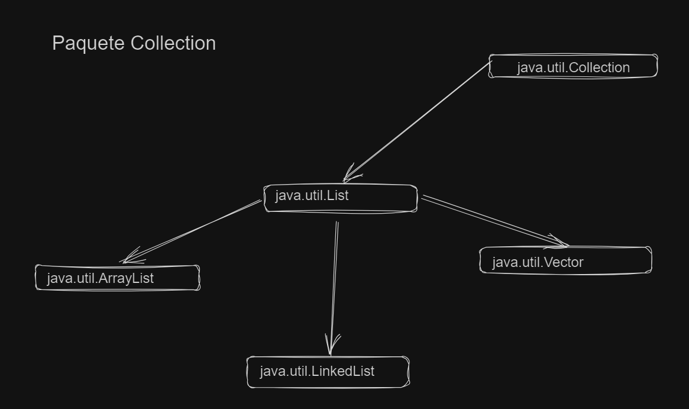
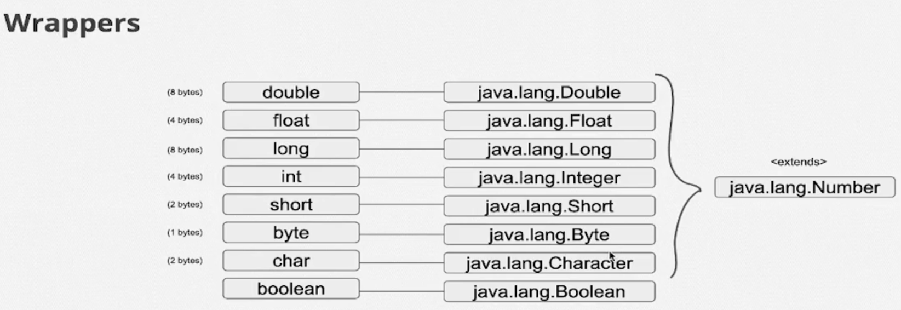
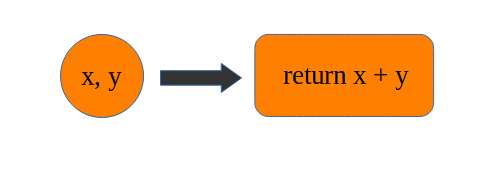

# Java y java.util: Colecciones, Wrappers y Lambda expressions

Estructuras de datos, arreglos de datos, agrupacion

- Wrappers

Objetos que engloban otros objetos para aplicar encapsulamiento y esconder los atributos propias de cada objeto

- Lambda expression

Es un tipo de funcion que se ejecutan en un contexto separado

## java.lang

Donde estan las principales clases de java como la clase `Object`, la clase `String`

## java-io

Clases para leer archivos, string de datos (nivel intermedio)

## java.util

Utilitarios, estructuras de datos, son objetos que nos van a simplificar la vida para realizar diferentes operaciones

---

## Arreglos (Array)

Es una estructura de datos utilizada para almacenar datos del mismo tipo (Ejem: Valores primitivos o referencias). Los arreglos almacenan sus elementos en ubicaciones de memoria contiguas
Los array usan corchetes `[]` sintaticamente, tienen un tamaño fijo.

En Java los arreglos son objetos. Todos los métodos pueden ser invocados

```Java
        String[] nombres = new String[5]; //llamarlo asi indicando el tamaño del string

```

Los arrays en Java se enumeran desde elemento 0, que sería el primer elemento, hasta el tamaño -1 que sería el último elemento, Es decir, si tenemos un array de diez elementos, el primer elemento sería el cero y el último elemento sería el nueve.

```Java
        int[] intArray = {2,5,46,12,34}; //Forma para inicializar un array definiendo sus valores
```

### Indice

El índice es la posición que tiene cada sección de mi "caja", los índices cominzan con 0

```Java
        int[] numeros = new int[5]; //especificamos el tamaño del array
        numeros[2] = 30;  //Indicamos con el indice en que posicion colocar el numero 30 
```

- Las matrices tienen un atributo  `.lenght` para conocer la cantidad de espacios que tenemos en el array

```Java
        .lenght // con este metodo conocemos la cantidad de espacios en nuestro array

        ///Ejemplo///

        int longitud = numeros.lenght;
        System.out.println(longitud); ///salida: 5
```

</br>

### Type cast

El cast explícito solo funciona si es posible, pero hay casos en los que el compilador sabe que un cast es imposible y luego ni compila ni con type cast.

```Java
        Cliente cliente = new Cliente();
        Cuenta cuenta = (Cuenta) cliente; // imposible, no compila ya que Cliente no estiende ni implemete Cuenta
```

ejemplo: `Designer` y `Gerente` extienden de Funcionario

```Java
        Funcionario[] referencias = new Funcionario[5]; //Array de funcionario llamado referencias

        referencias[0] = new Designer(); //en la posicion 0 guardamos la referencia de Designer 
        referencias[1] = new Gerente();  //En la posicion 1 guardamos la referencia de Gerente
        
        Designer designer = (Designer) referencias[0]; //Casteamos porque esta guardado en un array Funcionario y es un designer
        Gerente gerente = (Gerente) referencias[1]; //Casteamos porque esta guardado en un array Funcionario y es un Gerente
```

</br>

#### `ClassCastException`

Cuando falla el `type cast`, podemos recibir un ClassCastException.

- Lanzado para indicar que el código ha intentado convertir un objeto en una subclase de la que no es una instancia.

</br>

> [Consejo]
> Puedes crear métodos para agregar u obtener valores de un array (referencias si hablamos de objetos), auque hay otro tipo de arrays que ya los tienen, los `ArrayList`. Puedes hacerlo mediante una clase

```Java

        //////Ejemplo//////
        private Cuenta[] referencias;
        private int posicionLibre = 0;
            
    
        public GuardadorCuentas(){  //tambien podria ser GuardarObjetos
            this.referencias = new Cuenta[10];
        }
    
        public void adicionar(Cuenta ref) {  //de argumento //Object ref
            referencias[this.posicionLibre] = ref;
            posicionLibre++;
    
        }
    
        public int getCantidadElementos() {
            return this.posicionLibre;
        }

        //con el tipo de retorno obtenemos lo que queremos retornar
        public Cuenta getRerencia(int pos) { //que retorne Object en de que qeuramos otro tipo
        return this.referencias[pos];
        }
```

## Java.util.List (Interface List)

### ArrayList

Es una clase de array de tamaño ampliable, que se puede agregar y eliminar elementos a diferencia de un array tradicional, se puede decir que es un conjunto de objetos agrupados en un objeto mayor. Es realmente un guardador de referencias y usa un array internamente pero sin preocuparse por los detalles y limitaciones, el único límite es la memoria de la JVM.

`java.util.ArrayList` encapsula el uso de array y ofrece varios métodos de alto nivel.

</br>

Si la tratamos como objeto, se inicializa asi:

```Java
            ArrayList array list = new ArrayList();//Creamos el objeto de un ArrayList
            
            ArrayList array list = new ArrayList(capacidad); //metodo sobrecargado que sirve para señalar el tamaño del array
            
```

</br>

**Lista a partir de otra**.

Otra forma de inicializar una lista es basada en otra que es muy común en el día a día. Para esto, ArrayList tiene un constructor más que recibe la lista base:

```Java
        ArrayList lista = new ArrayList(26); //capacidad inicial
        lista.add("RJ");
        lista.add("SP");
        //otros estados
        ArrayList nueva = new ArrayList(lista); //creando basada en la primera lista
```

</br>

Forzamos a ser de un tipo (usando generics con el operador diamond `<>`):

```Java
        // <> Forzando a que solo acepte un tipo de objeto
        ArrayList<String> string = new ArrayList<String>(); //ArrayList de tipo String
        ArrayList<Integer> string = new ArrayList<Integer>(); //ArrayList de tipo Integer

```

</br>

- Métodos que podemos utilizar:

```java
        .add(Elemento) //Para agregar un elemento a nuestro ArraList
        .add(Indice, Elemento) //Para agregar un elemento a nuestro ArraList

        .get (indice) //Se utiliza para obtener un elemento del ArrayList

        .set(indice,valor)  //Cambiar el valor de un elemento
        
        .size() //Retorna el tamaño de elementos de la Lista (diferente de .lenght que es cantidad de espacios del array aunque sea null y no se cuantos estan llenos)

        .remove(indice)  // elimina la referencia del array deacuerdo al indice dado
        .remove(elemento)  //Elimina la referencia del array deacuerdo al elemento dado
        .isEmpty() //saber si la lista esta vacia, devuelve un boolean
        
        .contains(objeto) /*saber si una lista contiene un elemento, retorna un boolean 
        (si es un objetos compara la referencia pero no la informacion que esta dentro de la referencia,
        si queremos comparar la informacion tenemos que sobreescribir .equals )*/

        @Override
        .equals(Object obj) /*Metodo que internamente usa el metodo contains `return obj == object` devuelve un boolean 
        La implementación estándar compara las referencias y es usado por listas.
        Sobreescribir para permitir comparar la informacion de la referencia con nuestro propio return*/

        //EJEMPLO//
        @Override
        public boolean equals(Object obj) {
        Cuenta cuenta = (Cuenta) obj;
        return this.agencia == cuenta.getAgencia() && this.numero == cuenta.getNumero();
        }

         
```

</br>

### LinkedList (Lista anexada)

Es una estructura de datos de listas anexadas el cual cada nodo tiene referencias a su proximo elemento, **no es un array** pero si es una lista. Un conjunto de objetos en el que cada uno tiene referencias al siguiente nodo (conjunto de objetos) y al nodo anterior

El beneficio principal es que puedo utilizar operaciones de remover elementos o insertar elementos en un especifico orden sin necesidad de recorrer toda la lista

Si tienes muchas operaciones de recorrer toda la lista completa, de imprimir todos los elementos de la lista en todo momento ahí tiene un costo de performance ya que al iterar cada elemento pregunta por su referencia cercana, este lado LinkedList no es recomendada

---

- Comparación entre Arrays y ArrayLists en Java

| ARRAYS                                                                                              | ARRAYLIST                                                                                                                 |
|-----------------------------------------------------------------------------------------------------|---------------------------------------------------------------------------------------------------------------------------|
| Tamaño fijo: útil cuando se conoce el número exacto de elementos.                                   | Tamaño dinámico: útil cuando se desconoce el número exacto de elementos o cuando se requiere cambiar el tamaño.           |
| Rendimiento ligeramente mejor debido a la falta de métodos adicionales y administración de memoria. | Rendimiento ligeramente inferior en comparación con los arrays debido a la administración adicional de memoria y métodos. |
| Puede contener tipos de datos primitivos.                                                           | No puede contener tipos de datos primitivos directamente (utilizar clases envolventes como Integer, Double, etc.).        |

</br>

Si requerimos una estructura de datos de tamaño fijo y un rendimiento óptimo, los arrays pueden ser una opción adecuada.

Sin embargo, si necesitamos una estructura de datos más flexible que pueda cambiar de tamaño dinámicamente, las ArrayLists serán una mejor opción.

</br>

### Vector (ya no se usa dificil ver este metodo)

Practicamente hace lo mismo que cualquier lista ya que implelmenta la interface Lista y tiene los mismos métodos, pero el Vector es un ArrayList `Thread safe` (que 2 pilas de ejecucion pueden escribir en el pero el vector las enfila en una, primero unsa y después en otra), El es un unico objeto para todas las pilas de ejecucion

Ya no se usa por el hecho de ser **thread safe** tiene mucho impacto con el performance



</br>

### Generics

Permiten establecer restricciones a nivel de tipo, haciendo que ciertas clases, interfaces o metodos acepten unicamente los tipos estipulados.

Con Java Generics, podemos poner una limitación en los datos que se pueden ingresar en las estructuras de datos.

Cuando se trata con jerarquías los genéricos son invariantes, esto es, dado un Tipo1 subtipo de otro Tipo2, para los genéricos, ``List<Tipo1>`` no es considerado como subtipo ni un supertipo de ``List<Tipo2>`` excepto en el caso trivial de que A y B sean idénticos

Las comprobaciones se realizan en tiempo de compilación, por lo que la compilación fallará si los datos que intentamos ingresar en una estructura de datos no coinciden.

```Java

        ///Clase generica///
        List<String> listOfStrings = new ArrayList<String>();
        listOfStrings.add("HelloJava");
        String message = listOfStrings.get(0);
```

Creación de su propia clase genérica:
Puede crear su propia clase genérica, de modo que otros desarrolladores puedan usar su API de forma genérica.
Ejemplo:

```Java
        public class Color<T>{
            private T t;
        
            public void set(T t){
                this.t = t;
            }
            public T get(){
                return t;
            }
        }
```

`T` en el ejemplo anterior se refiere a un tipo genérico. Así que podemos crear códigos de color enteros o códigos de color de cadena.
Ejemplo:

```Java
        Color<String> color  = new Color<String>();
        Color<Integer> colorInt = new Color<Integer>();
```

</br>

**Tipos acotados**: especificar que tipo es nuestra clase generica `T` (por convencion es la letra `T` pero puede ser culquier otro nombre)

- En este caso es que si o si extiendan de number:

```Java
/*Especificamos que tipo es nuestra clase generica T,
en este caso es que si o si extiendan de number*/
public class Generic<T extends Number> { }

public class Generic<TIPO extends Number> { } //La especificacion del generic puede escribirse lo que sea


```

- Podemos usar el generic de atributo o como parametro al igual de que podemos agregar mas generics a usar y hasta retornar.

```Java
public class Generic<TIPO extends Number> { //para mencionar especificar el tipo de generic

    private final TIPO tipoObjeto; //como atributo

    public Generic(TIPO tipoObjeto) { //en el constructor
        this.tipoObjeto = tipoObjeto;
    }

    //en la clase usar generico o mas, retornando segundo
    public <TIPO, SEGUNDO> SEGUNDO mostrar (TIPO tipoObjeto, SEGUNDO tipoObj) { 
            System.out.println("Esta es la clase del generico " + tipoObjeto.getClass().getName());
            return tipoObj;
        }
}
```

</br>
</br>

#### Primitivos

```Java
        List<Integer> lista = new ArrayList<Integer>();
```

</br>

#### Autoboxing y Auto-unboxing

El autoboxing/unboxing simplifica y agiliza en gran medida el código que debe convertir los tipos primitivos en objetos, y viceversa. Debido a que tales situaciones se encuentran con frecuencia en el código de Java, los beneficios del autoboxing/unboxing afectan a casi todos los programadores de Java.

- El proceso de encapsular un valor dentro de un objeto se llama **boxing**
- El proceso de extraer un valor de un contenedor de tipo se denomina **unboxing**.

</br>

#### **Wrappers:**

Las clases Wrapper en Java o envoltorio permiten envolver un tipo de dato primitivo para tratarlo como si fuera objeto. (Integer, Double...)

- ¡Son clases que contienen funcionalidades y encapsulan la variable de tipo primitivo!

Creamos objetos de esas clases para envolver o envolver un valor primitivo



</br>

**AutoBoxing:**
Autoboxing es el proceso por el cual un tipo primitivo es automáticamente encapsulado (boxed) en su envoltura (wrapper) de tipo equivalente cuando se necesita un objeto de ese tipo. No hay necesidad de obtener explícitamente un objeto

```java
        class AutoboxingExample1{

           public static void myMethod(Integer num){
                System.out.println(num);
           }

           public static void main(String[] args) {
               /* passed int (primitive type), it would be 
                * converted to Integer object at Runtime
                */
                myMethod(2);
           }
        }


        Integer inum = 3; //Assigning int to Integer: Autoboxing
        Long lnum = 32L; //Assigning long to Long: Autoboxing


        ArrayList<Integer> arrayList = new ArrayList<Integer>();
        arrayList.add(11); //Autoboxing - int primitive to Integer
        arrayList.add(22); //Autoboxing
```

</br>

**Unboxing**
El Auto-unboxing es el proceso por el cual el valor de un objeto encapsulado se extrae automáticamente (desencapsula) de una envoltura de tipo cuando se necesita su valor.

```Java

        class UnboxingExample1{
           public static void myMethod(int num){
                System.out.println(num);
           }
        
           public static void main(String[] args) {
        
                Integer inum = new Integer(100);
        
                /* passed Integer wrapper class object, it 
                 * would be converted to int primitive type 
                 * at Runtime
                 */
                myMethod(inum);
            }
        }

```

- Métodos

```Java
        nameWrapper.valueOf(valor) //metodo para crear un nuevo dato primitivo
        nameVariableWrapper.byteValue(); //conveertir un valor a byte (ejemp: int a byte)
        nameVariableWrapper.doubleValue();//conveertir un valor a double (ejemp: int a double)
        nameVariableWrapper.floatValue();//conveertir un valor a float (ejemp: int a float)

        /////ejemplo/////
        Integer numeroObjeto = Integer.valueOf(40); //crear un integer que almacena un int

        byte byteInteger = numeroObjeto.byteValue();
        double doubleInteger = numeroObjeto.doubleValue();
        float floatInteger = numeroObjeto.floatValue();

        
        .SIZE //El tamaño de bits
        .MAX_VALUE //Numero maximo que soporta
        .MIN_VALUE //Numero minimo que soporta
        .BYTES //TAMAÑO EN bytes

```

</br>

**Intefaz `Comparator <T>`**

Interfaz que nos ayuda a comparar reescribiendo su metodo `.compare(T o1, T o2)` y junto con el metodo `.sort()` ordenar una lista.

La interfaz Comparator  `Comparator <? extend T> c` se  puede entender así, "Comparator cualquier clase hija de T", y hay que crear una clase que la implemente.

```Java
//////Interfaz  Comparator<T>  (dentro del generic la clase como parametro para comparar)///// 
        .compare(T o1, T o2)

        ///EJEMPLO para reordenar cuentas con numeros de cuenta///
        //creamos una cuenta que implemente Comparator
        class OrdenadorPorNumeroCuenta implements Comparator<Cuenta>{
        
            //sobreescribimos su metodo compare()
            @Override
            public int compare(Cuenta o1, Cuenta o2) {
            //////Forma Basica//////
            if (o1.getNumero() == o2.getNumero()) {
                return 0;
            } else if (o1.getNumero() > o2.getNumero()){
                return 1;
            } else {
                return -1;
              }
            //////Forma intermedia//////
            return o1.getNumero() - o2.getNumero(); //si son iguales se van a restar retur 0, si o1 es mayor retorba 1, sino retorna negativo (-1)
            /////Forma Wrapper//////
            return Integer.compare(o1.getNumero(), o2.getNumero());
    }
        }


        public static void main(String[] args) {
            Cuenta cc1 = new CuentaCorriente(22,33);
            cc1.depositar(333.0);
        
            Cuenta cc2 = new CuentaAhorros(22,44);
            cc2.depositar(444.0);
        
            Cuenta cc3 = new CuentaCorriente(22,11);
            cc3.depositar(111.0);
        
            Cuenta cc4 = new CuentaAhorros(22,22);
            cc4.depositar(222.0);
        
            List<Cuenta> lista = new ArrayList<>();
            lista.add(cc1);
            lista.add(cc2);
            lista.add(cc3);
            lista.add(cc4);        
        
            System.out.println("Antes de ordenar"); //Antes de ordenar
            for (Cuenta cuenta : lista){
                System.out.println(cuenta);
            }

            Comparator<Cuenta> comparator = new OrdenadorPorNumeroCuenta();
            lista.sort(comparator); //ordenar
            //lista.sort(new OrdenadorPorNumeroCuenta())            


            System.out.println("Despues de ordenar"); // Despues de ordenar
            for (Cuenta cuenta : lista){
                System.out.println(cuenta);
            }
        }

            ///Salida//
            /*
            Antes de ordenar
            Numero: 33 Agencia: 22
            Numero: 44 Agencia: 22
            Numero: 11 Agencia: 22
            Numero: 22 Agencia: 22
            Despues de ordenar
            Numero: 11 Agencia: 22
            Numero: 22 Agencia: 22
            Numero: 33 Agencia: 22
            Numero: 44 Agencia: 22
            
            */
        

        //metodo para comparary ordenar alfabeticamente por nombre que utiliza el metodo compareTo()//
        .compareTo(String OtroString)
        

        //sobrescribimos el metodo compare() de la intefaz Comparator<T>
        @Override
        public int compare(Cuenta o1, Cuenta o2) {
        return o1.getTitular().getNombre().compareTo(o2.getTitular().getNombre());
        }    

        //en el main utilizamos el metodo sort() que recibe de parameetro el nombre de la clase que implemento la interfaz
        lista.sort(comparatorNombre); //ordenar alfabeticamente
        

```

</br>

> Nota (Pregunta de certificacion)
> `@FuncionalInterface`
>
>Son aquellas que tienen un solo método que tienen para implementar.

</br>
</br>

#### Ordenaar listas en versiones antiguas de java 1.8 (1.7, 1.6..)

</br>

En sistemas bancarios aun manejan versiones antiguas de Java

- A través de la interfaz `Comparable` (orden natural)

- Clase `Collecttions` (es una fachada con varios métodos auxiliares para trabajar con colecciones, principalmente listas) de java.util para usar el método `sort()`

```Java
Collections.sort(lista);//No compila ya que no hemos definido el orden natural
```

</br>

**Orden Natural:** Es el atributo por defecto bajo el cual vas a ordenar una lista o un arreglo, debe ser definido en la clase que vamos a ordenar.

- El orden natural está definido por el propio elemento de la lista a través de la interfaz `java.lang.Comparable`.
- La clase define sus propios criterios de ordenación implementando la interfaz `java.lang.Comparable`.

```Java
        ///////Implementamos la interface que utiliza la clase Collections/////
        public abstract class Cuenta implements Comparable<Cuenta>{

            //implementamos el metodo de la interface//
            @Override
            public int compareTo(Cuenta o) {
            //Orden Natural: Numero de agencia o del atributo
            return Integer.compare(this.atributo, o.getAtributo());//atributos por los cuales ordenar
            /// Orden natural: Saldo//
            //return Double.compare(this.getSaldo(), o.getSaldo());
            }
        }


        ///main///    
        public static void main(String[] args){
        
            Collections.sort(lista);//llamamos a collections.sort y pasamos de parametro la lista sin crear un constructor ya que hicimos el orden natural
    
            Collections.reverse(lista); //Invertir el orden la lista
            
            Collections.shuffle(lista);//Mezclar todos los elementos de la lista
            
            Collections.rotate(lista, 5); //rotar 5 posiciones de la lista

        
        }
```

</br>

#### Ordenar Arrays

Para ordenar arrays tampoco es difícil, solo usar el método de ordenación de la clase `Arrays`. La clase `Arrays` es similar a `Collections` en el sentido de que también une varios métodos de utilidad:

```Java
        import java.util.Arrays;
        
        public class TestSortArrays{

            public static void main(String[] args){
                int[] numeros = new int[]{43, 15, 64, 22, 89};
        
                Arrays.sort(numeros); //método utilitário sort
                System.out.println(Arrays.toString(numeros)); //método utilitário toString
        
                //Salida : [15, 22, 43, 64, 89]
            }
        }
```

</br>

### Clase anonima (1.8 -> ...)

Las Clases anónimas en JAVA son una solución rápida para implementar una clase que se va utilizar una vez y de forma inmediata.

- Una clase anónima es una clase interna completa. Por lo tanto, tiene acceso a las variables externas de la clase, incluyendo las variables estáticas y privadas.
- También tienen algo en común con las clases locales: sólo son visibles dentro del método en el que se definen
- Otra limitación importante es que las clases anónimas heredan de sus “ancestros”, las clases internas: **una clase anónima no puede contener variables y métodos estáticos.**

**Recomendacion:** "Utiliza clases anónimas si necesitas una clase local de uso puntual"

Clases que nosostros no creamos, las crea directamente Java por debajo ya que una interfaz no puede hacer nada sola, necesita una clase. Llamar a clase (interfaz) para utilizar su metodo y definirlo

```Java
        //Se genera una clase anonima y se crea un objeto de tipo Comparador
        Comparator<String> comp = new Comparator<String>() { 
        
          @Override
          public int compare(String s1, String s2) {
            return s1.compareTo(s2);
          }
        };

        ///Otro ejemplo///
        //el metodo sort utiliza de parametro una lista y crea una clase anonima que utiliza el metodo compare
        Collections.sort(lista, new Comparator<Cuenta>() {
                @Override
                public int compare(Cuenta o1, Cuenta o2) {
                    return o1.getTitular().getNombre().compareTo(o2.getTitular().getNombre());
                }
            });

```

</br>

### Expresion Lambdas

Funciones anonimas, funciones de cierre, Closurse (método anonimo)
Basada en un lenguaje matemático formal
Mas expresivo (Con menos código) y elegante

Una expresión ``lambda`` representa el método abstracto de una interfaz funcional.

- **Interfaz Funcional**
una **interfaz funcional** es aquella que solo tiene un método abstracto, puede tener cualquier cantidad de métodos default o estáticos, pero solamente puede tener un método abstracto. Este método puede ser representado por una expresión lambda.

```Java
        // Clase principal
        public class lambdaFunction {
        
            // Se declara la interface
            interface operacion {
                // el metodo abstracto
                public double suma(double x, double y);
            }
        
            public static void main(String[] args) {
                // Expresion lambda
                operacion l = (x, y) -> x + y;
                System.out.println(l.suma(8, 30));
            }
        }
```

Una interfaz funcional es aquella que solo tiene un método abstracto, podemos utilizar métodos default, métodos estáticos y métodos heredados de la clase object y declararlos como métodos abstractos.

```Java
// Clase principal
        public class lambdaFunction {
            
            // Anotacion para declarar la interface
            @FunctionalInterface
            interface operacion {
                // el metodo abstracto
                public double suma(double x, double y);
            }
        
            public static void main(String[] args) {
                // Expresion lambda
                operacion l = (x, y) -> x + y;
                System.out.println(l.suma(8, 30));
            }
        }
```

Si la interface que estamos declarando contiene la Anotación `@FunctionalInterface` y esta no cumple con los criterios para que sea una interfaz funcional nos dará un error de compilación, esto nos ayuda y es una buena práctica para desarrollar correctamente. Cabe mencionar que  una interface con un solo método abstracto como lo hemos comentado sigue siendo una interfaz funcional aunque no tenga la Anotación @FunctionalInterface.

- Implementan un método definido en una **Interface Funcional**

Una expresión lambda está caracterizada o su sintaxis es:

`parámetro → cuerpo de la expresión lambda`



```java
        //ciclo for each lambda
        lista.forEach(cuenta -> System.out.println(cuenta));
```

</br>

### Maps `HashMap`

Se una `HashMap` para almacenar elementos en pares clave/valor y puedes acceder a estos elementos almacenados en un HashMap utilizando la clave del elemento, que es la única para cada elemento.

- Los elementos se almacenan en pares clave/valor.
- Los elementos no mantienen ningún orden cuando se agregan. Los datos están desordenados.
- En caso de que hayan claves duplicadas, la última anulará a las otras.
- Los tipos de datos se especifican utilizando clases contenedoras en lugar de tipos de datos primitivos.

Para crear y usar un HashMap, primero debes de importar el paquete `java.util.HashMap`

```java
        // Importamos el paquete "HashMap" 
        import java.util.HashMap;
```

Sintaxis para crear un nuevo HashMap:

- ``KeyDataType`` indica el tipo de datos de todas las claves que se almacenarán en el archivo HashMap.
- ``valueDataType`` indica el tipo de datos de todos los valores que se almacenarán en el HashMap.
- ``MiHashMap`` es el nombre que le damos al HashMap.
  
```Java
        //sintaxis
        HashMap<KeyDataType, ValueDataType> miHashMap = HashMap<>();
    
        ////Ejemplo////
        HashMap<Integer, String> ProductoInfo = new HashMap<>();//las claves seran enteras y valores string
```

Cundo trabajamos con HashMaps, hacemos uso de clases Wrappes y no con tipos primitivos (Integer, Character, Float..., etc)

</br>

- Para **agregar** elementos a un `HashMap` se hace uso del Método `put()`. Toma 2 parametros: la clave y el valor del elemento que se agrega.

```Java
    .put(1, "Zapatos de Cuero");//clave como numero enteros y strong los valores
    .put(2, "Casacas Cortaviento");

    .get(2); //get para acceder al valor con clave 2 //Casacas Cortaviento
        
    .replace(1, "Zandalias"); //actualizar key, clave que se cambiara y el nuevo valor

    .remove(key) //Eliminar un elemento, toma la clave del elemento a eliminar

    .clear() //elimina todos los elementos del hashMap

    .containsKey() //Devuelve true si si existe una clave especificada en un HashMap

    .containValue() //Devuelve true si existe un valor especificado en un HashMap

    .size() //Devuelve el número de elementos

    .isEmpty() //devuelve true si un HashMap no tiene elementos
```

- Bucle a través de un HashMap
  
Recorrer los elementos de un HashMapcon con un bucle for-each .

``keySet()`` si solo quiere las claves, y use el ``values()`` si solo quiere los valores:

```Java
        //bucle foreach lambda//
        hashMap.forEach((ca,so) -> System.out.println(hashMap.keySet())); //imprime las claves

        hashMap.forEach((ca,so) -> System.out.println(hashMap.values())); //imprime los valores
```

Si Utilizamos una clase como Generico en un HashMap para usarlo como indice, esa clase tiene que tener integrada por fuerza los metodos `equals` y `hashCode`.

```Java
        
        public class Indice Hash {
        
            private Integer indice; //para usar como indice
        
        }
        //hashCode e equals gerados//
        
        
        public static void main(String[] args){
        
 //         Map<IndiceHash, String> hash = new HashMap<>; //tambien podemos usar Interfaz Map
            HashMap<IndiceHash, String> hash = new HashMap<>;
            hash.put(new IndiceHash(1), "Juan");
            hash.put(new IndiceHash(2), "Ana");
            hash.put(new IndiceHash(3), "Pepe");
            hash.put(new IndiceHash(4), "Raul");
        }
```

</br>

> Usar este tipo de datos como indice es bastante "engorroso" y es preferible usar un dato inmutable como Integer, Double, etc.

</br>

---

</br>

- ¿Cómo puedo acceder (iterar) a todas estas implementaciones de manera uniforme sin conocer los detalles de cada implementación?

En el "cuadro de patrón de diseño" y se llama Iterador.

Un **Iterador** es un objeto que tiene al menos dos métodos: hasNext() y next(). Es decir, puede usarlo para preguntar si hay un próximo elemento y pedir el próximo elemento. La buena noticia es que funciona con TODAS las implementaciones y esa es la gran ventaja.

```Java
        List<String> nombres = new ArrayList<>();
        nombres.add("Super Mario");
        nombres.add("Yoshi"); 
        nombres.add("Donkey Kong"); 
        
        Iterator<String> it = nombres.iterator();
        
        while(it.hasNext()) {
          System.out.println(it.next());
        }
```

**``HasNext``** es un Método que devuelve `true` si existe un siguiente elemento a la hora de iterar sobre una colección, se suele utilizar con array que ya tienen un número definitivo. Cuando termina de leer el array la condición es false y sale.

```Java
        //uso de Iterator a través de un conjunto
        Set<String> nombres = new HashSet<>();
        nombres.add("Super Mario");
        nombres.add("Yoshi"); 
        nombres.add("Donkey Kong"); 
        
        Iterator<String> it = nombres.iterator();
        
        while(it.hasNext()) {
          System.out.println(it.next());
        }
```

