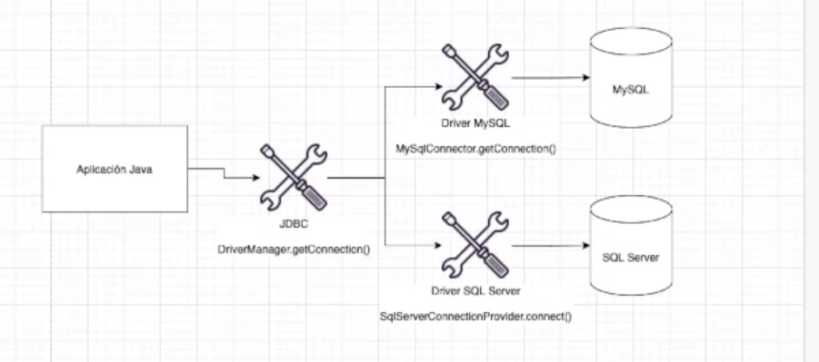
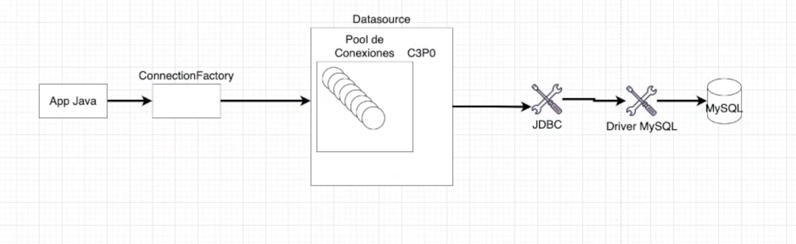

# JDBC (Java Database Conectivity)

Es una **API de Java** que posibilita que un aplicación construida en el lenguaje consiga introducir un banco de datos configurado local o remotamente. API compuesta por los paquetes ``java.sql`` y ``javax.sql``, incluidos en el JavaSE. Por medio de las clases e interfaces dados por esos 2 paquetes, las personas pueden desenvolver softwares que introduzcan cualquier fuente de datos, desde bancos relacionales hasta plantillas.

## Componentes

Clases a manejar de los paquetes `java.sql` y `javax.sql`

Contienen las clases e interfaces con sus correspondientes métodos que padronizan la comunicación de aplicación Java con una base de datos.

Los mas comúnes son la **clase** `DriveManger` y las **interfaces** `ResulSet`, `Connection`, `Statement` y `DataSource`

Su proceso es:

- Establecer la conexión con la BBDD
- crear un objeto *``Statement``*
- Ejecutar la sentencia SQL
- Leer el *``Resulset``*

Otro elemento importante son los **drivers**, verdaderos responsables por la conexión e interacción con un banco específico. Un driver JDBC es una *clase que implementa la **interface*** ``java.sql.Driver``. Muchos drivers son totalmente desarrollados con el uso de Java, lo que colabora para ser cargados de manera dinámica.

Las conexiones pueden lanzar excepciones ya que puedes haber escrito mal una cadena de conexión, instalado mal el driver, etc.

## Proceso de acceso

1. Realizar el cargamento del driver del banco.Class.forName("org.postgresql.Driver", "mysql-connector-java", etc).
2. Definir la clase que implementa el driver JDBC y establecer un objeto de tipo conexión.
   - Definir el **string** de conexión del banco de datos, básicamente una cadena de caracteres con informaciones para conectar. Es importante mencionar que la manera de definir este string varía entre bancos diferentes. Para explorar más formas de escribir esas strings [ConnectionString](https://www.connectionstrings.com/).
   - Definir el nombre de **usuario** y **contraseña** para conectarnos en el banco de datos.
3. Con nuestro objeto conexión creado anteriormente podemos utilizar el metodo `createStatement` con lo que debuelve un objeto de tipo Statement.
4. Ejecutar la sentencia SQL, con el objeto Statement creado anteriormente podemos usar un método `executeQuery("Sentencia SQL")` que permite ejecuter un a sentencia de SQL y este objeto nos va a devolver lo que se se denomina un `resulset` (Un objeto dende se almacena la información que devulve la sentencia SQL)
5. Leer el `ResulSet` que tenemos en la memoria (Si fuera el retorno de insert, update o delete, debemos evaluar el valor retornando) contamos con diferentes metodos como el `getString()` o el `next()` y con esto navegar registro a registro por la tabla virtual del resultado de haber ejecutado la sentencia SQL
   - Para recorrer este objeto `ResulSet` linea a linea con los métodos deneriamos utilizar un *bucle* dependiendo de la comodidad en el momento

- **Connection** - Representa una sesión junto al banco de datos deseado, vamos ejecutar las instrucciones SQL dentro de la conexión establecida.
- **Statement** - Tiene como objetivo la ejecución del comando SQL.
  - **``PreparedStatement``**, que pre-compila el comando y almacena el SQL en un objeto.
- **ResultSet** - Esta interface tiene por objetivo almacenar el retorno de una consulta realizada en el banco de datos. Las informaciones de las tablas son recuperadas en la secuencia y pueden ser iteradas en loops para la manipulación. Es una especie de tabla virtual que se almacena en la memoria

> Cuando se trata de una ``consulta``, usamos **executeQuery**, cuando se trata de un ``insert``, ``update`` o ``delete``, usamos **executeUpdate**

---

### Proyecto usando JDBC

Una aplicación que maneja el control de stock de una tienda.

- Creamos la base de datos por consola, para ello ingresamos a `C:\Programs Files\MYSQL\MySQL Server 8.0\bin` y ejecutamos dentro de la ruta `mysql -h localhost -u root -p`

Una vez hecho eso, creamos nuestra base de datos en consola:

- `AUTO_INCREMENT` - significa que para cada registro insertado este valor va a ser incrementado automaticamente, y no tenemos que preocuparnos por el proximo numero que estemos registrando, la propia base de datos de MYSQL se va a encargar de esto.
- `NOT NULL` - Que no queremos valores null
- `DEFAULT` - asigna un valor por default si no asignamos uno antes. Ej: DEFAULT O;
- `Engine=InnoDB;` - (rendimiendo, escalabilidad y simultaneidad) Este comando señala que queremos que esta tabla acepte operaciones dentro de una transaccion, se recupera de un problema volviendo a ejecutar sus logs, almacena físicamente los registros en el orden de la clave primaria, realiza lockeo por registro y no por tabla (100 usuarios insertando en la tabla no espera que uno termine, si no que actua al mismo tiempo), soporta claves externas y Foreign Key(no abusar porque puede alentar o causar errores)

```sql
CREATE DATABASE  control_de_stock; 

USE control_de_stock;

CREATE TABLE producto (
    id INT AUTO_INCREMENT,
    nombre VARCHAR(50) NOT NULL,
    descripcion VARCHAR(255),
    cantidad INT NOT NULL DEFAULT 0,
    PRIMARY KEY(id)
    )Engine=InnoDB;

```

</br>

#### ¿Como conectar una aplicación Java a una base de datos MySQL?

Podemos recurrir a un recurso muy común en el diseño de aplicaciones que es la utilización de librerias. MySql (Y otras) han creado una libreria Java qua facilita la vida de quien esta creando una aplicación y realiza toda la comunicación entre la aplicación y la base de datos, la librería proporciona una interfaz de comunicación que la aplicación Java usa para lograr conectarse con el protocolo de comunicacion de la base de MySQL.

- Interfaz de Driver MySQL:

`MySqlConnector`(Interfaz) que tiene el método `getConnection()`, que de esta forma tomamos una conexion de la base de datos hasta la aplicación
`MySqlConnector.getConnectiton()`

- Driver SQL Server:

La forma de SQL Server es: `SqlServerConnectionProvider.connect( )`

</br>

#### `java.sql` y `javax.sql`

Si necesitamos cambiar, agregar o elegir de una para otra base de datos, **Java tiene** una capa de abstacción que nos facilita la vida para **conectarnos a cualquier Driver** de Base de Datos que utilizemos, va a estar realizando la comunicación entre la aplicación y los distintos Drivers que llegemos a tener. Este tiene el nombre de **JDBC** (Java DataBase Conectivity).

El driver de cualquier base de datos que tenga una libreria para Java, todas sus clases implementan las interfaces de JDBC, Con eso lo único que va a ser necesario hacer es cambiar la dependencia del driver de base datos y el JDBC se encarga de todo.

</br>

Con JDBC, **si queremos conectarnos a una base de datos** vamos a estar utilizando la clase `DriverManager` y el método `.getConection( ,  ,  )`

- El método ``getConnection`` recibe tres parámetros. Son ellos la **URL** de conexión JDBC, el **usuario** y la **contraseña**.

```java
        DriverManager.getConection( url, user, password)
```

La **URL** = jdbc + :tipo de base de datos: + //URL de conexión con el :puerto + /nombre del esquema + ?{poder agregar mas parametros opcionales}

Ejemplo: `jdbc:mysql://localhost:3306/base_de_pruebas`

</br>



---

#### Configuracion y creacion del proyecto

1. Creamos un proyecto Java Maven
2. Agregamos configuraciones al archivo `pom.xml` (*Tener esto en cuenta para la creacion de aplicaciones*)

```xml
    <name>control-de-stock</name>
    <description>Proyecto para manejar con bases de datos con JDBC</description>

    <properties>           <!--propiedades -->
      <java.version>17</java.version>
    </properties>

    <dependencies>         <!--librerias que se van a utilizar-->
 
    </dependencies>

    <build>                        <!--configurar el build de la aplicacion-->
        <plugins>                  <!--listado de pligins-->
            <plugin>               <!--plugin para hacer la compilacion del proyecto-->
                <groupId>org.apache.maven.plugins</groupId>
                <artifactId>maven-compiler-plugin</artifactId>
                <version>3.11.0</version>
                <configuration>
                    <source>${java.version}</source>         <!--variable-->
                    <target>${java.version}</target>       <!--target-->
                    <optimize>true</optimize>              <!--propiedad de optimizacion-->
                </configuration>
            </plugin>
        </plugins>
    </build>
```

En el main, necesitamos una varible para recibir la conexión

```Java
    //Creamos una variable para recibir una conexion
    //Usamos la interfaz driverManager con el metodo getConnection
    //Agregamos parametros a la url para dejar bien configurado el TimeZone
    Connection con = DriverManager.getConnection(
        "jdbc:mysql://localhost/control_de_stock?useTimeZone=true&serverTimeZone=UTC",
        "root",
        "passowrd");
    
```

Cuando nos conectamos a una base de datos pueden ocurrir errores, muchos tipos de errores y excepciones (Base de datos offline, conectar a una URL invalida, falta de algún componente, equivocado con las credenciales de login del usuario) por esa razón se debe lanzar una excepción.

Podemos hacerlo de 2 maneras:

- Podemos tratar la SQL exception con un `try catch`

```java
        try {
            Connection con = DriverManager.getConnection(
                    "jdbc:mysql://localhost/control_de_stock?useTimeZone=true&serverTimeZone=UTC",
                    "root",
                    "password");
        } catch (SQLException e) {
            // TODO Auto-generated catch block
            e.printStackTrace();
        }
```

- lanzar una exception con un `trow`

```Java
        main(String[] args) trows SQLException {
            Connection con = DriverManager.getConnection(
                "jdbc:mysql://localhost/control_de_stock?useTimeZone=true&serverTimeZone=UTC",
                "root",
                "password"
            );
        }
```

Siempre que se haya abierto una conexión o cualquier otro tipo de recurso como puede ser un archivo, tienen que ser cerrados (**cerrar conexión**) después de ser utilizados para liberar el recurso y para no estar comprometiendo la base dato, no puedad corrumpir con alguna cosa.

```java
////ejemplo de cuando abrimos y cerramos la conexion////
Connection con = DriverManager.getConnection(
                "jdbc:mysql://localhost/control_de_stock?useTimeZone=true&serverTimeZone=UTC",
                "root",
                "27JulioAlberttlee"
        );

        System.out.println("Cerrando la conexion");

        con.close();
```

</br>

- Agregamos nuestra dependencia del Driver, en este caso Mysql en apartado `dependencies`

```xml
<dependencies>
        <dependency>
            <groupId>mysql</groupId>
            <artifactId>mysql-connector-java</artifactId>
            <version>8.0.33</version>
        </dependency>
    </dependencies>
```

Con esto sabemos que esto funciona, por lo que ahora toca paso a usar esta estructura con la base de datos usando `SELECT`, `UPDATE`, etc.

</br>

#### Utilizando JDBC Statement y Prepared Statement

- **``Statement``** - Tiene como objetivo la ejecución del comando SQL. Tenemos también la
  - **``PreparedStatement``**, que pre-compila el comando y almacena el SQL en un objeto.
- **``ResultSet``** - Esta interface tiene por objetivo almacenar el retorno de una consulta realizada en el banco de datos. Las informaciones de las tablas son recuperadas en la secuencia y pueden ser iteradas en loops para la manipulación.

</br>

- ##### Consulta (``Select``) usando Statement

Cuando nosotros construimos una **consulta normal** de JDBC utilizamos un **``Statement``**, este ``Statement`` o sentencia lo que se encarga es de definir una consulta SQL a ejecutar contra el motor de la base de datos.

```java
/*Creamos una sentencia y aportando un parámetro a la consulta de forma dinámica, lo cual
se convierte en una consulta SQL que nosotros ejecutamos via el driver JDBC contra la base datos.*/
Connection conexion = DriverManager.getConnection("jdbc:mysql://localhost/prueba", "root","contraseña"); 
Statement sentencia = conexion.createStatement(); 
String nombre="pepe"; 
String consulta = "select * from Persona where nombre='"+nombre+"'";
ResultSet rs=sentencia.executeQuery(consulta);
```

```java
public List<?> listar() throws SQLException {

        Connection con = new ConnectionFactory().recuperaConexion();

        Statement statement = con.createStatement();//con este objeto ejecutamos nuestra query

        //si el resultado de statement es un listado (como select) devuelve un true, si es insert, update o delete es false//
        statement.execute("SELECT ID, NOMBRE, DESCRIPCION, CANTIDAD FROM PRODUCTO");

        //Resultset es un listado de resultado, cuando lo leamos debemos saber cual es el proximo elemento desde la fila actual//
        //mientras haya una fila en el resultset nosotros podemos leer el resultado y cuando llegue al ultimo el loop termina
        ResultSet resultSet = statement.getResultSet();

        //list de un Map ya que no hay nada para representar el producto al front y haga el manejo de los datos
        List<Map<String, String>> resultado = new ArrayList<>();

        //resultSet proporciona provee .next() para seguir al proximo elemento hasta llegar al final
        //que dentro de while leemos el contenido para agregar a un listado de resultado y devolver al front de la app
        while (resultSet.next()){
            Map<String, String> fila =  new HashMap<>();
            //getInt("ID") devulve el valor numerico de la columna dependiendo a la columna indicada
            fila.put("ID",String.valueOf(resultSet.getInt("ID")));
            fila.put("NOMBRE",resultSet.getString("NOMBRE"));
            fila.put("DESCRIPCION",resultSet.getString("DESCRIPCION"));
            fila.put("CANTIDAD",String.valueOf(resultSet.getInt("CANTIDAD")));

            resultado.add(fila);

        }

        con.close();

        return resultado;
}
```

Para cada registro(fila) nosotros podemos tomar la informacion de las columnas de la query, se tiene un método `getInt(Int colunmindex)` para numericos, `getString()` para string y etc.

```java
resultSet.getInt("ID");
resultSet.getString("ID");

```

</br>

###### Patrón de diseño: Factory method

El patrón Factory, o patrón de diseño Método Factoría, describe un enfoque de programación que sirve para crear objetos sin tener que especificar su clase exacta.

Tiene como objetivo encapsular el codigo de creacion de un objeto especifico centralizando la lógica en un solo punto.

Su uso puede especificarse en una interfaz o implementarse mediante la clase hijo o la clase base y opcionalmente sobrescribirse (mediante clases derivadas). Al hacerlo, el patrón o método toma el lugar del constructor de clase normal para separar la creación de objetos de los propios objetos. Como resultado, es posible seguir los principios SOLID.

Básicamente, el patrón Factory encapsula la creación de objetos y proporciona una forma de delegar la responsabilidad de creación a clases secundarias.

Este patron nos dice especificamente que debemos crear clases independientes para gestionar cada una de las implementaciones de cada metodo.

- Ejemplo de como seguir este diseño (Pueden haber muchos modos):
  - Crear un paquete llamado ``factory``

```java


public class  ConnectionFactory  {

    public Connection recuperaConexion() throws SQLException {
        return DriverManager.getConnection(
                "jdbc:mysql://localhost/control_de_stock?useTimeZone=true&serverTimeZone=UTC", 
                "root",
                "contraseña");
    }

}
```

Ventaja de usar `ConnectionFatory`:

Los objetos son creados sin exponer la lógica o las configuraciones de creación al cliente. Además, es posible referirnos al objeto recién creado utilizando una interfaz (una abstracción), desacoplando la implementación.

</br>

- ##### Insertando registros a la tabla (`INSERT`) con ``Statement``

```java
Connection con = new ConnectionFactory().recuperaConexion();

        Statement statement = con.createStatement();

        statement.execute("INSERT INTO producto( NOMBRE, DESCRIPCION, CANTIDAD) "
                + "VALUES('" + producto.get("NOMBRE") + "', '"
                + producto.get("DESCRIPCION") + "', "
                + producto.get("CANTIDAD") + ")", Statement.RETURN_GENERATED_KEYS);

        //Statement.RETURN_GENERATED_KEYS parametro sobrecarga de execute, nosotros tomamos el id que fue creado como el resultado de la query de insert
        //cuando se ejecuta un insert yo quiero de vuelta la clave generada, el id que fue generada en la tabla
        ResultSet resultSet = statement.getGeneratedKeys(); //listado de ids que fueron generados

        while(resultSet.next()){
            System.out.println(
                    String.format(
                            "Fue insertado el producto de ID %d",
                            resultSet.getInt(1)));

        }
```

</br>

- ##### Borrando un registro (``DELETE``) con `Statement`

```java
        Connection con = new ConnectionFactory().recuperaConexion();

        Statement statement = con.createStatement();

        statement.execute("DELETE FROM producto WHERE ID = " + id );

        //metodo que devuleve un int, indica cuantas filas fueron modificadas
        int update = statement.getUpdateCount();

        statement.close();
        con.close();

        return update;
```

- ##### Actualizando registros

```java
public int modificar(String nombre, String descripcion, Integer id, Integer cantidad) throws SQLException {

        Connection con = new ConnectionFactory().recuperaConexion();

        Statement statement = con.createStatement();

        statement.execute("UPDATE producto SET NOMBRE = '"
                + nombre + "', DESCRIPCION = '"
                + descripcion + "', CANTIDAD = '"
                + cantidad + "' WHERE ID = "
                + id);

        int update = statement.getUpdateCount();

        statement.close();
        con.close();

        return update;
    }
```

</br>

#### Evitando SQL Injection utilizando `PreparedStatement`

Hay persona buscando vulnerabilidades en aplicaciones en la aplicación para hacer mal a alguna empresa o desarrolladores, en vez de romper el codigo con problemas de sintaxis pueden estar agredando otros comandos de SQL en el campo para borrar toda la aplicacion, este tipo de acciones se le conoce como **SQL Injection** que se basa practimamente en inyectar scrips SQL un campo de URL o formulario para intentar romper una aplicación o buscar informaciones que son criticas y que son sensibles

JDBC Tiene una opción para validar las informaciones de la query y evitar que los casos de SQL injection ocurran, `PreparedStatement` que pre-compila el comando y almacena el SQL en un objeto.

```java
        .preparedStatement(SQL);
```

</br>

##### `INSERT` con `PreparedStatement`

En lugar de concatenar los valores nosotros vamos a declarar los valores con el signo `?` ya despues los seteamos en orden

```java
        PreparedStatement statement = con.prepareStatement(
                "INSERT INTO producto( NOMBRE, DESCRIPCION, CANTIDAD) VALUES(?, ? ,?)",
                Statement.RETURN_GENERATED_KEYS);

        //seteamos los atributos de la query siguiendo el orden de las interrogaciones
        statement.setString(1,producto.get("NOMBRE"));// La posicion y el valor
        statement.setString(2, producto.get("DESCRIPCION"));
        statement.setInt(3, Integer.valueOf(producto.get("CANTIDAD")));

        statement.execute();
```

Con esto queda mas organizado, legilibilidad y mas seguro el código ya que pasamos la responsabilidad al JDBC, ahora los comandos SQL y los carácteres especiales son tratados como parte del texto ya que el `PrepareStatement` se encargo de normalizar la string y tratar todo su contenido como un texto común.

</br>

##### Manejar transacciones de base de datos

El esatándar de JDBC (del driver) para manejar transacciones de base de datos es el **Auto-Commit**, que puede puede ser modificado por el método `setAutoCommit`, de la interfaz `Connection`.

De forma predeterminada, JDBC utiliza un modo de operación llamado `auto-commit`. Esto significa que cada actualización de la base de datos se vuelve permanente de inmediato . Cualquier situación en la que una unidad lógica de trabajo requiera más de una actualización de la base de datos no se puede realizar de forma segura en el modo de confirmación automática.

`setAutocommit` - Este método acepta un valor booleano como parámetro. Si pasa verdadero a este método, activa la función de confirmación automática de la base de datos, si pasa falso a este método, desactiva la función de confirmación automática de la base de datos.

- Para garantizar que una operación sea realizada por completo o no haga nada si ocurre un error (si ocurre un error, no haga una transaccion a medias). Ejemplo: si quieres agregar 100 udidades de algo pero de 50 en 50 unidades, por alguna razón existe un error en la mitad de la transaccion .. termina ejecutando solo la primera de 50 y la segunda no, por lo que puede causar confusiones, deberia de no agregar nada solo si todo esta bien.

```java
Connection con = new ConnectionFactory().recuperaConexion();
        //con esto configuramos que la conexion no va a tener el control de la transaccion,
        //nosotros vamos a trabajar con el control manual
        con.setAutoCommit(false);
```

Cuando trabajamos con el control manual de una transacción `autoCommit(false)` nosotros tenemos que agregar explicitamente el comando de ``commit`` en el código

```java
        con.commit(); //para garantizar que todos los del loop hayan sido ejecutados correctamente
```

Si ocurre un error agregamos un `RollBack`

```java
        con.rollback();//hacemos un rollback si existe un error de cualquier tipo
```

Utilizandolo en el proyecto quedaria así:

```java
        try{

            do{
                //Math.min = Libreria de matematica que toma el valor minimo de 2 valores
                int cantidadParaGuardar = Math.min(cantidad,maximoCantidad);

                ejecutaRegistro(statement, nombre, descripcion, cantidadParaGuardar);

                cantidad = cantidad - maximoCantidad;

            }  while (cantidad > 0);

            con.commit(); //para garantizar que todos los del loop hayan sido ejecutados correctamente

        } catch (Exception e){
            con.rollback();//hacemos un rollback si existe un error de cualquier tipo
        }
        statement.close(); //cerramos el statement para tener un mejor control de la transacción
        con.close();//cerramos conexión
```

</br>

> Con el uso de `Auto-commit` para `false` y realizando un `commit` explícito tenemos el control total de las transacciones, para el manejo de un error de transacción también se necesita realizar el `rollback` explícito. Con esto conocemos como funciona el control de transacciones de aplicaciones del mercado.
> !Nota: **Redordar siempre cerrar todas las conexiones `close`**

</br>

##### Try-with-resources

Nos permite declarar recursos que van a ser utlizados en un bloque de ``try-catch`` con la certeza de que estos recursos van a ser **cerrados o finalizados automaticamente** después de la ejecucion del bloque.

*Requisito*:
Que los recursos implementen la interfaz `AutoClosable` y pueden tener los bloques de ``catch`` y ``finally`` para trabajar en una manejo de excepción

En la version 7 de java solo se podia utilizar estos recursos inicializados dentro del bloque de `try-with-resourses` pero desde la version 9 de Java es posible utilizar variables ``final`` dentro de la declaracion de los recursos dejando el código mas limpio.

- Verison 7

Con eso, la propia JVM se encarga de cerrar estos recursos

```java
        try(ResultSet resultSet = statement.getGeneratedKeys()) {
            while (resultSet.next()) {
                System.out.println(
                        String.format(
                                "Fue insertado el producto de ID %d",
                                resultSet.getInt(1)));

            }
        }
```

- Verison 9 (mas enetendible y mejor organizado)

```java
        final ResultSet resultSet = statement.getGeneratedKeys();

        try(resultSet) { 
            while (resultSet.next()) {
                System.out.println(
                        String.format(
                                "Fue insertado el producto de ID %d",
                                resultSet.getInt(1)));

            }
        }
```

JDBC Prepared Statement y Logs

Hay situaciones en las que necesitamos realizar un log de la consulta SQL, muchos drivers soportan el log de la propia consulta SQL con los parámetros ya aplicados realizando un log de la propia sentencia

```java
String consulta = "select * from Persona where nombre = ? "; 
PreparedStatement ps = con.prepareStatement(consulta);
 ps.setString(1, nombre); 
log(ps);
```

</br>

- INSERT : `final ResultSet resultSet = statement.getGeneratedKeys();`
- SELECT : `ResultSet resultSet = statement.getResultSet();` Resultset es un listado de resultado
- DELETE: `int update = statement.getUpdateCount();`metodo que devuleve un int, indica cuantas filas fueron modificadas
- UPDATE: `int update = statement.getUpdateCount();`

---
Lo que aprendi:

- Cuando ejecutamos una query SQL como ``Statement`` tenemos un riesgo de seguridad llamado SQL Injection;
  - **SQL Injection** es el hecho de enviar comandos SQL como parámetro de las solicitudes en una aplicación.
- Para evitar el fallo por **SQL Injection** debemos utilizar la interfaz PreparedStatement;
  - Diferente del ``Statement``, el ``PreparedStatement`` trata los parámetros del comando SQL para que caracteres y comandos especiales sean tratados como strings.
- Las bases de datos ofrecen un recurso llamado transacción, que junta muchas operaciones SQL como un conjunto de ejecución;
  - Si el conjunto falla no es aplicada ninguna modificación y ocurre el **rollback** de la transacción.
  - Todos los comandos del conjunto necesitan funcionar para que la transacción sea finalizada con un **commit**.
- Para garantizar el cierre de los recursos abiertos en el código, Java provee un recurso llamado ``try-with-resources`` para ayudarnos;
  - Para utilizar este recurso es necesario que la clase utilizada (como la ``Connection``) implemente la interfaz ``Autocloseable``.

---

Todas las bases de datos tienen un límite de conexiones, lograr atender a múltiples usuarios, configurar una cantidad mínima y máxima de conexiones.

</br>

#### POLL DE CONEXIONES

Se comunica con el JDBC para mantener una cantidad mínima y una cantidad máxima de conexiones abiertas en la aplicacion para que pueda atender a las requisiciones sin que tenga una cola muy grande y que no ahoge la aplicacion

**C3P0**
[Documentación de c3p0](https://www.mchange.com/projects/c3p0/#contents)

Es una de las opciones mas conocidas en el merdado y su implementacion es bastante sencilla, usa la interfaz `DataSource` que va a abstraer la implementacion del pool de conexiones para nosotros y con esta nueva estructura la factory de conexion no va a tener la responsabilidad de crear una conexion para nosotros

El dataSource maneja la parte de brindar conexiones ya creadas y evitamos problemas de performance y agotamiento de recursos



</br>

##### AGREGANDO LAS DEPENDENCIAS CORRESPONDIENTES

```XML
<dependencies>
        <dependency>
            <groupId>com.mchange</groupId> 
            <artifactId>c3p0</artifactId><!-- da la posibilidad de hacer un pool de conexiones -->
            <version>0.9.5.5</version>
        </dependency>

        <dependency>
            <groupId>com.mchange</groupId>
            <artifactId>mchange-commons-java</artifactId><!--Agregar mas detalles del datasouce via log de aplicacion de la consola-->
            <version>0.2.20</version>
        </dependency>
    </dependencies>

```

Cambios necesarios para la configuración del pool de conexiones, la idea es que ``connectionFactory`` utilice las conexiones desde el pool de conexiones en lugar de salir creando una conexion de forma directa

- Creamos el constructor de la clase `ConnectionFactory`, e instanciamos la clase `ComboPooledDataSource()` de c3p0

```java

    public ConnectionFactory() {
        //clase de c3p0,
        ComboPooledDataSource pooledDDataSource = new ComboPooledDataSource();
    }
```

En esta instancia nosotros configuraremos la **URL** de la base de datos, el **usuario** y la **contraseña**

```java
        pooledDDataSource.setJdbcUrl("jdbc:mysql://localhost/control_de_stock?useTimeZone=true&serverTimeZone=UTC");
        pooledDDataSource.setUser("User");
        pooledDDataSource.setPassword("Password");
```

- En la `ConnectionFactory` fuera del constructor cremaos un atributo `private` tipo ``DataSource`` del paquete `javax.sql` el cual, dentro del constructor le asignaremos el resultado de la variable que creamos en el constructor de `ComboPooledDataSource()`

```java
        this.dataSource = pooledDDataSource;
```

- Por último cambiamos la implementación que teniamos de JDBC, al final quedaría así:

```java
public class ConnectionFactory {

    private DataSource dataSource;

    public ConnectionFactory() {
        //clase de c3p0
        ComboPooledDataSource pooledDDataSource = new ComboPooledDataSource();
        pooledDDataSource.setJdbcUrl("jdbc:mysql://localhost/control_de_stock?useTimeZone=true&serverTimeZone=UTC");
        pooledDDataSource.setUser("User");
        pooledDDataSource.setPassword("Password");

        this.dataSource = pooledDDataSource;
    }

    public Connection recuperaConexion() throws SQLException {
        return this.dataSource.getConnection();
    }
}
```

</br>

#### DETERMINAR EL MAXIMO DE CONEXIONES QUE EL POLL PUEDE MANTENER

- Seteamos la cantidad maxima conexiones que podemos tener abiertas con el método `setMaxPoolSize(valor)`

```java
pooledDDataSource.setMaxPoolSize(valor); //por ejemplo de 10
```

De esta forma nosotros limitamos la apertura descontrolada de conexiones y no saturamos la base de datos, la cola de espera es muy rara de suceder porque los procesamientos son muy rápidos

- Utilizar el **pool de conexiones** es una buena práctica;
- El pool de conexiones controla la cantidad de conexiones abiertas entre la aplicación y la base de datos;
  - Es normal que haya un mínimo y un máximo de conexiones.
- De la misma forma que hay, en JDBC, una interfaz para representar la conexión (``java.sql.Connection``), también hay una interfaz que representa el pool de conexiones (``javax.sql.DataSource``);
- **C3P0** es una implementación Java de un pool de conexiones.

``show processlist;`` en la consola de **Mysql** para ver las conexiones actuales o la cola de conexiones disponibles

</br>

- ##### CREANDO MODELO PRODUCTO

Creeamos un paquete llamado `model` en el que crearemos una clase llamada `producto` que utlizaremos para poder realizar la persistencia de los datos (es el concepto general de **almacenar y recuperar datos**)

- Agregamos los atributos que recibiran los valores, los getter y setters y  agregar el constructor

```java
public class Producto {

    private Integer id;
    private String nombre;
    private String descripcion;
    private Integer cantidad;

    public Producto(String nombre, String descripcion, Integer cantidad) {
        this.nombre = nombre;
        this.descripcion = descripcion;
        this.cantidad = cantidad;
    }

    public String getNombre() {
        return nombre;
    }

    public String getDescripcion() {
        return descripcion;
    }

    public Integer getCantidad() {
        return cantidad;
    }

    public void setId(int id) {
        this.id = id;
    }

//Sobreescribimos el método ToString para poder imprimir la informacion de producto
    @Override
    public String toString() {
        return String.format(
                "{id: %d, nombre: %s, descripcion: %s, cantidad: %d}",this.id, this.nombre, this.descripcion, this.cantidad
        );
    }
}
```

</br>

#### PATRÓN DATA ACCESS OBJECT (DAO)

Objeto de acceso a datos

El patrón **Data Access Object** ([DAO](https://www.baeldung.com/java-dao-pattern)) es un patrón estructural que nos permite aislar la capa de aplicación/negocio de la capa de persistencia (normalmente una base de datos relacional, pero podría ser cualquier otro mecanismo de persistencia) utilizando una API abstracta.

La API oculta a la aplicación toda la complejidad de realizar operaciones CRUD en el mecanismo de almacenamiento subyacente. Esto permite que ambas capas evolucionen por separado sin saber nada entre sí.

El patrón DAO permite que los mecanismos de acceso a los datos cambien independientemente del código que utiliza los datos.

- separa la interfaz de cliente de un recurso de datos de sus mecanismos de acceso a datos
- adapta la API de acceso de un recurso de datos específico a una interfaz de cliente genérica

> Estas clases de tipo DAO trabajan con las operaciones de acceso a los datos de una entidad, la clase que realiza el acceso a los datos de la entidad (producto)

La finalidad de este patron de diseño es tener un objeto que tiene como responsabilidad acceder al repositorio de la base de datos y realizar las operaciones necesarias sobre una entidad, solo sirve para acceder a caulquier fuente de datos con este patrón la idea es centrar las operaciones en él para evitar replicación de código.

</br>

#### Modelo MVC

- **Vista** (View): Representa la interfaz de usuario y todas las herramientas con las cuales el usario hace uso del programa. hace las requisiciones para el controller
- **Modelo** (Model): Es donde esta toda la lógica del negocio, la representación de todo el sistema incluido la interacción con una base de datos, si es que el programa asi lo requiere. Ejemplo: `Producto`
- **Controlador** (Controller): Este componente es el que responde a la interacción (eventos) que hace el usuario en la interfaz y realiza las peticiones al modelo para pasar estos a la vista. (Intermediario entre una capa más interna como puede ser DAO (Todo el acceso a base de datos, como se guardan, este intermediario de controller y factory) y con los paquetes view). Encargado de llamar a las demas clases para la informacion solicitada por la view

</br>

##### OPERACIONES ABM

La abreviatura ABM (Alta, Baja y Modificación) es un término muy utilizado en el mundo informático para hacer referencia a formularios que permite dar de alta, baja y modificar registros en una tabla de una base de datos.

</br>

---

- Creamos una segunda tabla

```Sql
    CREATE TABLE categoria(
    id INT AUTO_INCREMENT,
    nombre VARCHAR(50) NOT NULL,
    PRIMARY KEY(id)
    )EngineInnoDB;
```

- Insetamos valores al campo de nombre

```SQL
    INSERT INTO categoria(
    nombre)
    VALUES('Muebles'), ('Tecnologia'), ('Cocina'), ('Zapatillas');
```

- Creamos una nueva columna en la tabla de prodducto para agregar su categoria correspondiente a cada producto de la lista (Varios registros en un solo campo)

```SQL
ALTER TABLE produto
ADD COLUMN categoria_id INT;
```

</br>

##### CLAVE FORANEA

Una clave foránea es una columna o un conjunto de columnas en una tabla cuyos valores corresponden a los valores de la clave primaria de otra tabla.

</br>

- Agregamos una clave foranea en la tabla producto del campo `categoria_id` que hace referencia a la tabla categoria del campo `id`

```sql
ALTER TABLE PRODUCTO ADD FOREIGN KEY (categoria_id) REFERENCES CATEGORIA(id);
```

---

- ejecutar una query y obtener su resulset al mismo tiempo

```java
        final ResultSet resultSet = statement.executeQuery();
        try (resulset){
        
        }
```

</br>

##### QUERYS ``N + 1``

Es cuando que para ejecuta una cierta funcionalidad son utilizadas múltiples queries, aumentando la cantidad de acceso a la base de datos y, por consecuencia, empeorando la performance de la aplicación y del propio sistema de base de datos. Estamos yendo a la base de datos más de los que es necesario cuando hay la posibilidad de ir una sola vez

Cuando las consultas son sencillas no hay problemas. Pero cuanto más complejidad van teniendo nuestras consultas hay la necesidad de buscar más informaciones de múltiples tablas, aumentando el acceso exponencialmente. Eso impacta gravemente la performance de la aplicación y del sistema de base de datos.

</br>

###### INNER JOIN (`JOIN`)

Para obtener las informacion en usa sola Query, combinar información de distintas tablas usamos un recurso de SQL llamado `JOIN`.

La cláusula **JOIN** nos permite asociar 2 o más tablas, en base a una columna que tengan en común.

- para hacer el `join` nosotros debermos identificar las tablas, para hacer eso vamos a crear un alias a las tablas y saber la referencia de cada una

ON = condicion

```SQL
        SELECT C.ID, C.NOMBRE, P.ID, P.NOMBRE, P.CANTIDAD
                    FROM CATEGORIA C
                    INNER JOIN PRODUCTO P ON C.ID = P.CATEGORIA_ID
```

---

Lo que aprendí:

- Cuando tenemos una relación entre *tables* debemos tener cuidado para no crear el problema de queries ``N + 1``;
  - ``N + 1`` quiere decir que, para buscar los datos de una relación, es ejecutada una query y luego una más por cada relación.
  - Este tipo de problema puede generar problemas de performance en la aplicación y en la base de datos.
  - Este tipo de problema puede ser evitado utilizando join en la query SQL.