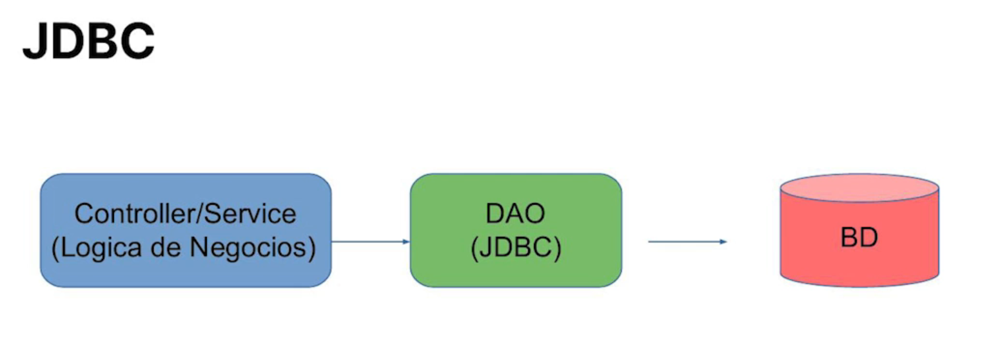
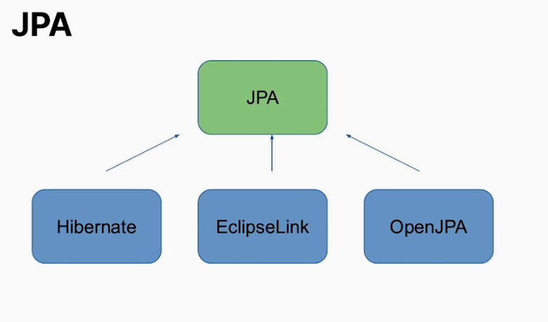
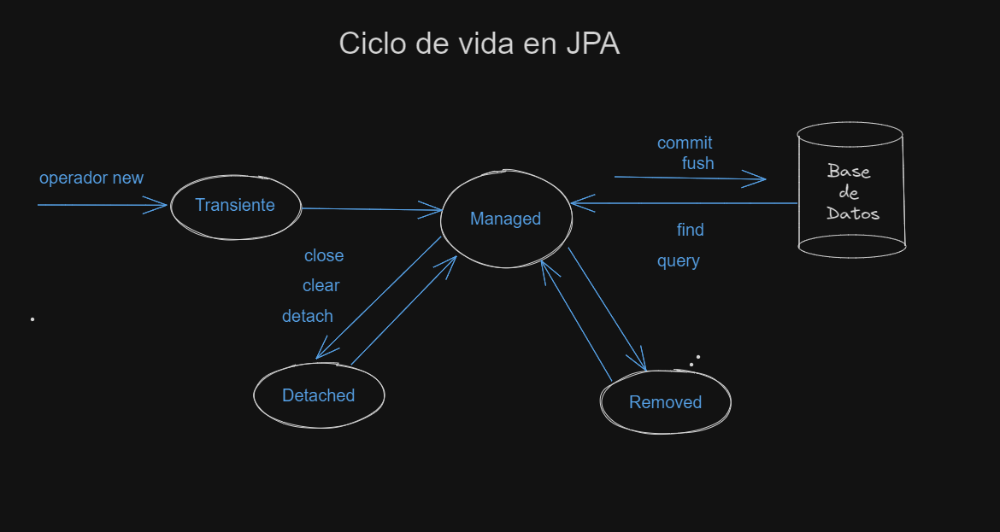
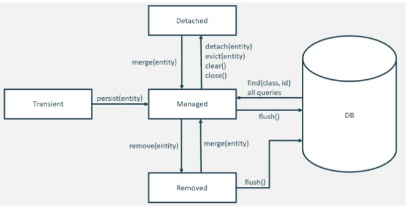

# JPA - Java Persistence API HIBERNETE

`TransientPropertyValueException` -- Se esta pasando un parámetro que aún no a sido guardado dentro de la base de datos (que se tiene que hacer un Dao de alguna entidad)

- Motivacion para utilizar JPA
- Configuraciones
- Archivo persistence.xml
- Mapeamento de entidades
- Mapeamento de relacionamientos
- Ciclo de vida de una entidad
- Consultas con JPQL

Java nacio en 1995 y en 1997 llego JDBC que es una especificación para acceder a las bases de datos relacionales por lo que solo es una capa de abstracción para acceder desde el código



Desventajas de JDBC

- Demasiadas líneas de código
  - Los códigos que utilizan JDBC son más verbosos y eso aumenta la dificultad de mantenimiento.
- Alto acoplamiento con el banco de datos
  - El JDBC causa un acoplamiento mayor entre el código de la aplicación y la base de datos.

## Hibernete

Biblioteca, Nació gracias a los problemas que tenia JDBC, creado en 2001 por Galvin King con la idea de simplificar JDBC.

Es una herramienta **ORM (Object-Relational Mapping)** para la plataforma Java como tambien para .net, capa de persistencia objeto/relacional que permite diseñar objetos persistentes que podrán incluir polimorfismo, relaciones, colecciones, y un gran número de tipos de datos, facilita el mapeo de atributos entre una base de datos relacional tradicional y el modelo de objetos de una aplicación.

Implementa JPA (Java persistence API) que es un conjunto de estandares.

## JPA

Lanzada en 2006. Es un conjunto de estandares, Java Persistence API, más conocida por sus siglas JPA, es una API de persistencia desarrollada para la plataforma Java EE, es la propuesta estándar que ofrece Java para implementar un Framework Object Relational Mapping (ORM), que permite interactuar con la base de datos por medio de objetos, de esta forma, JPA es el encargado de convertir los objetos Java en instrucciones para el Manejador de Base de Datos (MDB).

- En el mercado nos quedamos con este diagrama



> - **JPA** es una *especificación* mientras que **Hibernate** es una de sus *implementaciones*.
> - **JDBC** es una API *de bajo nivel*, es decir, que está orientada a permitir ejecutar comandos SQL directamente y procesar los resultados obtenidos.

</br>

### Configuración

- Agregamos las dependecias Maven de hibernete y una de base de datos

```xml
    <properties>
        <java.version>17</java.version>
    </properties>
<!--compilador y las versiones-->
    <build>
        <plugins>
            <plugin>
                <groupId>org.apache.maven.plugins</groupId>
                <artifactId>maven-compiler-plugin</artifactId>
                <version>3.11.0</version>
                <configuration>
                    <source>${java.version}</source>
                    <target>${java.version}</target>
                    <optimize>true</optimize>
                </configuration>
            </plugin>
        </plugins>
    </build>
<!--dependecia hibernete-->
    <dependencies>
        <dependency>
            <groupId>org.hibernate.orm</groupId>
            <artifactId>hibernate-core</artifactId>
            <version>6.3.0.Final</version>
        </dependency>
<!--dependecia Mysql-->
        <dependency>
            <groupId>mysql</groupId>
            <artifactId>mysql-connector-java</artifactId>
            <version>8.0.33</version>
        </dependency>
    </dependencies>
</project>
```

Nos dirigimos al paquete ``resourses`` del proyecto y cremoas una carpeta llamada `NETA-INF` la cual es la que se busca por default por la aplicación, dentro de ella creamos un archivo llamado `persistence.xml`

- **`<persistence> </persistence>`** - donde van a ir todas unidades de persistencia y dentro las propiedades de la base de datos.
- **`<persistence-unit>`** - Agrupa las configuraciones de una unidad de persistencia, que representa una base de datos utilizada por la aplicación, Corresponde a la base de datos con la que estamos trabajando, cada base de datos que utilicemos vamos a tener una unidad de persistencia

```xml
<?xml version="1.0" encoding="utf-8" ?>
<!-- version 2.2 de JPA-->
<persistence version="2.2"
             xmlns="http://xmlns.jcp.org/xml/ns/persistence"
             xmlns:xsi="http://www.w3.org/2001/XMLSchema-instance"
             xsi:schemaLocation="http://xmlns.jcp.org/xml/ns/persistence http://xmlns.jcp.org/xml/ns/persistence/persistence_2_2.xsd">

    <!-- los tipos de transacciones que se manejaran, son 2 valores
        JTA = cuando utilizamos un servidor externo que maneja las transacciones de forma automatica
        RESOURCE_LOCAL = Cuando utilizamos una aplicación stand alone donde vamos a indicar el momento de la transaccion -->
    <persistence-unit name="tienda" transaction-type="RESOURCE_LOCAL">
        <!-- Proveedor de la implementacion de JPA-->
        <provider>org.hibernate.jpa.HibernatePersistenceProvider</provider>
        <!-- Paquete donde se van a encotrar las clases de persistencia que vamos a utilizar, las clases de entidad?-->
        <class>mx.com.al.Persona</class>

        <!-- Propiedades para conectarse a la base de datos de mysql-->
        <properties>
            <property name="javax.persistence.jdbc.driver" value="com.mysql.cj.jdbc.Driver"/>
            <property name="javax.persistence.jdbc.url" value="jdbc:mysql://localhost:3306/tienda?useSSL=true"/>
            <property name="javax.persistence.jdbc.user" value=""/>
            <property name="javax.persistence.jdbc.password" value=""/>

             <!-- dialecto = Caracteristicas internas de como se comunica esa base de datos con nuestra aplicacion,
            Indicamos las caracterisiticas particulares de nuestra base de datos-->
            <property name="hibernate.dialect" value="org.hibernate.dialect.MySQLDialect"/>
            <!-- Mostrar los sql que se van ejecutando en la consola-->
            <property name="hibernate.show_sql" value="true"/>
            <property name="hibernate.hbm2ddl.auto" value="create"/> <!-- para desarrolladores y no produccion, creo--> 
        </properties>

    </persistence-unit>

</persistence>
```

</br>

### Creando el modelo que vamos a persistir

Una tabla que va a representar un listado de productos en la que va a existir una lista de propiedades

Id = bigint
Nombre = varchar
Descripcion = varchar
Precio = decimal

> Hibernete reconoce la entidades y esas estan reprecentadas por clases de Java, **una entidad JPA funciona como un espejo de una tabla en el banco de datos.**
</br>

Creamos una clase del paquete `modelo` llamada **Producto** al cual le agregaremos una anotación **``@Entity``** que provee la especificacion y no con la implementación

```java
        @Entity
        public class Producto {        
        }
```

JPA realiza un **mapeamento** de los elementos existentes de nuestra clase para compararlo con el modelo de la base de datos, Por Hibernete entiende y considera que el nombre de la clase es el mismo nombre que existe en nuestra tabla, si no es el caso usamos otras anotaciones

- ``@Table(name="nombre)`` - para indicar en nombre de la tabla
- `@Colum(name="nombre")` - para el atributo

```java
        @Entity
        @Table(name="productos)
        public class Producto {
        }
```

El **Id** es un elemento en las tablas que representa la unicidad de cada una de esas filas, para indicar en nuestro proyecto cual va a ser el ``id`` de esas tablas tenemos la anotacion `Id` que da responsabilidad de dar el identificador siempre de la base de datos.

Para indicar que la resposabilidad no pertenece al usuario sino a la base de datos se tiene otra anotacion llamada `@GeneratedValue(strategy=GenerationType.xxx)` Para usar la estrategia de `Identity` se tiene que usar ``auto_increment`` en MySQL

1. ``AUTO`` -- with auto_increment
    Es el tipo de generación por defecto y permite que el proveedor de persistencia elegir la estrategia de generación.
2. ``IDENTITY`` -- with auto_increment
   Se basa en una columna de base de datos con incremento automático y permite que la base de datos genere un nuevo valor con cada operación de inserción. Desde el punto de vista de la base de datos, esto es muy eficiente porque las columnas de incremento automático están altamente optimizadas y no requiere ninguna declaración adicional.
3. ``SEQUENCE`` -- not supported
4. ``TABLE`` -- with hibernate_sequences TABLE
   Simula una secuencia almacenando y actualizando su valor actual en una tabla de base de datos que requiere el uso de bloqueos pesimistas que colocan todas las transacciones en un orden secuencial . Esto ralentiza su aplicación.

```java
            @Id
            @GeneratedValue(strategy = GenerationType.IDENTITY)
            private Long id;
```

Con eso tenemos el ID configurado para representar la **llave primaria** en nuetra tabla.

</br>

- **EntityManager**

La intefaz **``EntityManager``** es el encargado de realizar las operaciones a la base de datos pero que tiene que implementar otra interfaz para poder ser instanciado, esa clase uitiliza un metodo estatico `createEntityManager("valorDeBaseDeDatos")`

```java
// nos permite crear una clase estatica guardable en EntityManager y utiliza el valor de la base de datos
        EntityManagerFactory factory = Persistence.createEntityManagerFactory("tienda");
        EntityManager em = factory.createEntityManager();
```

</br>

---
**Propiedad de hibernete** que construye la base de datos con todas las columnas y registros y el cual tiene varios valores

- `create` = Crea la base de datos, tablas columnas, inserta los valores y despues de que haya finalizado la app va a dejar esos valores en la base de datos
- `create-drop` = crea la base datos y valores y al finalizar la app elimina las tablas y todo de la base da datos
- `validate` = no crea y actualiza valores, simplemente que los valores sean correctos y que existan esos valores y tampoco agrega valores en la base de datos solo para consulta
- `update` = crea la tabla si es que no existe y si existe realiza las operaciones, si falta un nuevo elemento lo crea y al finalizar la app los valores permanecen en la base de datos

```xml
<property name="hibernate.hbm2ddl.auto" value="create"/>
```

---

Para asegurarnos de que se esta instanciado un producto agregaremos otro atributo que  guarde la fecha actual. `LocalDate`, tambien dependiendo de la base de datos se podria usar `Timestamp`

```java
            private LocalDate fechaDeRegistro = LocalDate.now();

```

Si nosotros tenemos elementos limitados es recomendable usar enumeradores `enum` pero no es recomendable que ese valor sea guardado en la base de datos como numero ya que puede ser alterado el orden, un tip es guardarlo como String Usando la etiqueta ``@Enumerated(EnumType.tipo)``

```java
    //Cremos nuestro enumerador 
    public enum Categoria {
        SOFTWARE,
        LIBROS,
        CELULARES;
    }

    
    //Agregamos una etiqueta en el atributo de producto para que sea guardado en String
    @Enumerated(EnumType.STRING)
    private Categoria categoria;

```

</br>

> Los tipos primitivos, atributos del tipo String y algunas clases de Java, como LocalDate y BigDecimal pueden se mapeados automáticamente sin la necesidad de configuraciones adicioneles.

</br>

### Mapeando relacionamientos

Relaciones entre tablas que comparten un mismo valor, Se debe añadir la nueva entidad como atributo en la entidad principal con la diferencia que vamos a utilizar la anotación para mapear relaciones de cardinalidad para el identificador usaremos una nueva anotación `ManyToOne` o `OnetoOne` .. dependiendo del tipo de relación de las entidades

```Java
    @ManyToOne //muchos productos tienen una única categoria
    private Categoria categoria;
```

> Es **obligatorio** agregar alguna anotación de cardinalidad en todos los atributos que representan relaciones. JPA no asume una cardinalidad default cuando no colocamos anotaciones.

</br>

### Ciclos de vida de una entidad



- Al utilizar la palabra clave `new` de una clase pasa a un estado **transiente**, eso significa que ya fue instanciada pero no considerada para ser registrada en la base de datos, todos los elementos que se encuentran en estado transiente JPA los ignorará y solo trabajara con los del siguiente estado.
- Estado **Managed**, para pasar a él tenemos que instanciar el `EntityMager` y persistir esa entidad que se encuentra como estado transciente el cual se convierte en estado Managed, todas las entidades en estado Managed son los que cuentan para ser ser registradas en la base de datos
- Al hacer el `commit` (sincroniza los datos con la base de datos de forma definitiva) o `flush` (sincroniza los datos con la base de datos y permite realizar un roll back en caso de errores) se sincroniza la base de datos, se crea el id y genera un nuevo registro en la base de datos.
- Luego de realizar el ``commit`` y el `close` esa entidad pasa a estar en un estado de **detach**, el cual se comporta similar al estado transiente ya que JPA va a desconsiderar a todos los elementos que se encuentren como detach y solo va a trabajar con las entidades que se encuentren con estado *managed*

`clear` - Envia toda las entidades a un estado *detach* para ahorrar espacio en memoria en el proyecto

El `insert` sucede cuando persisitimos una entidad
EL `Update` sucede cuando modificamos una entidad

```java
        Categoria celulares = new Categoria("CELULARES");
        
        EntityManager em = JPAUtils.getEntityManager();

        ProdutoDao produtoDao = new ProdutoDao(em);
        CategoriaDao categoriaDao = new CategoriaDao(em);

        em.getTransaction().begin(); 

        em.persist(celulares); //Insert

        celulares.setNombre("LIBROS"); //Update, cambiando el nombre

        em.getTransaction().commit();
        em.close(); //Cerramos el EntityManager

        celulares.setNombre("SOFTWARES"); //En estado detach y no sera tomado en cuenta
```

</br>

Como traer los elementos que se encuentran en estado detach, despues de cerrar la conexión para un estado Managed y seguir realizando alteraciones en los elementos?

- Método ``merge(entidad)``
Nos permiten traer esas entidades que se encuentran como *detach* al estado *Managed* para poder guardar nuevas alteraciones en la base de datos (update)

```java
        Categoria celulares = new Categoria("CELULARES");
        
        EntityManager em = JPAUtils.getEntityManager();
        em.getTransaction().begin(); 

        em.persist(celulares); //Insert

        celulares.setNombre("LIBROS"); //Update, cambiando el nombre

        em.flush();
        em.clear(); //cerramos conexion que envia las todas las entidades a datach para ahorrar memoria

        celulares = em.merge(celulares); //resignamos ese registro seleccionado en memoria
        celulares.setNombre("SOFTWARES"); //En estado detach y no sera tomado en cuenta
        
        em.flush();
```

Por lo que nuestro nuevo metodo de actualizar en CategoriaDao quedaría así

```java
        public void actualizar(Categoria categoria){
            this.em.merge(categoria);
        }
```

</br>

> La finalidad del método `merge(entidad)` es traer los registros deseados con estado managed pero en una diferente ubicación en memoria, por lo que tenemos que reasignar la variable que se encuentra como detached.

</br>

Para eliminar un registro, ese registro tiene que existir en la base de datos y debemos traerlo como un estado manage.

- Método `remove`
Metodo remove del *EntityManage()*, tenemos que garantizar que ese elemento se encuentre en estado manage y que exista en la base de datos

```java
        Public void remover(Categoria categoria){
            categoria = this.em.merge(categoria);
            this.em.remove(categoria);
        }
```

Con eso estamos garantizando que la entidad se encuetra como *managed*



Comenzamos por el estado **transiente** que tiene una entidad al ser instanciada, luego pasamos al estado **Managed** utilizando el método ``persist()`` de JPA hasta el momento que sincronizamos la información con la base de datos utilizando el método ``flush()`` o ``commit()`` de JPA.
Estas transiciones de estados fueron realizadas en el DAO (Data Access Object).

</br>

### Consultas de entidades con JPA

Consultas por ID y consulta de todos los productos

- Consulta por ID Usaremos el método `find(entityClass, primaryKey)`, el primer parámetro es la entidad a la que vamos a solicitar y el segundo la llave primaria, la posicion en la tabla de ese elemento que queremos buscar

```java
    public Producto consultaPorId(Long id){
        return em.find(Producto.class,id);
    }
```

- Para buscar todos los elementos de una tabla usando el lenguaje **JPQL**(Java Persistence Query Lenguage) que es similar a SQL pero utilizado para java

```java
    public List<Producto> consultarTodos(){
        String jpql = "SELECT P FROM Producto AS P"; //select P(Token) de producto, agregamos un alias(AS) llamdo P
        return em.createQuery(jpql,Producto.class).getResultList(); //parametro del JPQL y el de la entidad y obtenemos la lista de resultado
    }
```

- **Consulta con filtro**, obtener elementos especificos dentro de la tabla
    Consulta de todos los elementos en la tabla que tenga un determinado nombre y realizar la consulta de todos los elementos en la tabla que tenga el nombre de categoria(Otra tabla relacionada)

```java
    public List<Producto> consultaPorNombre(String nombre){
        //Para agregar mas parametros usar AND P.descripcion=:descripcion
        String jpql = "SELECT P FROM Producto AS P WHERE P.nombre=:nombre";
        return em.createQuery(jpql,Producto.class).setParameter("nombre",nombre).getResultList();
    }
```

- Consulta por nombre de Categoria

```java
    public List<Producto> consultaPorNombreDeCategoria(String nombre){
        String jpql = "Select P FROM Producto AS P WHERE P.categoria.nombre=:nombre";
        return em.createQuery(jpql,Producto.class).setParameter("nombre",nombre).getResultList();
    }
```

- Consultas con filtro limitadas a un único atributo de esa entidad, Limitar el resultado a una propiedad o columna de esa entidad

```java
    public BigDecimal consultarPrecioPorNombreDeProducto(String nombre){
        String jpql = "SELECT P.precio FROM Producto AS P WHERE P.nombre=:nombre ;";
        //creatyQuery pasamos el parametro de la query y el parametro de que tipo nos va a retornar
        return em.createQuery(jpql,BigDecimal.class).setParameter("nombre",nombre).getSingleResult();
    }
```
