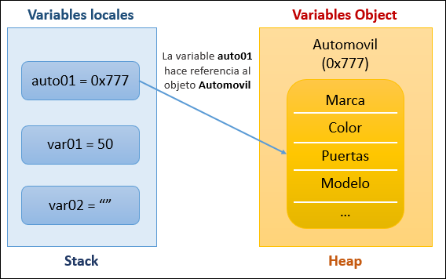

# Importante

## 1. Buenas prácticas

- El uso de `this` para señalar que un atributo o un método es de la propia clase, teniendo mayor legibilidad en el código.
  Solo la palabra `this` dentro de una clase hace referencia referencia al objeto que se esta ejecutando osea, la referencia de la memoria (insertando `toString` definimos el estado del objeto en cualquier momento, modificamos que queremos mostrar)

  ```java
    @Override
    public String toString() { //stringBuilder para crear strings mutables
        final StringBuilder sb = new StringBuilder("Empleado{");
        sb.append("idEmpleado=").append(this.idEmpleado);
        sb.append(", sueldo=").append(this.sueldo);
        sb.append(", ").append(super.toString());
        sb.append('}');
        return sb.toString();
    }
  ```

- Paquete `domain` las clases que resuelven el problema que estamos analizando, clases de dominio.
- Sobreescribir los métodos `toString`

---

## 2. Datos

1. Instancia, reservar espacio de la memoria para un objeto.
2. El compilador de Java de manera implicita al terminar un método `void` internamente agrega ``return ;``
  
    ```java
        public static void cambiarValor(Persona persona){
            persona.nombre = "Karla";
            return;
        }
    ```

    > Siempre esta precente la palabra `return` de manera implicita o explicita en nuestro método, podemos mandar llamar varias veces en nuestro método pero la primera anulara a las démas (útil de manera condicionada, en metodos como validadores, etc).

3. El paquete `java.lang` se importa de manera implicita a todos nuestros programas en java, por lo que podemos usar cualquier clase que provenga de ella sin importarla.
4. En una un archivo solamente podemos tener una clase de tipo `public`, todas las demas clases ya no se les va a agregar este modificador de acceso ya que solamente se va a poder utilizar dentro de la clase o dentro del paquete.
5. FQN (Full Qualified Name, Nombre completamente calidicado) es el nombre completo de la clase, que consta del nombre del paquete y el nombre de la clase. FQN = ``Nombre del paquete. Nombre de clase simple``
6. La palabra `final` en variables evita cambiar el valor que almacena, en objetos no permite cambiar la referencia, en métodos y sobre todo cuando se trabaja el concepto de herencia la palabra final evita que los metodos en la clase hija modifiquen el comportamiento de un método en la clase padre y si agregamos la palabra final en clases evita que creemos clases hijas de la clase que hemos marcado como final. Otra caracteristica normalmente cuando se trabaja con variables se combina con el modificador de acceso _static_ para convertir una variable en una constante, es decir que no podemos modificar el valor pero ademas poder accerder a lavariable directamente poniendo el nombre de la clase, por ejemplo `Math.PI` donde toda la clase Math sus atributos y métodos son *final y static*

    ```java
       public final static int MI_NUMERO = 10; 
    ```

7. En sobrecarga de métodos, el retorno puede ser diferente pero en el contexto de modificadores de acceso no puede ser más restrictivo que el original, ejemplo:  si un método es de tipo ___públic___ no podemos crear uno mas restrictivo como ___protected___ o ___private___.
8. Argumentos Variables
  La sintaxis es indicar el tipo que tomará el método y segido de 3 puntos "...", eso quiere decir que va a recibir argumentos variables por lo tanto no sabemos la cantidad de argumentos que vamos a recibir hasta cuando se ejecute, en el método solo debe haber un argumento variable. El argumento variable es un arreglo en el que no conocemos su tamaño hasta su ejecución.

    ```java
        public static void main(String[] args) {
            imprimirNumeros(3,2,5,4,7,8,9);
            imprimirNumeros(1,2,3);
        
            variosParametros("Anais", 32,3,4);
        }
    
        private static void imprimirNumeros(int ... numeros){ //se va a convertir en un arreglo pero sin saber cuntos valores se van a pasar
            for (int i = 0; i < numeros.length; i++) {
                System.out.println("Elemento: " + numeros[i]);
            }
        }
    
        public static void variosParametros(String nombre, int ... numeros){ //el argumento variable deber ser el ultimo en el metodo
            System.out.println("nombre: " + nombre);
            imprimirNumeros(numeros);
        }
    ```

1. Enum: Los enumeradores por default son elementos públicos, estáticos y finales. Todos los elementos son constantes.

---

## 3. Información importante

### null

una vez terminado nuestro programa podemos igualamos a `null`, esa variable que estaba apuntando a un objeto ya no contiene su referecia y es candidato para que el __garbage collector__ lo elimine de la memoria heap

- System.gc() -- Linea de código que va a programar el recolector de basura para que cuando sea posible se ejecute y pueda eliminar todos los objetos que no estan siendo utilizados o referenciados, no garantiza que se va a ejecutar el recolector de basura en este momento. programa el rc de basura para que pueda ejecutarse cuando sea necesario ya que es un proceso bastante pesado y no lo podemos llamar solamente porque nuestro programa lo necesita

> [!Note]
> No es común utilizar esos métodos ya que los administradores de sistemas tienen sus metodos para **limpiar la memoria**

### Paso por

- Paso __por valor__ (métodos void)
    Pasar un valor ya establecido a un método se le conoce como __paso por valor__, le estamos pasando una copia al método que estamos mandando llamar, el método no puede modificar el valor de la variable original.

    </br>

- Paso por valor **por referencia**
    Una variable almacena una referencia y apunta a la memoria en el que se encuentra, cuando esta referencia es enviada a un método como parámetro, este metodo hace uso del párametro apuntando a la misma referencia del objeto pasado, por lo cual puede modificar su contenido sin que el método devuelva nada, al terminar el método la variable se destruye y solo queda la original.

</br>

### Memoria

- #### Pila de ejecucion Stack

Lugar en la memoria por decir así, donde tiene lugar todos los eventos que java va ejecutando, es una secuencia de elementos del mismo tipo en la que el acceso a la misma se realiza por un único lugar denominado cima.
Una pila de Java es parte de la JVM y almacena los métodos que se están ejecutando. Además del bloque de código, la pila almacena las variables y referencias de ese bloque. Entonces, la JVM organiza la ejecución y sabe exactamente qué método se está ejecutando, que es siempre el método en la parte superior de la pila. La JVM también sabe qué otros aún deben ejecutarse, que son precisamente los métodos que continúan.

**Stack** (pila): Es un conjunto de abjetos apilados uno sobre otro.

- Se utiliza para hacer filas, stacks de memoria
  - Ejemplo: el browser, cuando ves una pagina... esta se acumula una sobre otra y cuando retrocedes elimina una, y así sucesivamente.

Los programadores ya saben que un programa usa la memoria RAM para almacenar la información (del programa) mientras se está ejecutando. Al interior de Java existen dos clasificaciones para almacenar los valores del programa, estas son conocidas como memoria `Stack` y memoria `Heap`.

1. La memoria **STACK**
   Se usa para almacenar las __variables locales__ (cuyo ámbito de acción está limitada solo a la función donde se declaró) y también las llamadas de funciones en Java, referencias de objetos. Las variables almacenadas en esta memoria por lo general tienen un periodo de vida corto, viven hasta que terminen la función o método en el que se están ejecutando.

   </br>

2. La memoria **Heap**
   Es utilizada para __almacenar los objetos__ (incluyendo sus atributos) y este objeto tendra referencia en memoria, puede ser un valor hexadecimal (0x777) que sera asignada a una varible (en memoria _stack_), los objetos almacenados en este espacio de memoria normalmente tienen un tiempo de duración más prolongado que los almacenados en Stack.

```java
        Automovil auto01 = new Automovil();
        int var01 = 50;
        String var02 = "";
```



</br>

### PollString

La región de memoria especial donde la JVM almacena las cadenas.

Cuando creamos un  objeto String usando el  operador `new()` , siempre crea un nuevo objeto en la memoria del montón. Por otro lado, si creamos un objeto usando la sintaxis literal de cadena, puede devolver un objeto existente del grupo de cadenas eficientando el proceso de creación de objetos de tipo String, si ya existe. De lo contrario, creará un nuevo objeto String y lo colocará en el grupo de cadenas para su reutilización futura.

```java
    new String("ddd") //Creamos un nuevo objeto en posicion de memoria única

    = "Nombre" // Utilizando la sintaxis java utiliza un espacio de memoria que se conoce como poolString
```

Antes de Java 7, la JVM colocaba el Java String Pool en el espacio PermGen , que tiene un tamaño fijo: no se puede expandir en tiempo de ejecución y no es elegible para la recolección de basura.
El riesgo de internar Strings en PermGen (en lugar de Heap ) es que podemos obtener un error OutOfMemory de la JVM si internamos demasiados Strings .

A partir de Java 7, el Java String Pool se almacena en el espacio Heap , que es la basura recolectada por la JVM . La ventaja de este enfoque es la reducción del riesgo de error OutOfMemory porque las cadenas sin referencia se eliminarán del grupo, liberando así memoria.

> Los objetos String se almacenan en el Constant String Pool que es un repositorio o almacén de cadenas, de valores de Strings. Esto se hace  con el fin de que si creamos otro String, con el mismo valor, no se cree un nuevo objeto sino que se use el mismo y se asigne una referencia al objeto ya creado. Los objetos StringBuffer y StringBuilder se almacenan en el heap que es otro espacio de memoria usado en tiempo de ejecución para almacenar las instancias de clases, objetos y arrays.

- [Java String Pool](https://www.baeldung.com/java-string-pool)
- [Optimizacion y rendimiento](https://www.baeldung.com/java-string-pool#performance-and-optimizations)
- [StringBuffer, StringBuilder Java](https://www.aprenderaprogramar.com/index.php?option=com_content&view=article&id=961:stringbuffer-stringbuilder-java-ejemplo-diferencias-entre-clases-criterios-para-elegir-metodos-cu00914c&catid=58&Itemid=180)

</br>

### Contexto estático y dinamico

- Contexto estático
  Cuando trabajamos con las clases, carga de clases. No puede acceder al contexto dinámico. Se asocia a la clase y no a los objetos, usando la palabra reservada `static`, puede llamar solo metodos estaticos o usar atributos estaticos.
  - Sintaxis: `NombreClase.atributoEstatico;`

</br>

- Contexto dinámico (this)
  Cunado tenemos la clase cargada en memoria y empezamos a crear objetos de la clase, carga de objetos. Si puede acceder al contexto estático debido a que como ya creamos los objetos, se asocia a los objetos cuando no usamos la palabra reservada `static`

</br>

### Concurrencia y paralelismo

- Concurrencia
  La concurrencia es, en esencia, el poder realizar múltiples cosas en el mismo tiempo, pero, no específicamente en paralelo.
  Cuando se ejecutan tareas de forma concurrente a estas se les asigna un x periodo de tiempo antes de cambiar de tarea, será en ese periodo en el cual se inicie, continúe, o se complete la tarea

  </br>

- Paralelismo
  El paralelismo es el poder de ejecutar dos o más acciones de forma simultánea, en lugar de concurrentemente.
  Si ejecutamos tareas en paralelo, las tareas se realizarán de forma simultánea, comenzarán y finalizarán sin interrupciones.

> Phyton: Si deseamos implementar concurrencia en nuestros programas una muy buena idea será utilzar Threads, por otro lado, si deseamos implementar paralelismos optaremos por procesos.

</br>

### Constructores

Los constructores en java de manera implicita llaman al constructor vacio de la clase padre `super()`, si no especificamos una herencia de una clase por defecto toda clase hereda de Object.

Si llamas de un constructor sobrecargado a uno vacio de la misma clase `this()` (Comunmente se hace eso para inicializar ciertos atributos por default) no puedes llamar el constructor padre `super()` de esa clase en ese constructor ya que no puedes llamar 2 constructores en uno mismo, en ese caso al constructor de la misma clase que llamas tendria que tener implicitamente la llamada al padre o explicitamente si tiene parametros.

```java
public class Empleado extends Persona{

    private int idEmpleado;
    private double sueldo;
    private static int contadorEmpleado;

    public Empleado(){ //constructor vacio que inicializa un valor
        //super() de manera implicita ya que por default se agrega y es redundante ponerlo a no ser que tenga argumentos
        this.idEmpleado = ++Empleado.contadorEmpleado; //Inicializamos un valor por defecto al crear un  objeto
    }

    public Empleado(String nombre, double sueldo) {
//        super(nombre);
        this(); //constructo vacio de esta clase que inicializa valores
        this.nombre = nombre; //atributos definidos en Persona pero con permiso protected para ser usado en clases hijas
        this.sueldo = sueldo; //atributos definidos en Persona
    }
}
```

