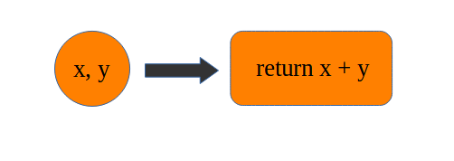

# Programacion funcional

En un paradigma de la programación, es una forma en la cual podemos resolver diferentes problematicas. Principalmente se trabaja con funciones, evitando los datos mutables así como el hecho de compartir estados entre funciones. Nos permite crear software mucho mas legible y fácil de testear.

Las funciones pueden ser asignadas a variables, como entrada y salida de otras funciones. **Es declarativo**, **enfocando en que estamos haciendo y no en como se esta haciendo**.

Al trabajar con programación funcional no toparemos con conceptos:

- **Funciones Puras**: No son más que funciones, las cuales, dado el mismo input, siempre retornan el mismo output, además de no tener efectos secundarios, no modificar una variable externa a la aplicacion, osea que la funcion no tiene valores que pueden ser cambiados fuera de ella, obviamente los parametros si pero en el cuerpo no deberia de hacerlo.
- **Composicion de funciones**: El proceso de combinar dos o más funciones, teniendo como finalidad ejecutar cada una de estas funciones en secuencia para tener un resultado en concreto. Concatenar funciones.
- **Estados compartidos**: Es cualquier variable, objeto o espacio de memoria que exista en un ámbito compartido. Puede incluir el ámbito global o ambitos de cierre.
- **Inmutabilidad**: Un objeto inmutable es aquel que no puede ser modificado una vez haya sido creado.
- **Efecto secundario**: Es cualquier cambio de estado en la aplicación que sea observable fuera de la función llamada.

---

- **PROGRAMACION IMPERATIVA**

Paradigma de programación, está **enfocada en cómo se ejecuta el código**, define el control de flujo de manera explícita y cambia el estado de una máquina. Describe como la computadora debe realizar una tarea.

Un programa imperativo, es una fórmulta que tiene pasos escritos por el programador, paso que cambian el estado del programa con el fin de llegar a obtener un resultado. Es decir **implementar un algoritmo**, las definiciones de variables, estas vas a modificar el estado de la máquina, y es aún peor si definimos variables globales ya que estas mutan el estado de la maquina y esta mutación puede perdurar durante bastante tiempo, años inclusive; las deciciones (`if, else, else if, switch`) o una instrucción que permita tomar una decisión en base a algo es considerado imperativo, incluyendo los loops, etc.

> Decir como se va a hacer, paso a paso.

- **PROGRAMACION DECLARATIVA**

Es un paradigma de programación, que tiene todo lo contrario de la programación imperativa, es decir, se especifica el resultado deseado, no cómo lograrlo, sin indicar como, ni un detalle del control de flujo.

> Consiste en decirle a un programa lo que tiene que hacer en lugar de decirle cómo debería hacerlo

---

## TEMAS

- [Intefaz Funcional](#interfaz-funcional)
- [Lambdas](#clase-anonima-18)

---

### Clase anonima (1.8 -> ...)

Las Clases anónimas en JAVA son una solución rápida para implementar una clase que se va utilizar una vez y de forma inmediata.

- Una clase anónima es una clase interna completa. Por lo tanto, tiene acceso a las variables externas de la clase, incluyendo las variables estáticas y privadas.
- También tienen algo en común con las clases locales: sólo son visibles dentro del método en el que se definen
- Otra limitación importante es que las clases anónimas heredan de sus “ancestros”, las clases internas: **una clase anónima no puede contener variables y métodos estáticos.**

> Recomendacion: "Utiliza clases anónimas si necesitas una clase local de uso puntual" como de un parametro de un unico uso

Clases que nosostros no creamos, las crea directamente Java por debajo ya que una interfaz no puede hacer nada sola, necesita una clase. Llamar a clase (interfaz) para utilizar su metodo y definirlo

```Java
        //Se genera una clase anonima y se crea un objeto de tipo Comparador
        Comparator<String> comp = new Comparator<String>() { 
        
          @Override
          public int compare(String s1, String s2) {
            return s1.compareTo(s2);
          }
        };

        ///Otro ejemplo///
        //el metodo sort utiliza de parametro una lista y crea una clase anonima que utiliza el metodo compare
        Collections.sort(lista, new Comparator<Cuenta>() {
                @Override
                public int compare(Cuenta o1, Cuenta o2) {
                    return o1.getTitular().getNombre().compareTo(o2.getTitular().getNombre());
                }
            });

```

</br>

### INTERFAZ FUNCIONAL

Una **interfaz funcional** es aquella que solo **tiene uno y solo un método abstracto,** puede tener cualquier cantidad de métodos default, estáticos y métodos heredados de la clase object y declararlos como métodos abstractos pero solamente puede tener un método abstracto. Este método puede ser representado por una [expresión lambda.](#expresiones-lambdas)

```Java
// Clase principal
        public class lambdaFunction {
            // Anotacion para declarar la interface Funcional
            @FunctionalInterface
            interface operacion {
            //Una interfaz Funcional: tiene uno y solo un método abstracto
                public double suma(double x, double y);
            }
        
            public static void main(String[] args) {
                //definimos con la expresión lambda como se debe hacer, definimos el comportamiento y si lleva argumentos también
                operacion l = x, y -> x + y;  // (x, y) -> {x + y};
                System.out.println(l.suma(8, 30)); //llamamos al metodo
            }
        }

/////Otro ejemplo di interfaz
        public class ISaludar{
        
            @FunctionalInterface
            public interface ISaludar {
              void Saludar(String usuario);
            }
        
            public static void main(String[] args) {
                    
                    ISaludar saludar = (String usuario) -> System.out.println("Hola Mundo " + usuario);
                    saludar.Saludar("Alice");    
            }
        }

```

Si la interface que estamos declarando contiene la Anotación `@FunctionalInterface` y esta no cumple con los criterios para que sea una interfaz funcional nos dará un error de compilación, esto nos ayuda y es una buena práctica para desarrollar correctamente. Cabe mencionar que  una interface con un solo método abstracto como lo hemos comentado sigue siendo una interfaz funcional aunque no tenga la Anotación.

> [!Note]
> Como buena practica se debe agregar la anotacion `@FunctionalInterface` para que el compilador pueda realizar ciertas validaciones sobre la interfaz
>
> **Pregunta de certificacion**:
> *Las interfaces funcionales son aquellas que tienen un solo método para implementar*.

#### Expresiones Lambdas

Funciones anonimas, funciones de cierre, Closurse (método anonimo).

Una expresión lambda **representa el método abstracto de una interfaz funcional**.

- Basada en un lenguaje matemático formal
- Mas expresivo (Con menos código) y elegante

Una expresión lambda está caracterizada con la sintaxis:

- `(parámetro) -> {cuerpo-de-la-expresión-lambda}`



Podemos crear expresiones mas complejas, las que nos permitan trabajar con parámetros, retornar valores (si es más de una linea de codigo hace uso de la palabra reservada `return`), ejecutar otras funciones, etc.

```java
//lambda con parametro y mas sentencias de codigo (uso de llaves)
            ISaludar saludarDos = nombre -> {
            if (nombre.equals("Alice")){
                System.out.println("Te gusta un buen juego");
            } else {
                System.out.println("Buen día amigou: " + nombre);
            }
        };
//retornando valores
        @FunctionalInterface
        public interface ISuma {
            int suma(int valor1, int valor2);
        }

        ISuma suma = (valor1, valor2) -> { // definimos el metodo abstracto
            int result = valor1 + valor2;
            System.out.println("El resultado dentro de la expresión es: " + result);
            return result;
        };

        suma.suma(100,200);
//ciclo for each lambda
        lista.forEach(cuenta -> System.out.println(cuenta));
```

</br>

### API Stream

Cuando trabajamos con software muy cercanamente tengamos la necesidad de trabajar con collecciones, un arreglo, matriz, una lista, etc.

Las collecciones nos permitiran almacenar distintos tipos de datos, datos que posteriormente procesaremos o realicemos tareas muy comunes como:

- Buscar
- Filtrar
- Agrupar

Apartir de la versión 8 de Java podemos trabajar con streams, que no son mas que una abstraccion de interfaz los cuales nos permiten procesar información de una coleccion, trabajar con un alto nivel de abstracción.

> Un **Stream** es una secuencia de elementos de un origen que admite operaciones concatenadas

- Admiten operaciones estilo SQL, podemos:
  - Agrupar
  - Sumar
  - filtrar
  - contar
  - etc

Los stream trabajaran con las colecciones de 2 maneras:

1. **Estructura de proceso**, el stream ***genera un nuevo stream*** para de esta manera concatenar acciones
2. **Iteración interna**, el stream internamente realizara ciertas acciones de tal manera quue obtengamos un resultado en concreto, osea, que ***retornan un valor en concreto***

---

Algunos métodos:

- **.stream()** - no retorna un nuevo stream, solo posee los elementos de nuestra coleccion (los valores de la lista)  
  - **.count()** - cantidad de elementos que posee el stream, devuelve long
  - **.filter()** - filtrar elementos de una coleccion a través de un predicado (Como: Expresion lmbda), busqueda de elementos. *Devuelve una stream* y posera los mismos o menos elementos que el stream anterior
  - **filter( xxxx ).collect** - para cuando queremos obtener como resultado final una lista

    > El ``filter()`` con lambda funciona bien, pero **no siempre queremos filtran usando una expresión lambda** de una forma directa ya que no tiene una gran capacidad de reutilización. En muchos casos suele ser mejor tener alguna clase de apoyo que defina una serie de expresiones lambda y predicados que nos ayuden y se reutilicen.

  - **.map(num-> num * num)** - nos permite transformar un objeto en otro a través de una función de forma muy directa sobre el flujo original, ***devolviendo el mismo número de elementos que el stream*** (como obtener los datos de la lista que son string y transformar a int (`x -> Integer.parseInt(x)`) o devolver valores voleanos (`x -> x > 5`))
    - **.mapToInt(x to y)** - se nos abrirá la posibilidad de acceder a métodos adicionales muy orientados a estadísticas (`sum,max,etc`)
    - **.mapToDouble(condicion)** - se nos abrirá la posibilidad de acceder a métodos adicionales muy orientados a estadísticas (`sum,max,etc`)
    - **.summaryStatistics()** - acceder de forma directa a todas las estadísticas
- **.flatMap(clase::método)** - se utiliza para manejar el mapeo cuando cada elemento del stream puede ser mapeado a cero o más elementos de salida. En otras palabras, .flatMap() ***permite manejar streams anidados de manera más eficiente***,  se aplica a cada lista interna, y luego ``flatMap`` combina esos streams internos en un solo stream plano

    >Ayuda a "aplanar" streams anidados.
- **.anyMatch(returnBolean)** - recibe un predicado(lambda) si algún elemento de esta secuencia coincide con el predicado proporcionado
- **.findAny()** - Recupera una \*abstracción\*, poseera un elemento omitiendo el orden, al azar
  - **.get()** - retorna el unico elemento obtenido, si el valor esta presente retorna el valor (`filter(predicado).findAny().get`)
- **.findFirst()** - recupera el primer elemento
- **.orElse(valorDefault)** -  Devuelve un valor default si no sabemos a ciencia ciera si el stream devolvera un elemento, el default tiene que ser del mismo tipo

</br>

***Métodos matematicos*** (`stream().mapToInt(n->n)`)
intStrem -> mapInt

- **.sum()**
- **.average()** - promedio de una coleccion
- **.min().getAsInt()** - el valor minimo de la coleccion

> Algunos de estos elementos retornaran abstracciones por lo cual tenemos que apoyarnos de un segundo método

- **.reduce(inicializarAcumulador, (acumulador, elemDeColeccion) -> valorAcumulador)** - combinar los elementos de un stream, genera un único resultado apartir de los valores de una única colección. Podemos ver a este método como un acumulador.
  - Este método trabajará con 2 argumentos
    - 1.- El primer elemento es tanto el valor inicial del acumulador como el resultado predeterminado si no hay elementos en la secuencia
    - 2.- El segundo argumento una expresión lambda `.reduce(0, (acumulador, elemento) -> )` la cual poseera 2 argumentos
      - 1.- El primer parametro sera la \*variable acumulador\*
      - 2.- El segunndo será un elemento de la colección
    - En el cuerpo de la expresión lambda debemos retornar un valor el cual será asignado al acumulador

    ***`.reduce(0, (acumulador, elemento) -> acumulador + elemento)`***
    otra variante sería ***`.reduce((acumulador, elemento) -> acumulador + elemento)`***

  > retorna el Acumulador

> [!Important]
> Es importante tener en cuenta que el método .reduce() puede tener implicaciones de rendimiento cuando se utiliza en paralelo debido a la naturaleza de las operaciones de acumulación. En esos casos, se pueden usar variantes de `.reduce()` que admiten operaciones paralelas.

- 

---

#### Crear un stream

Podemos crear un stream a tráves de:

- Collecion

Aquellos elementos que implementan la Intefaz `List` (LikedList, ArrayList, etc.)

- Stream
- Arreglo
- Secuencia

> [!Important]
> Al hacer uso de cualquier método de streams no vamos a modificar la colleccion original