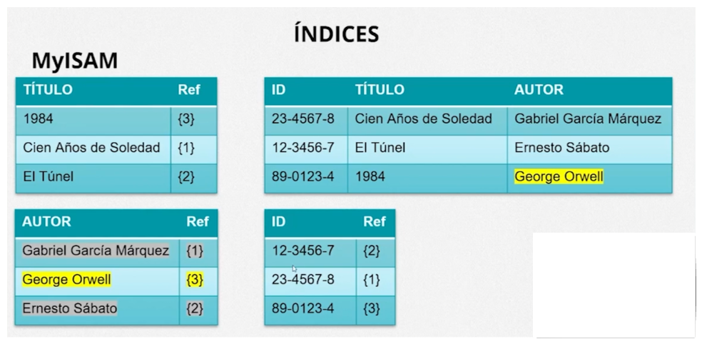
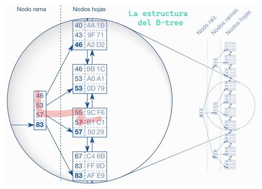
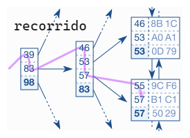

- `net stop mysql80` o `net start mysql80`: Detener/iniciar servicio
- `SHOW STATUS` muestra el valor actual de las variables de entorno
- `my.ini` ruta `C:\ProgramData\MySQL\MySQL Server 8.0`
- Saber cuantas tablas fueron creadas en el disco y `SHOW GLOBAL STATUS LIKE 'Created_tmp_disk_tables';`

---

# Administracion en MYSQL

Se conocerá como es el trabajo diário de un/una profesional responsable por gerenciar, instalar, configurar, actualizar y monitorar una base de datos: un/una DBA (DataBase Administrator).

Plano de ejecución y sus características, indicadores y joins. Se mirará como manejar backups y entenderás que es y como funciona la recuperación de datos.

Papel del DBA

- Profesional de administrar la base de datos

Funciones del DBA

- Evaluar el ambiente de la empresa. (Hardware necesario para la instalación y el mantenimiento de MYSQL de acuerdo con las necesidades operativas de la empresa)
- Configura accesos a la base de datos de forma segura. (Conexiones/IDE/otras interfaces) Prevenir invasiones o hacking.
- Mantener la base con buen desempeño, trabajar con todos los parámetros de inicialización en MYSQL. (Saber trabajar con los índices, que mejoran las consultas en la base de datos)
- Almacenar los datos
- Realizar Backup/copia de seguridad de los mismos
- Apoyar el área de dasarrollo con el mantenimiento de los datos. Eliminar datos no deseados, defragmentar la base, entre otros.
- Monitorea la instalación de MYSQL. Gestionar recursos usados por la base y adecuarla a las necesidades de los usuarios.
- Configurar el ambiente y sus diversas propiedades. (my.ini).
- Otorga niveles de acceso a los usuarios. (Lectura, Actualizacion a tablas, etc.).

> Hoy en dia con las herramientas en la `cloud` se han cubierto muchas acciones por las que un DBA deber conocer e implementarlas

---

## Conexiones de MYSQL

Los parametros que componen u información principal para crear conexiones son:

- Usuario
- Servidor
- Puerto
- Contraseña

Es importante conocer el lugar donde se encuentra el archivo de `connections.xml` ya que es necesario para configurar varias conexiones en diversos equipos en una empresa u organizacion. (Se puede traspasar el mismo archivo a cada equipo en vez de configurarlas paso a paso, así que todos tengan lo mismo)

- Se encuentran almacenadas por default en la ruta: `C:\Users\nombreUsuario\AppData\Roaming\MySQL\Workbench` en un archivo llamado `connections.XML`

- ### Cliente Servidor

En el mismo lugar físico que seria el hardware donde se instalo MYSQL

- ### Cliente Servidor Cloud

Servidor en la nube, MYSQL operando en un lugar remoto

### Servidor

Es un conexión de red/servicio de red, un servidor de red aunque este en el mismo equipo.

**Aveces se necesita desactivar/desactivar el servidor**, ya sea por mantenimiento a la red (como dar mas memoria a tablas temporales) o configuración de inicialización (archivo `my.ini`) en el cual nadie más va a tener acceso a excepto el DBA.

- Windows
  
1. Para desactivar en el caso de Windows es ir a la ventana de servicios y buscar el servicio llamado `MySQL80`, click derecho y 'detener'.
2. Por líneas de comando `net stop mysql80` o `net start mysql80`.

---

## TUNNING

Poner a punto en este caso, en otros casos fuera seria como sintonizar. Hacer que de alguna manera el desempeño aumente.

4 formas de configurar el ambiente MySQL para hacer tuning:

1. Esquemas
2. [Índices](#índices)

### 3. Hardware/Sistema

- Trabajar con 64 bits (**MySQL puede usar varios procesadores en paralelo** y puede llegar a consumir toda la capacidad dee memoria de la maquina).
</br>
- Configuración de la RAM (Existe un parámetro interno que nos permite indicar el máximo de RAM que nuestros procesos podrán consumir )

    > **No exceder el 50% de RAM** disponible en la máquina.

    1 DB de 1 GB no va a consumir más de 8GB de RAM, pero en un ambiente real no habrá solo una conexión ejecutando operaciones en la base. (Dependiendo de la manera como se utilice la DB, como muchas conexiones... 8 GB de RAM será poco).
</br>

- Tipo de lectura de disco: HDD / SSD (rápido)
  - Existen SCSI(ambiguo), SATA, SAS (mejor desempeño entre SATA y SAS)

- Uso de **controlador de disco RAID** (0,1,5 y 10...). Son empleados para la seguridad de los datos.
  - **RAID 0**: Divide los datos en 2 HD diferentes, aunque observemos tan solo 1 drive el sistema operativo divide el dato en los discos.
  - **RAID 1**: Uno de los HD es copia del otro (Lo que se haga en un disco automáticamente se produce en el otro).
  - **RAID 5**: Divide los datos en más de dos HD aunque observemos tan solo 1 drive el sistema operativo divide el dato en los discos.
  - **RAID 10**: Los HD tienen espejos (Lo que se haga en un disco, automáticamente se reproduce en los demás)
  - Aunque _**RAID 1**_ y _**10**_ gastan más espacio físico con redundancia, son más seguros porque hay Back-up disponible

</br>

### 4. [System Variables MySQL](https://dev.mysql.com/doc/refman/8.0/en/server-system-variables.html)

Variables de ambiente de MySQL, variables que se declaran afuera del programa para que al momento de su inicialización queden predefinidos diversos parámetros de funcionamiento o de operación de nuestro servidor.

- Existen 250+ variables de ambiente en MySQL que pueden sufrir modificaciones con cada nueva versión. Con la experiencia se permite saber cuales son las que tienen más utilidad, aquellas que hagan a MySQL tener un gran desempeño.

```sql
/* visualizar el valor actual de una variable global en la instancia/conexión que estamos ejecutando.*/
SHOW GLOBAL STATUS;
```

hay 2 tipos:

1. _GLOBAL_: que vale para todo el entorno MySQL
2. _SESSION_: solamente para la conexión actual.

</br>

#### Archivo `my.ini`

Lugar donde se encuentran las variables de entorno que pueden ser ajustadas deacuerdo a las necesidades.
Es encontrado por default en la ruta `C:\ProgramData\MySQL\MySQL Server 8.0` (Linux `my.cnf`)

Tiene 2 directivas:

- [mysqld] Global
- [client] Session

> [!Note]
> `my.ini` es un archivo oculto lo cual puede que no nos deje almacenarlo por lo que se tendria que cambiar los permisos, 'Propiedades', 'Seguridad', 'Editar permisos'.

Mas en la [página Oficial MySQL](https://dev.mysql.com/doc/refman/8.0/en/server-system-variables.html)

##### Tablas temporales

Lugar en RAM donde guarda todas las consultas, su variable `tmp_table_size`

- Operaciones, joins, group by, agrupaciones, unions.. etc. Todas esas las coloca en RAM,con muchas conexiones haciendo consultas se crean muchas tablas, acabando la RAM para luegos escribirlas en disco y despues leerlas (realentiza el procesamiento de la información)

```sql
/*Saber las tablas creadas en disco*/
SHOW GLOBAL STATUS LIKE 'Created_tmp_disk_tables'; 

 /*Saber las tablas temporales creadas en Ram /consultas,operaciones, etc, creadas usando mysql*/
SHOW GLOBAL STATUS LIKE 'Created_tmp_tables'; 
```

- Para mirar el valor (bytes) de la variable en consola

```sql
SHOW GLOBAL VARIABLES LIKE 'tmp_table_size'; /*valor numerico de bytes*/
```

- Podemos aumentar el tamaño del valor/memoria disponible para la creación de tablas temporales en terminal pero, solo afectará para todas las conexiones mientras el **servidor este activo** por lo que el valor de tablas temporales va a aumentar

```sql
SET GLOBAL tmp_table_size = 136700160; /*alrededor de 135M*/
```

</br>

> [!Note]
> La actualizacion de variables por consola en este caso las  'tablas temporales'  van a funcionar siempre y cuando el servidor este activo, si se detiene o se reinicia el sistema las variables se inicializan con los valores del archivo `my.ini`.
>
> Para que queden realmente asignadas en todo momento es hacerlo mediante el **archivo `my.ini`**

---

## Mecanismos de Almacenamiento

La forma en como almacenamos nuestros datos en nuestras tablas. (_Recusrsos más exclusivos dentro de la base de datos_)

MySQL 8.0 Community dispone de 9 Mecanismos para almacenar datos en las tablas. (Una misma DB puede usar diversos mecanismos en sus tablas).

Si se recibe muchas o pocas transacciones se puede alterar los mecanismos para optimizar el desmpeño de la base de datos.

- **ENGINE**: Es el párametro que indica el mecanismo de almacenamiento en tabla.

> Los 3 principales engines son: **MyISAM, InnoDB, MEMORY**, por defecto en MySQL 8.0 Trabaja con InnoDB

```sql
SHOW ENGINES; /*Muestra toda la informacion de los engine*/
```

### 1. MyISAM

- No es transaccional, no está diseñado para que varios usuarios realicen operaciones en las tablas simunltáneamente.
- Solamente permite el **bloqueo a nivel de tabla** (Bloquear la tabla para poder alterarla). Lectura más rápida
- Recomendable para tablas que no están cambiando continuamente
- La clave externa **no soporta Full Text**
- Almacena datos de manera más compacta. Optimiza espacio de almacenamiento
- Implementa **índices HASH y BTREE** (Ventaja)

> Más adecuado cuando trabajamos con data warehouse
> El data warehouse se enfoca en analizar datos históricos y el big data en el procesamiento de datos en tiempo real

#### Variables de Ambiente MyISAM

- **key_buffer_size**: Determina el tamaño de caché para almacenar los índices de MyISAM. Varía de 8MB ~ 4GB de acuerdo con el OS.
- **concurrent_insert**: Comportamiento de las iserciones concurrentes dentro de una tabla MyISAM, es decir; la cantidad de inserciones que se pueden estar realizando en ese momento
  - **0** = Inserciones simultáneas desactivadas
  - **1** = Inserciones simultáneas sin intervalo de datos (Al mismo tiempo, como no es tranasaccional pueden haber problemas)
  - **2** = Inserciones simultáneas con intervalo de datos.
- **delay_key_write**: Atraso entre la actualización de índices y en el momento en que se crea la tablas. (Espera a que todos los registros sean insertados para depues actualizar los índices => +Consistencia de los datos -Rapidez(más lento))
- **max_write_lock_count**: Determina el número de grabaciones en las tablas que tendrán precedencia a las lecturas. Priorizar la cantidad de grabaciones que se realizarán antes de las lecturas en varias conexiones
- **preload_buffer_size**: Tamaño del buffer a ser usado antes de cargar los índices de caches de claves de las tablas: 32KB.

> [!Note]
> El uso de estas variables de ambiente se realizará en medida que el DBA entienda mejor su ambiente y los mecanismos de MyISAM. Si el DBA sepa si verdaderamente su tabla con la que trabaja funciona mejor con un mecanismo MyISAM considerando las caracteristicas como si no tiene muchas transacciones, pocas modificaciones o tablas fijas, para lectura.
>
> - **Es recomendable utilizar la configuración por defecto al usar el mecanismo MyISAM**.

#### Aplicaciones

- **myisamchk**: Analiza, optimiza y repara tablas MyISAM . (Si alguna se corrempe las reconstruye)
- **myisampack**: Crea tablas MyISAM compactadas que serán usadas solo para lectura. No es posible hacer inserciones a las tablas. (Mejor desempeño para lectura)
- **myisam_ftdump**: Exhibe información más completa de los campos de tipo texto.

### 2. InnoDB

- Mecanismo de almacenamiento transaccional más utilizado en MySQL. Diseñado para que vários usuarios realicen operaciones en las tablas sumultáneamente.
- Soporte transaccional completo / Soporte a claves externas.
- Cache de buffer confugurado se forma separada tanto para la base como para el índice *\*
- Bloqueo de tabla a nivel de línea. Bloquea la línea a la cual se va a trabajar
- Indexación BTREE.
- Back-up de DB puede ser online / servidor activo, no hay necesidad de parar el servidor para hacer un back-up. Sin bloqueo.

#### Variables de Ambiente InnoDb

Tablas

- **innodb_data_file_path**: Determina el camino y tamaño máximo del archivo dentro del sistema donde se almacenará la información.
- **inndb_data_home_dir**: Camino común del directorio de todos los archivos innodb; cuando se especifica, graba todo dentro de ese directorio. **Default = /mysqldata**
- **innodb_file_per_table**: Separa el almacenamiento de los datos y sus índices. Por defecto almacena datos e índices de forma compartida

##### Desempeño

- **innodb_buffer_pool_size**: Determina tamaño de almacenamiento que innodb va a usar para almacenar índices y datos en cache.
- **innodb_flush_log_at_trx_commit**: Determina la frecuencia con que el buffer de log-in es habilitado por el disco. Crece con el uso Y después de un lapso es descargado al HD
- **innodb_log_file_size**: Tamaño en Bytes con el cual se crearán los archivos log-in. Por defecto es 5MB, de 5 en 5 cada archivo de log-in.

### 3. Memory

- Mecanismo de almacenamiento que **crea tablas en memoria RAM**. No en disco, siempre que se reinicialice se va a borrar.
- No soporta clave externa
- Acceso muy rápido a la información.
- Los datos necesitan ser reinicializados junto con el servidor / se piede.
- Tiene **bloqueo de tabla** al igual que MyISAM
- Utiliza índices HASH por defecto y BTREE.
- Formato de línea de longitud fija, No soporta BLOB/TEXT ya que serian muchisimos datos

> El mecanismo de almacenamiento en memoria es el de más rápido acceso.

---

## Base de datos

### Localización para la creación de la base de datos

En algun momento como DBA el espacio donde fue instalado MySQL ya no tendrá más espacio y necesito cambiar de disco

```sql
SHOW VARIABLES WHERE Variable_name LIKE '%dir'; --Ver las variables dir, interesa ver la ruta de aquella llamada 'datadir'

```

`datadir` : Esta es la variable que determina la localización de la base de datos.

Para cambiar de ruta:

- Crear un directorio en el destino deseado, disco deseado
- Dentro del directorio debera contener la Carpeta `Data`
- Configurar el [`my.ini`](#archivo-myini)

    ```java
        datadir=C:/Ruta_del_nuevo_directorio\Data
    ```

- Parar y reiniciar el servicio `Mysql80`

> Tener en cuenta que siempre hay que copiar la carpeta/directorio en su totalidad a la nueva ruta ya que tiene unas 'tablas de control' internas para poder funcionar.

### Back-Up

Es una copia de seguridad de la base que se realiza periodicamente para recuperarla en caso de problemas con la base de datos, algún problemas que cause la perdida de datos.

Existen 2 tipos de back-up

1. Back-up lógico

   - Exporta todas las estructuras, tablas, rutinas, (...) a un scrip sql que al ser ejecutado recrea la base de datos con todas las entidades.
   - Permite la manipulación externa, antes de recuperar la información, abrir el scrip y hacer los ajustes necesarios

   Desventaja

   - Es más lento porque se ejecuta comando a comando
    </br>

2. Back-up físico

- Contiene todos los archivos binarios del sistema donde la información está almacenada, pero sin los respectivos comandos.
- Es más rápido que el back-up lógico, **pero es menos flexible**. No permite editar tablas y datos antes de su restauración.

> Para copias de seguridad y restauración a gran escala, una copia de seguridad física es más apropiada para copiar los archivos de datos en su formato original para que puedan restaurarse rápidamente.

#### [Mysqldump](https://dev.mysql.com/doc/refman/8.0/en/mysqldump.html)

Es una una aplicación que nos permite crear **back-ups lágicos**, no se necesita bloquear la instancia

- Sitaxis:

```sql
mysqldump [options] db_name [tbl_name ...]
mysqldump [options] --databases db_name ... > <nombre_ archivo>.sql
mysqldump [options] --all-databases
```

- Usuario, contraseña, servidor
- `--all-databases` indica que el back-up será completo.
- `> <nombre_ archivo>` muestra el archivo de salida del back-up.
- Si desea incluir stored procedures e eventos usar `--routines` y `--events`

En la ruta `C:\Program Files\MySQL\MySQL Server 8.0\bin>` desde el Command Prompt usamos `mysqldump` con los parametros

```java
/*En este caso usamos un archivo .sql para despues ejecutarlo*/
mysqldump -u name-user -p --databases name-database > c:\destino\name-scrip.sql


/*Back-up de base de datos exceptuando una tabla*/
mysqldump -u name-user -p --databases name-database --ignore-table name-database.name_table > c:\destino\name-scrip.sql
```

Mas sobre [Mysqldump](https://dev.mysql.com/doc/refman/8.0/en/mysqldump.html)

> Si queremos hacer back-up de manera periodicamente con `mysqldump` podemos hacerlo con un archivo `batch` que se ejecute todos los dias

#### Back-up usando el asistente de MySQL

Para crear **backups lógicos** con el asistente tenemos que parar la conexión en la base de datos `LOCK INSTANCE FOR BACKUP`, `UNLOCK INSTANCE` para desbloquear la conexión una vez realizadas las acciones

```sql
/*Parar la base de datos / detenemos la conexión*/
LOCK INSTANCE FOR BACKUP; /*No se puede hacer nada en la db*/


UNLOCK INSTANCE; /*desbloqueamos la instancia/conexion, ya se pueden hacer inserciones*/
```

- Por el asistante nos dirigimos a `Adminostrator`
- `Data Export` y seleccionamos la base de datos que queremos
- `Export to Self-Contained File` (para un archivo sql) de las opciones y ponemos la direccion en donde se realizara el Back-up
- `Export to Dump Project Folder` (Para crear un folder con un archivo para cada tabla)

#### Back-up fisico

Muchas veces haciendo el back-up físico es la forma más eficaz de hacer una copia de seguridad y más rápida pero, debemos de asegurarnos de que al hacerlo traigamos todos los archivos referentes de nuestras bases de datos, las 'tablas temporales innodb' así como el 'archivo de inicialización del servidor' por lo que al hacer un backup completo es necesario **bloquear nuestra instancia** `LOCK INSTANCE FOR BACKUP`

- Crear la localización del backup
- **Copiar la carpeta `DATA` y el archivo `my.ini`** que por default esta en la ruta: `C:\ProgramData\MySQL\MySQL Server 8.0`
- Pegarlos en la nueva ruta y desbloquear la conexión `UNLOCK INSTANCE`

> El desempeño es muy rápido ya que no tengo que ejecutar todos los comandos del script, el problema es que si no se le hace un buen mantenimiento a los discos donde esta la base de datos almacenados existe la probabilidad de que se corrompan alguno de los archivos binarios y como consecuencia no pueda abrir alguna de las tablas lo que causara perdida

**Recomendación: es hacer los 2 back-ups**, de algún modo estas haciendo la manera de prepararte por si se presenta un problema al momento de crar los back-ups, aunque requiera más espacio de almacenaje

</br>

### Recuperando Back-ups

Lógicos

- Se crea la base de datos `CREATE DATABASE name_database`
- Por Command Prompt (CMD) en la ruta de 'Mysql Server' `C:\Programs Files\MYSQL\MySQL Server 8.0\bin` logearse `mysql.exe -h host -u user -p`
- insertar los comandos `mysql -u user -p < c:\ruta\archivo.sql`

Físico

- Para instancia `LOCK INSTANCE FOR BACKUP` o de manera más eficiente es parar completamente el servidor 'Detener el servicio MySQL80'
- Copiar los archivos del backup 'Directorio' `DATA` y el archivo `my.ini` a la ruta actual

---
---

### Optimización de las consultas

De las principales funciones del DBA es auxiliar al analista en el mejoramiento y desempeño de sus consultas, ya que cuando las consultas son más rebuscadas o más especificas puede haber una demora en tiempo de ejecución y lo que se requiere es que el tiempo de ejecución sea el menor posible

Debemos pensar si existe una herramineta o mecanismo para saber cuanto se demora mi consulta

#### Plan de ejecución

- Comando `EXPLAIN` para conocer el plan de ejecución

Lo que más necesitamos observar es el apartado de `cost_info`, nos representará el costo de cada consulta. El costo no está expresado en ninguna unidad. Tan solo usamos este valor para compararlo con otros planes de ejecución. Cuanto menor sea el valor, más rápida va a ser la consulta.

```sql
EXPLAIN sentencia_sql; /*en tabla*/

EXPLAIN sentencia_sql \G; -- En lista

/*Vista json que obtiene el plan de ejecución de la consulta
con algunos parámetros ('const_info' que expresa el costo para la resolución de esta query )*/
EXPLAIN FORMAT = JSON sentencia_sql \G; 
```

Mientras las consultas a las tablas involucren Joins, el costo de procesamiento aumentará sustancialmente. Uno de los principales desafíos del DBA es el de auxiliar al analista de modo que sus consultas sean menos costosas y consecuentemente más rápidas.

#### ÍNDICES

Entidad de la db que facilitan la búsquedad de datos dentro de la tabla (Diccionario). Un índice es un puntero a una fila de una determinada tabla de nuestra base de datos. Un puntero no es más que una referencia que asocia el valor de una determinada columna (o el conjunto de valores de una serie de columnas) con las filas que contienen ese valor (o valores) en las columnas que componen el puntero.

Los índices mejoran el tiempo de recuperación de los datos en las consultas realizadas contra nuestra base de datos, el costo de procesamiento para recorrer toda la tabla y encontrar el registro será bajo.

**Los índices no son todo ventajas**, la creación de índices implica un aumento en el tiempo de ejecución/procesamiento sobre aquellas consultas de `INSERT`, `UPDATE` y `DELETE` realizadas sobre los datos, como los índices deben ser reconstruidos cada vez que se modifican los datos de las tablas, muchos índices sí afectan el desempeño. Del mismo modo, los índices necesitan un espacio para almacenarse, por lo que también tienen un coste adicional en forma de espacio en disco.

- ##### Índices en MYISAM

Si quiero crear índices para MyISAM, para el campo que será el índice crea una nueva estructura adicional (una tabla ordenada?) cada que se quiera buscar un elemento al interir de la tabla que estará almacenando como referencia (un número) que corresponde la posición del registro en la tabla original



- Crea una estructura separada para índices PK y no PK.
- La columna del índice es ordenada y toma como referencia la posición de la fila de la tabla original.
- Implemente índices **HASH y B-TREE**.

###### Consideraciones MyISAM

Modificación en la tabla original => Todos los índices se actualizan
Muchos índices => Mas tiempo de ejecución.

- ##### Índices en InnoDB

En tablas InnoDB si un campo es la clave primaria automáticamente se convertirá en el mismo índice de la misma tabla, la información esta organizada de modo que el acceso a los datos va a ser mucho más ágil, mucho más rápido

Los índices que no son PK como índice toman como referencia el valor de clave primaria (trae el campo a una estructura auxiliar y toma como referencia la clave primaria)

###### Consideraciones InnoDB

- La tabla viene ordenada automáticamente con la clave primaria (PK).
- Mejor desempeño en las consultas buscando a través de la clave primaria (PK).
- Costo para hallar el registro de campo que no es PK en InnoDB es igual a MyISAM
- Solo trabaja con **B-TREE**

---

> Hash y B-Tree son algoritmos de búsqueda en listas ordenadas.

---

##### ÁRBOL BINARIO

Un árbol binario se puede definir como una estructura de datos utilizada en la ciencia de la computación. Esta estructura inicia con una raíz que luego se extiende en dos ramificaciones hasta que finalmente terminan en una hoja.

En otras palabras, se podría decir que un árbol binario inicia con un nodo que funciona como una raíz. Luego, de esa raíz se originan dos nuevos nodos o ramificaciones que se conocen como hijos.

Cada raíz **solo puede tener dos hijos o ramificaciones**. Por esa razón, se denomina árbol binario. Una ramificación se presenta hacia el lado derecho y la otra hacia el lado izquierdo.

**Nodo hoja**: Este es un nodo que tiene padre, pero no tiene hijos.

> Nada me garantiza que la cantidad de nodos como de la izquierda o derecha va a ser igual

</br>

Un árbol binario de búsqueda (abb) se basa en la propiedad de que las claves que son menores que el padre se encuentran en el subárbol izquierdo, y las claves que son mayores que el padre se encuentran en el subárbol derecho.

- Valores a la izquierda del nodo son menores
- Valores a la derecha del nodo son mayores


</br>

###### B-TREE

- Balanced - Binary Tree (**Nodos distribuídos de forma balanceada**). Tanto derecha como izquierda tiene la misma cantidad de nodos por lo que crece de manera equilibrada
- +4 Billones de registros en 32 niveles (2^32)

> [!Note]
> Un B-tree es un árbol equilibrado, no como un árbol binario.

Es matemáticamente más eficiente trabajar con un algoritmo b-tree porque el tiempo computaciónal va a ser mucho mejor que ir preguntando línea por línea

Ejemplo:



Recorrido



</br>

##### HASH

Es un algoritmo matemático que transforma cualquier bloque arbitrario de datos en una nueva serie de caracteres con una longitud fija.
Mapea datos grandes de tamaños variables en tamaño fijo.

Ejemplo:

```powershell
ADSNFDJHDUHVMLRURJGKÇIRTJHNJG .................. 101254102200
KJFDKK.......................................... 035215658965
125666INHFJHDYJLPP9998U8UF...................... 650002550055
DF.............................................. 987545854580
```

- Cuando abrimos un libro, buscamos un índice para encontrar la página que deseamos consultar.
- Es muy utilizado en la parte de criptografía, almacenar contraseñas, criptomonedas, entre otros.

###### HASH EN MYSQL

Tenemos **buckets** que seria como espacios de memoria, agrupados o en conjunto. La función hash distribuye cada uno de los registros en un espacio de memoria encontrados en cada uno de los 'buckets' (puede estar 2 regisros en un espacio de memoria ), este espacio ya le genera un hash que contiene la información del registro que queremos.


</br>

##### Crear índices

```sql
ALTER TABLE nombre_tabla ADD INDEX(campo);
```

##### Eliminar índices

```sql
ALTER TABLE name_table DROP INDEX campo;
```

</br>

#### Herramienta Mysqlslap

Nos permite simular diversas consultas realizadas de forma concurrente, el como se comportarian las consultas realizadasa al mismo timpo a nuestras tablas.

- Al estar dentro del directorio `bin/`, por Commmand Promp ingresamos a la herramienta

```powershell
mysqlslap -u user -p --concurrency=100 --iterations=10 --create-schema=name_database --query="statement_sql";
```

Nos mustra el tiempo de busqueda de la consulta simulando busquedas simultaneas.

> [!Important]
> Consejo: Usar índices en nuestras campos de igualdades, de igual manera en la condición de filtro implementar un índice. Mejor desempeño de nuestras consultas.

</br>

---

### Gestion de Usuarios

Creación de usuarios que tendrán acceso a la base de datos con distintos privilegios

#### Usuario Administrador

Creación de un usuario administrador que tendra acceso el DBA

```sql
create user 'name_user'@'name_host' IDENTIFIED BY 'password';


-- Dar permisos
GRANT ALL PRIVILEGES ON *.* TO 'name_user'@'name_host' WITH GRANT OPTION; /*todos los privilegios */

-- GRANT ALL PRIVILEGES ON databases.tables 
-- TO 'name_user'@'%'  =  %  por si solo dice que se puede conectar desde cualquier direccion ip
```

> [!Important]
> Es aconsejable excluir el usuario root.
> El usuario root es creado durante la instalación y su contraseña es definida por un operador que hizo la instalación. Pero, no siempre, está persona será el DBA. Cambiar la contraseña del usuario root también resuelve el problema de seguridad, pero lo aconsejable es crear un nuevo usuario administrador y excluir el root.

</br>

##### Gestion de Privilegios

La manera en que decimos desde que o desde donde se conectara al servidor

Cuando creas un usuario,si mantienes el símbolo **%** o **__** en el campo Limit to Hosts Matching, quedará determinado que otros IPs puedan ser utilizados para acceder a la base. Estos caracteres funcionan como comodines:

- Usando '%' y '_'

1. **192.168.1.%** => `192.168.1.0` - `192.168.1.255`
  Rangos de ips
2. **192.168.1.1__** => `192.168.1.100` - `192.168.1.255`
  Intervalo de direcciones IP, 2 numeros representados por 2 guiones bajos
3. **192.168.%** => `192.168.0.0` - `192.168.255.255`
  Intervalo de direcciones
4. **client__.myscompany.com** => `clienteXY.mycompany.com`
  Acceder desde cualquier servidor por numeros o letras

</br>

##### Limitando acceso a los esquemas

Un usuario puede ver ciertas bases de datos

```sql
CREATE USER 'user04'@'%' IDENTIFIED BY 'user04';

GRANT SELECT, INSERT, UPDATE, DELETE, CREATE TEMPORARY TABLES, LOCK TABLES, EXECUTE
ON jugos_ventas.* TO  'user04'@'%';


-- LIMITAR DE ACCESO A SOLO LA TABLA
CREATE USER 'user05'@'%' IDENTIFIED BY 'user05';

GRANT SELECT, INSERT, UPDATE, DELETE ON database.table TO 'user05'@'%';
```

#### Usuario normal

Gran parte de los usuarios que accederan a la base de datos serán con privilegios comunes para todos, no necesita tener todos los privilegios.

```sql
create user 'user'@'host' IDENTIFIED BY 'password'; /*crear un usuario*/

/*  dar  los permisos */
GRANT SELECT, INSERT, UPDATE, DELETE,
CREATE TEMPORARY TABLES, LOCK TABLES,
EXECUTE ON *.* TO 'user'@'host'; 
```

#### Usuario solo Lectura

Un usuario que solo puede realizar informes, un analista de bussines por ejemplo. Ese usuario que no necesita hacer inserts, updates o deletes en las tablas, probablemente ejecute un Stored Procedure para que en su  informe a través de estos datos generar información valiosa para toma de deciciones como un ejemplo.

```sql
create user 'user'@'host' IDENTIFIED BY 'password'; /*crear un usuario*/

/*Dar permisos*/
GRANT SELECT, EXECUTE ON *.* TO 'user'@'host'; 
```

> De repente el Stored procedure tiene comandos `insert`, `delete` or `update` por lo que debemos **tener cuidado con los permisos** que se le proporcionan a un usuario solo lectura, ya que a pesar de que el usuario no tenga los privilegios de INSERT, UPDATE y DELETE, los comandos que realizan estas ejecuciones en la tabla, que se encuentran al interior del Stored Procedure, serán ejecutados, porque la característica EXECUTE se sobrepone a los mismos.
> **Saber manejar un SP** es responsabilidad de un DBA

#### Usuario para solo Back-up

Usuario para realizar la copias de seguridad con cierta regularidad

```sql
CREATE USER 'back01'@'host' IDENTIFIED BY 'password'; /*crear un usuario*/

/*dar permisos*/
GRANT SELECT, RELOAD, LOCK TABLES, REPLICATION CLIENT ON *.* TO 'back01'@'host'; /*reload = refrescar los privilegios*/

```

</br>

---

#### Revocar provilegios

```sql
-- ver los usuarios y sus privilegios
SELECT * FROM mysql.user; 
-- Muestra los permisos que tiene el usuario
SHOW GRANTS FOR 'user'@'host'; 

-- Eliminar todos los privilegios
REVOKE ALL PRIVILEGES, GRANT OPTION FROM 'user'@'host';

```

---
